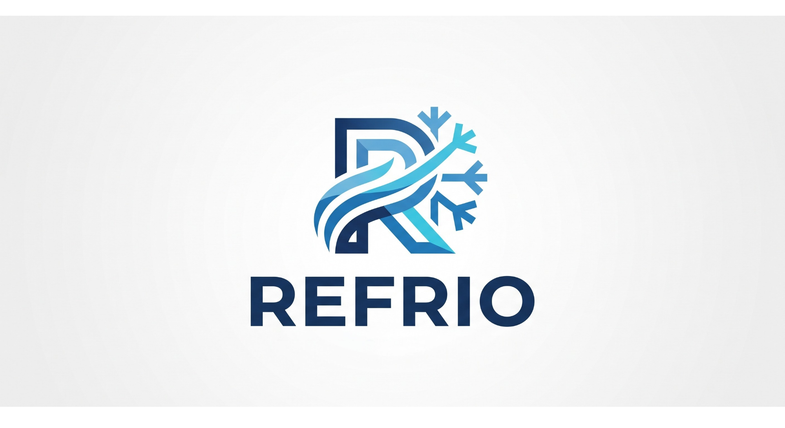
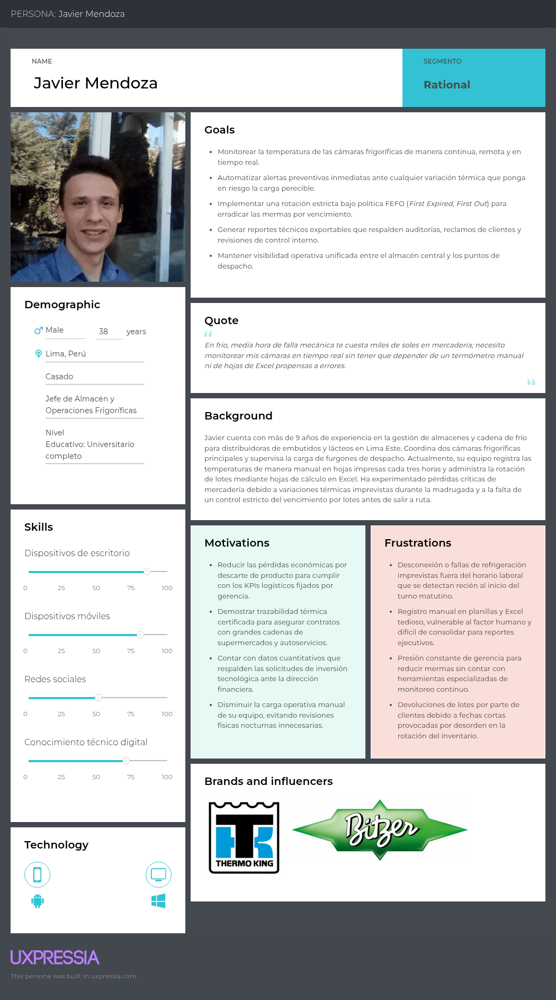
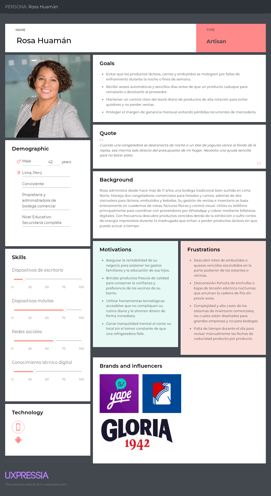
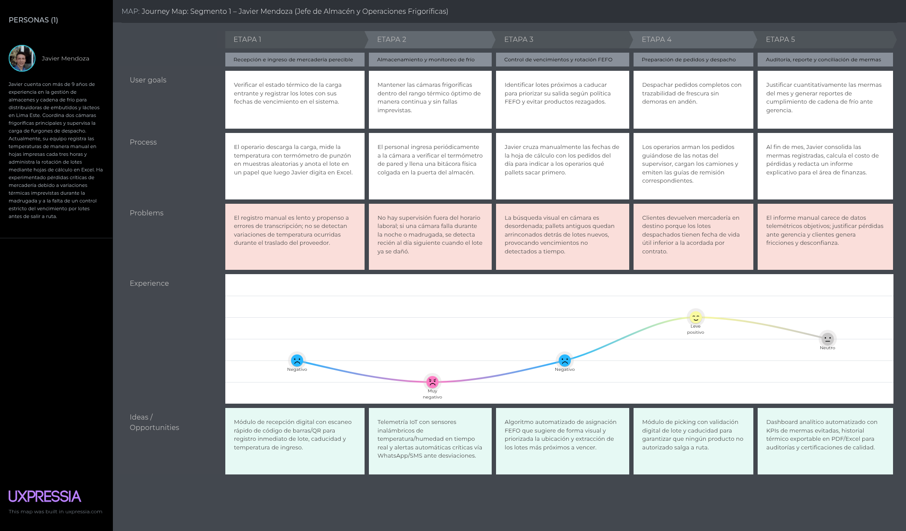
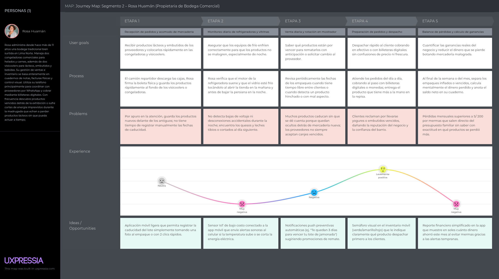
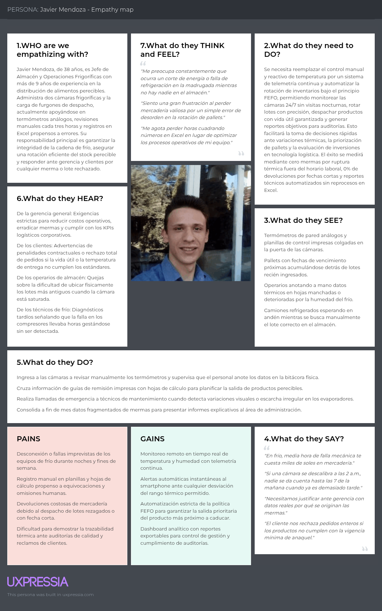
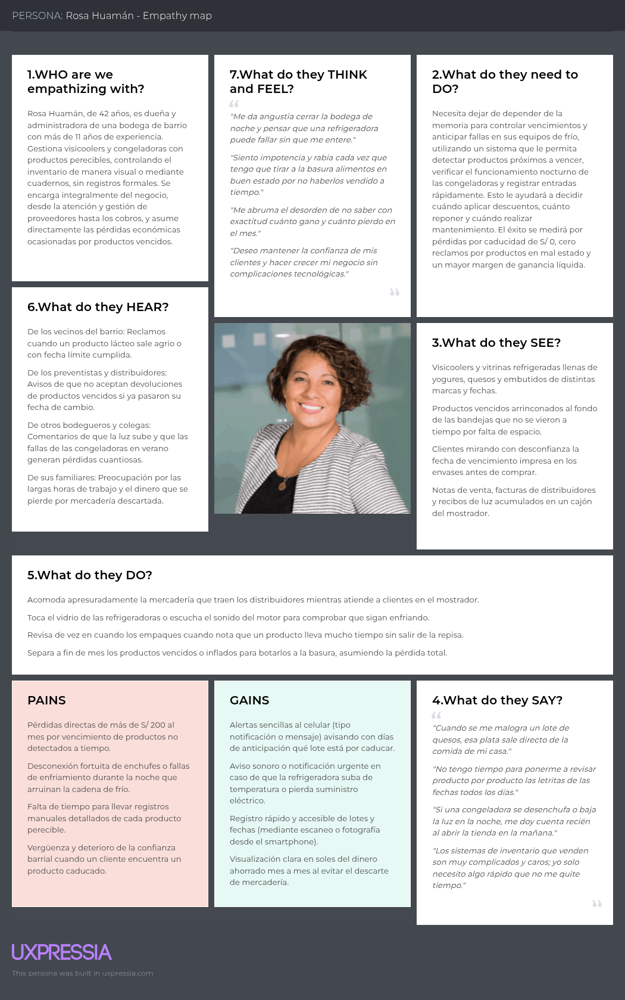
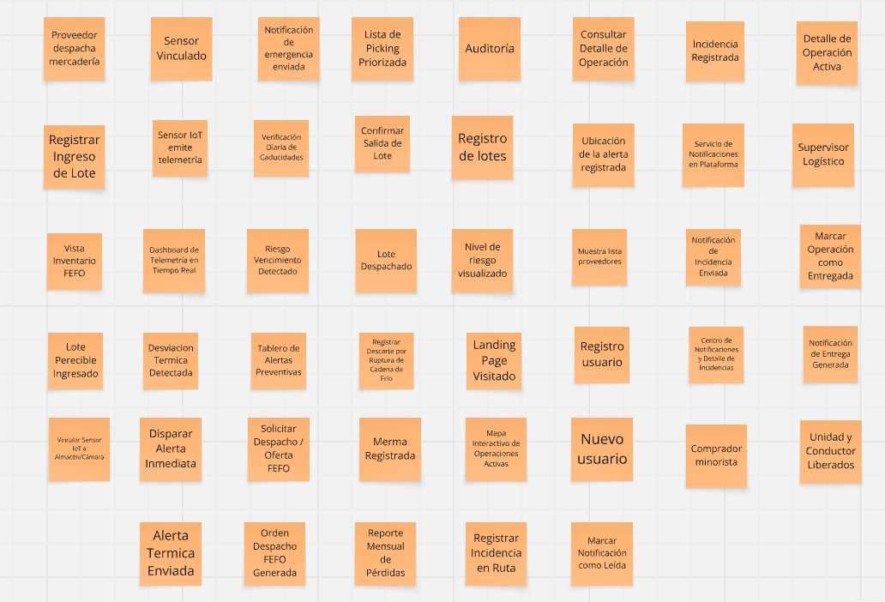

# Capítulo II: Requirements Elicitation & Analysis

## 2.1. Competidores

En esta sección se identifican y describen los principales competidores de **Refrio** —tanto directos como indirectos—, es decir, aquellos que ofrecen productos digitales con modelos de negocio total o parcialmente similares en el mercado de gestión logística y cadena de frío para empresas de alimentos perecibles.

### 2.1.1. Análisis competitivo

**¿Por qué llevar a cabo este análisis?** Entender el panorama competitivo es crucial para identificar oportunidades de diferenciación y áreas de mejora en la propuesta de valor de **Refrio**. Este análisis permite evaluar cómo los competidores abordan los problemas de gestión de inventario, distribución, y cómo se posicionan en términos de precio, funcionalidad y experiencia del usuario.

<table border="1">
<!-- Encabezado de Columnas -->
<tr>
<td colspan="2"> <b>Competidores</b> </td>
<td>
    
    <b>Refrio</b>
</td>
<td> 

  <b>Competidor 1: Óptima ERP (Perú)</b>
</td>
<td>
 

<b>Competidor 2: Sinapsys WMS (Perú)</b></td>
<td>

 
<b>Competidor 3: Tive (EE.UU.)</b></td>
</tr>

<!-- Sección Perfil -->
<tr>
<td rowspan="2" style="vertical-align: middle; transform: rotate(-90deg);"><b>Perfil</b></td>
<td>Overview</td>
<td>Plataforma web SaaS peruana que integra monitoreo IoT de temperatura y gestión de inventario FEFO en un solo producto.</td>
<td>ERP peruano orientado a pymes con módulo de inventario y facturación electrónica integrada a SUNAT.</td>
<td>Software WMS (Warehouse Management System) con distribución en Latinoamérica. Cubre gestión de almacén, picking y despacho.</td>
<td>Plataforma IoT global de monitoreo de temperatura y ubicación para cadena de suministro con alta precisión industrial.</td>
</tr>
<tr>
<td>Ventaja competitiva</td>
<td>Única solución que combina monitoreo IoT térmico + gestión FEFO + alertas multicanal en un solo producto accesible para el segmento PYME peruano.</td>
<td>Integración nativa con SUNAT para facturación electrónica. Fuerte presencia en pymes limeñas con soporte local en español.</td>
<td>Cobertura funcional amplia de operaciones de almacén (recepción, picking, despacho). Adaptable a múltiples sectores.</td>
<td>Alta precisión en sensores de temperatura y geolocalización en tiempo real. Cobertura global con más de 150 países.</td>
</tr>

<!-- Sección Perfil de Marketing -->

<tr>
<td rowspan="2" style="vertical-align: middle; transform: rotate(-90deg);"><b>Perfil de Marketing</b></td>
<td>Mercado objetivo</td>
<td>Distribuidoras medianas de alimentos perecibles y bodegas/puestos de mercado en Lima Metropolitana y ciudades intermedias del Perú.</td>
<td>Pymes peruanas de comercio, manufactura y distribución general que requieren control de inventario y facturación integrada.</td>
<td>Empresas medianas y grandes de distribución y manufactura en Perú, Colombia, Chile y México.</td>
<td>Empresas exportadoras, operadores logísticos y cadenas de supermercados globales que transportan bienes de alto valor o sensibles a temperatura.</td>
</tr>
<tr>
<td>Estrategias de marketing</td>
<td>Marketing digital en redes sociales, SEO orientado a términos de cadena de frío y bodegueros, alianzas con gremios sectoriales (ABP), ventas directas B2B a distribuidoras.</td>
<td>Publicidad en Google Ads y ferias PYME, base de clientes referenciada por contadores y consultores tributarios.</td>
<td>Fuerza de ventas directa B2B, participación en ferias de logística latinoamericanas (ExpoLogística Perú), canales de distribución con integradores locales.</td>
<td>Presencia en LinkedIn y eventos globales de supply chain (LogiMed, Gartner Supply Chain). Ventas enterprise con ciclos largos.</td>
</tr>

<!-- Sección Perfil de Producto -->
<tr>
<td rowspan="3" style="vertical-align: middle; transform: rotate(-90deg);"><b>Perfil de Producto</b></td>
<td>Productos & Servicios</td>
<td>Dashboard de temperatura IoT en tiempo real, gestión de inventario FEFO con alertas de vencimiento multicanal, analítica exportable y trazabilidad de lotes.</td>
<td>Módulos de contabilidad, facturación electrónica SUNAT, inventario básico, cuentas por cobrar/pagar, planillas, reportes financieros.</td>
<td>Módulos de recepción de mercadería, gestión de ubicaciones, picking y embalaje, despacho, control de lotes y vencimientos (básico), integración con ERPs.</td>
<td>Sensores físicos de temperatura y GPS con plataforma SaaS de trazabilidad térmica y de ubicación en tiempo real, alertas, reportes y API para integración.</td>
</tr>
<tr>
<td>Precios & Costos</td>
<td>Plan básico: S/ 59/mes. Plan estándar: S/ 129/mes. Plan premium: S/ 249/mes. Sin costo de hardware propietario (compatible con sensores IoT de mercado).</td>
<td>Desde S/ 89/mes para plan básico de inventario + facturación. Módulos adicionales con costo extra.</td>
<td>Desde USD 300/mes para instalación on-premise o SaaS. Implementación con costo adicional (USD 1,500–5,000).</td>
<td>Desde USD 5 por sensor/mes + costo de los sensores físicos (USD 80–200 c/u). Orientado a contratos anuales enterprise.</td>
</tr>
<tr>
<td>Canales de distribución (Web y/o Móvil)</td>
<td>Web responsive y móvil. Acceso desde cualquier dispositivo con conexión a internet, sin instalación local.</td>
<td>Web (escritorio). Aplicación de escritorio instalable. Solo compatible con Windows.</td>
<td>Web y aplicación de escritorio. Requiere proceso de implementación con consultor certificado.</td>
<td>Web, API REST y aplicación móvil iOS/Android. Hardware (sensores) entregado e instalado por técnicos certificados de Tive.</td>
</tr>

<!-- Sección Análisis SWOT -->
<tr>
<td rowspan="4" style="vertical-align: middle; transform: rotate(-90deg);"><b>Análisis SWOT</b></td>
<td>Fortalezas</td>
<td>Arquitectura web moderna en español, intuitiva y mobile-first con precios de entrada competitivos.</td>
<td>Más de 10 años de presencia en el mercado peruano y una sólida integración con SUNAT.</td>
<td>Cobertura funcional amplia del ciclo de almacén y presencia multipaís en Latinoamérica.</td>
<td>Alta precisión y confibilidad de sensores industriales con un historial exitoso en cadena de frío farmacéutica.</td>
</tr>
<tr>
<td>Debilidades</td>
<td>Producto nuevo en fase de validación inicial frente a otras consolidadas. Dependencia a internet para el monitoreo en tiempo real.</td>
<td>Sin módulo de monitoreo de temperatura. Interfaz desactualizada y experiencia de usuario poco intuitiva.</td>
<td>Precio y complejidad de implementación fuera del alcance de pymes y bodegas. Sin monitoreo IoT de temperatura integrado.</td>
<td>Sin módulo de gestión de inventario y presenta ciclos de ventas largos y orientados a clientes enterprise.</td>
</tr>
<tr>
<td>Oportunidades</td>
<td>Mercado PYME de perecibles amplio y desatendido, además de una creciente aceptación de pagos digitales entre bodegueros.</td>
<td>Agregar un módulo básico de temperatura para diferenciarse en el mercado de alimentos.</td>
<td>Incorporar un módulo IoT de monitoreo de temperatura para ampliar su propuesta de valor.</td>
<td>Asociarse con distribuidores locales en Perú para reducir costos de hardware.</td>
</tr>
<tr>
<td>Amenazas</td>
<td>Resistencia cultural al cambio tecnológico en el segmento bodeguero e inestabilidad de conectividad a internet en zonas periféricas de Lima</td>
<td>Plataformas más completas que integren facturación y temperatura en un solo producto.</td>
<td> RPs globales como Odoo que ofrecen módulos de almacén a bajo costo.</td>
<td>Nuevos actores con hardware de bajo costo y plataformas SaaS integradas</td>
</tr>
</table>

### 2.1.2. Estrategias y tácticas frente a competidores

A partir del análisis competitivo, **Refrio** define las siguientes estrategias y tácticas preliminares para afrontar las fortalezas de sus competidores y aprovechar sus debilidades en el mercado peruano:

**Frente a Óptima ERP**

*Estrategia:* Diferenciación por especialización vertical y cobertura de necesidades no atendidas.

Óptima ERP tiene presencia consolidada en el segmento pyme peruano, pero carece por completo de un módulo de monitoreo de temperatura y no está especializado en el sector de alimentos perecibles. **Refrio** aprovechará esta brecha posicionándose explícitamente como "la herramienta que Óptima no puede hacer": monitoreo térmico en tiempo real integrado con gestión de inventario FEFO.

*Tácticas:*
- Desarrollar materiales de ventas que cuantifiquen el costo mensual de no tener monitoreo de temperatura (pérdidas promedio de S/ 150–400/mes en bodegas y 12–20 % de facturación en distribuidoras), evidenciando el ROI de **Refrio** frente a ERPs genéricos.
- Implementar una funcionalidad de importación de datos desde Excel para facilitar la migración de clientes que actualmente usan Óptima u hojas de cálculo, reduciendo la fricción del cambio.
- Ofrecer un período de prueba gratuita de 30 días sin tarjeta de crédito para capturar usuarios que ya tienen Óptima pero necesitan complementar con gestión de perecibles.

**Frente a Sinapsys WMS**

*Estrategia:* Competir en accesibilidad económica y facilidad de adopción para el segmento PYME.

Sinapsys WMS cubre funciones más amplias de almacén, pero su costo de implementación (desde USD 300/mes + USD 1,500–5,000 de implementación) lo pone fuera del alcance de las distribuidoras medianas y, en especial, de las bodegas. Su curva de aprendizaje alta y la necesidad de consultor certificado representan barreras de adopción que **Refrio** puede explotar.

*Tácticas:*
- Posicionar a **Refrio** como "el WMS que no necesita consultor": onboarding en menos de 30 minutos, con tutoriales en video en español y soporte vía WhatsApp.
- Orientar las campañas de adquisición hacia distribuidoras medianas que hayan evaluado y descartado soluciones WMS por su costo o complejidad, ofreciendo la propuesta de valor esencial —FEFO + temperatura— a una fracción del precio.
- Publicar casos de uso específicos en el sector lácteo, cárnico y de frutas/verduras para demostrar la especialización vertical que Sinapsys no tiene.

**Frente a Tive**

*Estrategia:* Aprovechar la brecha de precio y la orientación a pymes locales frente a una solución enterprise global.

Tive ofrece alta precisión industrial en monitoreo térmico, pero su modelo de negocio —hardware propietario costoso, precios en dólares y enfoque enterprise— lo hace completamente inaccesible para los segmentos objetivo de **Refrio**. Además, Tive no integra gestión de inventario ni alertas de vencimiento.

*Tácticas:*
- Comunicar activamente la ventaja de **Refrio** de ser compatible con sensores IoT de bajo costo ya disponibles en el mercado peruano (desde S/ 80–150 por sensor), eliminando la barrera del hardware propietario.
- Desarrollar alianzas con proveedores locales de sensores IoT (Arduino-compatible, ESP32-based) para ofrecer kits de inicio a precios accesibles que el cliente pueda instalar por sí mismo siguiendo una guía en video.
- Orientar la comunicación de marca hacia la identidad local: "Hecha en el Perú, para el negocio peruano", como contrapunto a una solución internacional que no conoce las particularidades del mercado nacional (temporadas de calor en Lima, informalidad del sector, preferencia por WhatsApp, etc.).

## 2.2. Entrevistas

### 2.2.1. Diseño de entrevistas

#### Segmento 1: Empresas distribuidoras de productos perecibles

##### Datos del entrevistado
1. ¿Cuál es su nombre y edad? 
2. ¿En qué distrito opera su empresa actualmente? 
3. ¿Cuál es su cargo o rol dentro de la empresa? 
4. ¿En qué sector específico trabaja su empresa? (alimenticio, farmacéutico, agroindustrial, otro) 
5. ¿Cuántos años lleva trabajando en el rubro logístico o de distribución? 
6. ¿Cuántas personas conforman su equipo operativo actualmente? 

##### Gestión de inventario
7. ¿Qué método utilizan actualmente para registrar y controlar el inventario de sus productos perecibles? 
8. ¿Con qué frecuencia detectan pérdidas por productos vencidos o en mal estado? 
9. ¿Qué tan actualizado se mantiene el stock en sus registros durante las operaciones diarias? 
10. ¿Han tenido inconvenientes graves por errores en el registro del inventario? ¿Cómo los manejaron? 

##### Control de temperatura y cadena de frío
11. ¿Cómo monitorean la temperatura durante el almacenamiento y el transporte de sus productos? 
12. ¿Qué sucede operativamente cuando detectan un fallo en la cadena de frío?
13. ¿Qué tan difícil les resulta identificar mermas o pérdidas en tiempo real dentro del proceso?

##### Logística y distribución
14. ¿Qué herramientas o sistemas utilizan actualmente para planificar y ejecutar su distribución?
15. ¿Cómo realizan el seguimiento de los productos desde el almacén hasta el punto de entrega final?
16. ¿Qué tan eficiente consideran su proceso de distribución actual y en qué basan esa valoración?

##### Impacto económico y operativo
17. ¿Cuánto estiman que pierden mensualmente por fallas en almacenamiento, transporte o control de inventario?
18. ¿Cuál de estos factores afecta más su rentabilidad: gestión de inventario, transporte o control de calidad?
19. ¿Cómo repercuten estos problemas en la satisfacción de sus clientes?

##### Disposición hacia una solución digital
20. ¿Qué tan valioso sería para ustedes contar con visibilidad del stock en tiempo real? 
21. ¿Qué importancia le darían a una herramienta que monitoree la temperatura de forma automática y continua? 
22. ¿Estarían dispuestos a invertir en una solución que automatice su inventario y distribución? ¿Bajo qué condiciones? 
23. ¿Qué funcionalidades serían indispensables en una plataforma de gestión logística como Refrio? 

---

#### Segmento 2: Tiendas y bodegas con productos perecibles

##### Datos del entrevistado
1. ¿Cuál es su nombre y edad? 
2. ¿En qué distrito se ubica su tienda o bodega? 
3. ¿Cuántos años lleva gestionando su negocio? 
4. ¿Qué tipo de productos perecibles comercializa principalmente? 
5. ¿Cuántas personas trabajan en su negocio actualmente? 
6. ¿Maneja un solo local o tiene más puntos de venta? 

##### Control de inventario
7. ¿Cómo controlan actualmente el stock de sus productos perecibles? 
8. ¿Registran las entradas y salidas de forma manual o cuentan con algún sistema digital? 
9. ¿Qué tan actualizado suele estar su inventario durante un día normal de operación? 
10. ¿Con qué frecuencia se quedan sin stock de productos de alta rotación? 

##### Fechas de vencimiento y pérdidas
11. ¿Cómo controlan las fechas de vencimiento de sus productos actualmente? 
12. ¿Con qué frecuencia tienen pérdidas por productos vencidos o deteriorados? 
13. ¿Qué tipo de productos les generan mayor cantidad de pérdidas y a qué lo atribuyen? 

##### Organización y errores frecuentes
14. ¿Qué dificultades enfrentan para mantener ordenado su almacén o área de stock? 
15. ¿Qué errores ocurren con mayor frecuencia en el registro o control de su inventario? 
16. ¿Qué consecuencias les trae no encontrar un producto rápidamente cuando un cliente lo solicita? 

##### Impacto en ventas y clientes
17. ¿Han perdido ventas o clientes por problemas relacionados con una mala gestión del inventario?
18. ¿Cómo deciden actualmente cuándo y cuánto reponer de cada producto? 

##### Disposición hacia una solución digital
19. ¿Les resultaría útil recibir alertas automáticas cuando un producto esté próximo a vencerse? 
20. ¿Utilizarían una aplicación sencilla para gestionar su inventario desde el celular o computadora?
21. ¿Qué funciones priorizarían: alertas de vencimiento, reportes de ventas o control automático de stock?
22. ¿Cuánto estarían dispuestos a pagar mensualmente por una solución como Refrio?

### 2.2.2. Registro de entrevistas

### 2.2.3. Análisis de entrevistas

## 2.3. Needfinding
Para llevar a cabo el proceso de needfinding en Refrio, se realizaron entrevistas en profundidad con actores clave pertenecientes a los segmentos objetivo, incluyendo jefes de almacén y supervisores logísticos de empresas distribuidoras medianas, así como propietarios y administradores de bodegas comerciales y puestos de mercado de abastos. Estas conversaciones se centraron en comprender sus dinámicas de trabajo diarias, sus métodos de control de inventario y sus principales frustraciones vinculadas con la ruptura imprevista de la cadena de frío, la caducidad no controlada de alimentos y las pérdidas económicas derivadas del descarte de productos perecibles.

Gracias a esta exploración, se identificaron áreas críticas de mejora en el ecosistema logístico y comercial, tales como la dependencia de mediciones térmicas manuales no continuas, la falta de supervisión durante horarios no laborales, la ausencia de trazabilidad en la rotación de existencias y la limitada adopción de herramientas tecnológicas accesibles frente a soluciones ERP complejas y costosas. Asimismo, se evidenció una marcada brecha operativa entre el registro en papel o Excel y la toma de decisiones preventivas en tiempo real. Durante las entrevistas, surgieron patrones y necesidades recurrentes, como la urgencia de recibir alertas tempranas y automatizadas ante fallas de refrigeración y la necesidad de aplicar de forma sencilla políticas de rotación FEFO (First Expired, First Out). De esta manera, se consolidó una oportunidad clara para desarrollar Refrio, una plataforma digital de código abierto impulsada por telemetría IoT que resguarda la cadena de frío, optimiza la rotación de stock y reduce drásticamente las mermas de alimentos perecibles en el Perú.

### 2.3.1. User Personas

**Segmento Objetivo: Jefes de almacén y supervisores logísticos de distribuidoras medianas:**

**Segmento Objetivo: Propietarios y administradores de bodegas y puestos en mercados de abastos:**

### 2.3.2. User Task Matrix
<table border="1" cellpadding="8" cellspacing="0" style="border-collapse: collapse; text-align: center; width: 100%;">
  
  <tr style="background-color:#f2f2f2;">
    <th rowspan="2">Task</th>
    <th colspan="2">Javier Mendoza (Jefe de Almacén y Logística)</th>
    <th colspan="2">Rosa Huamán (Propietaria de Bodega)</th>
  </tr>

  <tr style="background-color:#f2f2f2;">
    <th>Frequency</th>
    <th>Importance</th>
    <th>Frequency</th>
    <th>Importance</th>
  </tr>

  <tr>
    <td style="text-align: left;">Monitorear temperatura de cámaras/vitrinas</td>
    <td>High</td>
    <td>High</td>
    <td>High</td>
    <td>High</td>
  </tr>

  <tr>
    <td style="text-align: left;">Registrar fecha de vencimiento y lote de productos</td>
    <td>High</td>
    <td>High</td>
    <td>Medium</td>
    <td>High</td>
  </tr>

  <tr>
    <td style="text-align: left;">Verificar rotación de inventario bajo criterio FEFO</td>
    <td>High</td>
    <td>High</td>
    <td>Medium</td>
    <td>High</td>
  </tr>

  <tr>
    <td style="text-align: left;">Detectar desviaciones térmicas fuera de horario laboral</td>
    <td>High</td>
    <td>High</td>
    <td>Low</td>
    <td>High</td>
  </tr>

  <tr>
    <td style="text-align: left;">Revisar manualmente el estado físico de los equipos de frío</td>
    <td>Medium</td>
    <td>High</td>
    <td>High</td>
    <td>High</td>
  </tr>

  <tr>
    <td style="text-align: left;">Lanzar promociones o remates por caducidad cercana</td>
    <td>Low</td>
    <td>Medium</td>
    <td>High</td>
    <td>High</td>
  </tr>

  <tr>
    <td style="text-align: left;">Preparar pedidos o despachos para clientes/rutas</td>
    <td>High</td>
    <td>High</td>
    <td>High</td>
    <td>High</td>
  </tr>

  <tr>
    <td style="text-align: left;">Generar reportes de mermas y pérdidas económicas</td>
    <td>Medium</td>
    <td>High</td>
    <td>Low</td>
    <td>Medium</td>
  </tr>

  <tr>
    <td style="text-align: left;">Justificar trazabilidad térmica ante clientes o auditorías</td>
    <td>Medium</td>
    <td>High</td>
    <td>Low</td>
    <td>Low</td>
  </tr>

  <tr>
    <td style="text-align: left;">Coordinar mantenimiento de equipos de refrigeración</td>
    <td>Low</td>
    <td>High</td>
    <td>Low</td>
    <td>High</td>
  </tr>

  <tr>
    <td style="text-align: left;">Separar y desechar mercadería deteriorada/vencida</td>
    <td>Medium</td>
    <td>High</td>
    <td>Medium</td>
    <td>High</td>
  </tr>

</table>

### 2.3.3. User Journey Mapping

**Segmento Objetivo: Jefes de almacén y supervisores logísticos de distribuidoras medianas:**

**Segmento Objetivo: Propietarios y administradores de bodegas y puestos en mercados de abastos:**

### 2.3.4. Empathy Mapping

**Segmento Objetivo: Jefes de almacén y supervisores logísticos de distribuidoras medianas:**

**Segmento Objetivo: Propietarios y administradores de bodegas y puestos en mercados de abastos:**

## 2.4. Big Picture EventStorming
En la sesión de Big Picture EventStorming, el equipo exploró de forma visual el panorama general del dominio de telemetría IoT para la cadena de frío y la gestión inteligente de inventarios perecibles de Refrio. Se identificaron los eventos significativos del ciclo de vida de un lote perecible y su monitoreo ambiental, desde la recepción e ingreso de la mercadería hasta el despacho bajo políticas FEFO y la prevención o reporte de mermas críticas. Asimismo, se integraron los sistemas externos que interactúan con la plataforma —como los nodos sensores IoT y las pasarelas de mensajería para alertas inmediatas— exponiendo los problemas operativos, dudas técnicas y oportunidades de automatización detectados durante la sesión. Esta primera aproximación permitió alinear el entendimiento del equipo y sentar las bases para el diseño detallado de la solución.

**Primera fase: Eventos**

**Mapa general:**
https://canva.link/65l1zwoqzdoajro

## 2.5. Ubiquitous Language
- **Cold Chain (Cadena de Frío):** Conjunto logístico ininterrumpido de etapas de refrigeración o congelación controlada necesario para preservar la frescura, inocuidad y valor biológico de los productos perecibles desde su almacenamiento hasta su consumo.

- **Perishable Batch (Lote Perecible):** Agrupación uniforme de mercancía perecible que comparte el mismo identificador de procedencia, fecha de producción y fecha crítica de caducidad.

- **FEFO Policy - First Expired, First Out (Primero en Vencer, Primero en Salir):** Estrategia de gestión logística que prioriza la rotación y despacho del lote cuya fecha de caducidad es la más próxima, independientemente de su fecha de entrada al almacén.

- **Thermal Telemetry (Telemetría Térmica):** Registro y transmisión periódica de métricas de temperatura y humedad ambiental capturadas por sensores electrónicos remotos.

- **Thermal Threshold (Umbral Térmico):** Margen de temperatura (límite inferior y superior) en el que un producto perecible debe mantenerse para evitar su descomposición o pérdida de inocuidad.

- **Cold Breach (Ruptura de Cadena de Frío):** Evento en el cual la temperatura ambiental supera o cae por debajo del umbral térmico durante un tiempo mayor al margen de tolerancia establecido.

- **IoT Sensor Node (Nodo Sensor IoT):** Dispositivo microcontrolador de hardware abierto dotado de sensores térmicos y módulo de conexión inalámbrica (WiFi/LoRa/GSM) que envía lecturas al sistema.

- **Storage Unit (Unidad de Almacenamiento):** Espacio físico cerrado acondicionado térmicamente para resguardar producto, abarcando cámaras frigoríficas industriales, visicoolers o congeladoras comerciales.

- **Shrinkage / Merma:** Valor económico o volumen físico de alimentos perecibles descartados tras perder aptitud para el consumo debido a expiración o ruptura térmica.

- **Critical Expiration Window (Ventana Crítica de Caducidad):** Intervalo de tiempo previo al vencimiento de un lote donde se disparan notificaciones de advertencia para remate, despacho prioritario o devolución al proveedor.

- **Telemetry Ingestion (Ingesta de Telemetría):** Proceso del backend encargado de recibir, deserializar, validar y persistir el flujo de datos telemétricos provenientes de los brokers de mensajería IoT.

- **Telemetry Loss (Pérdida de Comunicación Telemétrica):** Condición anómala generada por corte eléctrico o pérdida de conexión que impide al nodo sensor enviar lecturas a la plataforma.

- **Thermal Deviation Event (Evento de Desviación Térmica):** Incidencia registrada cuando las mediciones telemétricas superan los parámetros de seguridad establecidos para una cámara o vitrina.

- **Dispatch Order (Orden de Despacho):** Instrucción formal generada para extraer mercancía de la unidad de almacenamiento y prepararla para su transporte o entrega al cliente.

- **Picking List (Lista de Picking):** Documento o vista digital que indica al operario las ubicaciones exactas y los lotes que deben extraerse primero según el algoritmo FEFO.

- **Emergency Alert (Alerta de Emergencia):** Notificación automática de alta prioridad transmitida al smartphone del usuario (SMS, Push o WhatsApp) para advertir de una falla crítica inminente.

- **Clearance Discount (Descuento de Liquidación):** Rebaja de precio sugerida o aplicada a un lote perecible próximo a caducar para acelerar su venta en el mostrador minorista antes de convertirse en merma.

- **Warehouse Supervisor (Supervisor de Almacén):** Usuario del Segmento 1 con permisos para configurar umbrales, gestionar entradas de lotes multisede y auditar reportes ejecutivos.

- **Retail Merchant (Comerciante Minorista):** Usuario del Segmento 2 (bodeguero o puesto de mercado) que utiliza la plataforma móvil para recibir alertas sencillas de temperatura y caducidad.

- **MQTT Broker (Broker MQTT):** Intermediario de mensajería de código abierto liviano basado en el protocolo publish/subscribe, empleado para el transporte de telemetría de bajo consumo.

- **Thermal Recovery Time (Tiempo de Recuperación Térmica):** Lapso que demora una unidad de almacenamiento en retornar a su rango térmico seguro luego de una apertura de puertas prolongada o falla eléctrica momentánea.

- **Shelflife (Vida Útil en Anaquel):** Tiempo remanente garantizado en el que un producto perecible puede ser comercializado y consumido con seguridad tras salir del almacén de distribución.
