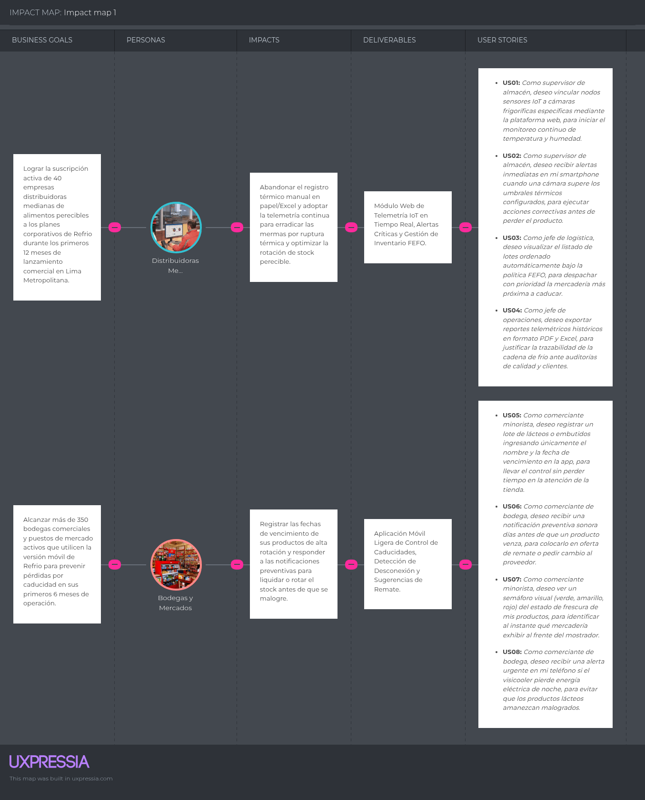

# Capítulo III: Requirements Specification

---

### 3.1. User Stories

En esta sección se detallan los requisitos del producto digital Refrio a través de 9 Epics y 50 User Stories (40 funcionales y 10 técnicas). Para cada historia se han definido dos escenarios de aceptación (un flujo principal y un flujo alternativo/excepción).

| Epic / Story ID | Título | Descripción | Criterios de Aceptación | Relacionado con (Epic ID) |
|:---------------:|:------:|:------------|:------------------------|:-------------------------:|
| **EP01** | **Landing Page y Captación** | Funcionalidades del portal web público para presentar la propuesta de valor de Refrio, concientizar sobre el desperdicio alimentario y captar clientes de ambos segmentos. | — | — |
| US01 | Visualización de Hero Section | Como visitante, deseo visualizar la propuesta de valor de Refrio, para comprender rápidamente cómo la telemetría IoT y la política FEFO reducen las mermas. | **Scenario 1:** Carga inicial   **Given** el visitante ingresa al dominio web   **When** la página carga exitosamente   **Then** el sistema despliega el mensaje principal de Refrio, métricas de impacto nacional y botones de llamada a la acción (CTA).  **Scenario 2:** Clic en CTA principal   **Given** el visitante observa la sección principal   **When** pulsa el botón "Solicitar Demo B2B"   **Then** el sistema redirige fluidamente a la sección del formulario comercial. | EP01 |
| US02 | Visualización de Planes y Tarifas | Como potencial cliente, deseo consultar los planes de suscripción (Distribuidoras vs. Bodegas), para evaluar el costo-beneficio del servicio. | **Scenario 1:** Consulta de planes   **Given** el visitante navega por el sitio web   **When** accede a la sección de precios   **Then** el sistema muestra la comparativa entre el Plan Distribuidora (multisede IoT) y el Plan Bodega (móvil accesible).  **Scenario 2:** Selector de periodicidad   **Given** el usuario visualiza los planes   **When** cambia el selector a facturación anual   **Then** el sistema recalcula y muestra las tarifas con el descuento anual aplicado. | EP01 |
| US03 | Formulario de Demostración B2B | Como supervisor de una distribuidora, deseo enviar mis datos corporativos, para solicitar una asesoría técnica y demostración de los sensores IoT. | **Scenario 1:** Envío de solicitud exitoso   **Given** el usuario llena nombre, empresa, RUC, correo y teléfono corporativo   **When** hace clic en "Enviar Solicitud"   **Then** el sistema valida los campos y muestra un mensaje de confirmación de contacto.  **Scenario 2:** Correo corporativo inválido   **Given** el usuario ingresa un correo con formato inválido o vacío   **When** intenta enviar el formulario   **Then** el sistema bloquea el envío y resalta el campo con un aviso de corrección. | EP01 |
| US04 | Visualización de Casos de Éxito y Ahorro | Como visitante, deseo leer testimonios y métricas de merma evitada en comercios peruanos, para confiar en la solidez de la plataforma. | **Scenario 1:** Lectura de métricas de ahorro   **Given** el usuario está en el portal   **When** se desplaza a la sección de impacto   **Then** el sistema exhibe testimonios verificados de almacenes y bodegueros con el porcentaje de pérdidas reducidas.  **Scenario 2:** Rotación interactiva   **Given** el visitante observa los testimonios   **When** pulsa las flechas de navegación   **Then** el carrusel avanza mostrando nuevos casos de estudio del sector alimentos. | EP01 |
| US05 | Acceso a Plataforma Web / Móvil | Como usuario registrado, deseo ingresar a mi portal de gestión correspondiente, para acceder a mis paneles de control. | **Scenario 1:** Redirección a Login   **Given** el usuario está en la Landing Page   **When** presiona el botón "Ingresar"   **Then** el sistema lo redirige a la vista de autenticación unificada.  **Scenario 2:** Sesión persistente   **Given** el usuario cuenta con un token JWT válido almacenado en el navegador   **When** pulsa "Ingresar"   **Then** el sistema lo redirige directamente al dashboard operativo. | EP01 |
| **EP02** | **Autenticación y Gestión de Cuentas** | Administración de identidades, roles de acceso y perfiles comerciales para distribuidoras y bodegas. | — | — |
| US06 | Registro de Distribuidora Mediana | Como administrador logístico, deseo registrar mi empresa en Refrio, para habilitar la administración de cámaras y sensores. | **Scenario 1:** Registro B2B completado   **Given** datos fiscales válidos (RUC, razón social, dirección de almacén central)   **When** el usuario confirma el registro   **Then** el sistema crea la cuenta en estado activo y envía un correo de bienvenida.  **Scenario 2:** RUC existente   **Given** un RUC previamente registrado en la plataforma   **When** se intenta enviar el registro   **Then** el sistema deniega la creación e indica que la empresa ya se encuentra registrada. | EP02 |
| US07 | Registro de Comerciante Minorista (Bodega) | Como dueña de bodega, deseo registrarme con mi número telefónico y nombre comercial, para acceder rápidamente a la versión móvil. | **Scenario 1:** Alta simplificada   **Given** número de teléfono celular y nombre del puesto o bodega   **When** se solicita el código de verificación SMS e ingresa correctamente   **Then** el sistema crea la cuenta con perfil "Minorista".  **Scenario 2:** Código SMS incorrecto   **Given** un código de verificación erróneo   **When** se intenta validar   **Then** el sistema alerta sobre la discrepancia y permite solicitar un nuevo código. | EP02 |
| US08 | Inicio de Sesión Multi-rol | Como usuario de Refrio, deseo iniciar sesión con mis credenciales, para acceder a las herramientas asignadas a mi rol. | **Scenario 1:** Autenticación exitosa   **Given** credenciales de acceso correctas   **When** el usuario presiona "Iniciar Sesión"   **Then** el sistema genera un token de sesión seguro y abre el panel operativo.  **Scenario 2:** Contraseña errónea   **Given** una contraseña incorrecta   **When** se intenta ingresar   **Then** el sistema bloquea el ingreso y muestra un mensaje de credenciales inválidas. | EP02 |
| US09 | Recuperación de Contraseña | Como usuario registrado, deseo recuperar mi clave mediante enlace seguro, para restaurar mi acceso al sistema. | **Scenario 1:** Enlace de restablecimiento   **Given** un correo o teléfono registrado   **When** el usuario solicita el restablecimiento   **Then** el sistema envía un token temporal de recuperación.  **Scenario 2:** Usuario no encontrado   **Given** una cuenta inexistente en el sistema   **When** se pide la recuperación   **Then** el sistema muestra una confirmación genérica por políticas de seguridad sin emitir enlaces. | EP02 |
| US10 | Configuración de Perfil y Almacén | Como jefe de almacén, deseo configurar los datos de mis sedes de almacenamiento, para organizar geográficamente mis cámaras de frío. | **Scenario 1:** Actualización de sede   **Given** el usuario administrador autenticado   **When** añade una nueva sede física con su dirección   **Then** el sistema guarda la sede y la deja disponible para asociar cámaras.  **Scenario 2:** Nombre de sede duplicado   **Given** una sede con nombre idéntico dentro de la misma empresa   **When** se intenta registrar   **Then** el sistema solicita un nombre distintivo. | EP02 |
| **EP03** | **Gestión de Inventario Perecible e Ingreso de Lotes** | Funcionalidades para ingresar, clasificar y parametrizar lotes alimenticios con fechas de caducidad. | — | — |
| US11 | Registro de Categoría de Alimento | Como supervisor de calidad, deseo parametrizar categorías de alimentos (lácteos, carnes, embutidos, frutas), para definir sus rangos térmicos seguros por defecto. | **Scenario 1:** Alta de categoría   **Given** nombre de categoría y umbrales térmicos (ej. Lácteos: 2°C a 6°C)   **When** se guarda la categoría   **Then** el sistema la almacena en el catálogo corporativo.  **Scenario 2:** Rango térmico inconsistente   **Given** un umbral mínimo mayor al umbral máximo   **When** se intenta guardar   **Then** el sistema bloquea la operación por inconsistencia numérica. | EP03 |
| US12 | Alta de Lote Perecible (Batch) | Como operario de almacén, deseo ingresar un nuevo lote de mercadería, para registrar su cantidad, fecha de elaboración y fecha de caducidad. | **Scenario 1:** Lote registrado correctamente   **Given** datos de producto, fecha de vencimiento y unidades ingresadas   **When** se confirma el ingreso   **Then** el sistema genera un identificador único de lote (ej. `LOT-2026-001`) y actualiza el stock.  **Scenario 2:** Fecha de caducidad vencida   **Given** una fecha de vencimiento igual o anterior a la fecha actual   **When** se intenta registrar   **Then** el sistema rechaza el lote indicando que el producto se encuentra expirado. | EP03 |
| US13 | Escaneo Rápido de Caducidad (Móvil) | Como dueña de bodega, deseo registrar la caducidad escaneando el código de barras o tomando una foto al empaque, para no perder tiempo tipeando. | **Scenario 1:** Reconocimiento óptico asistido   **Given** la cámara del celular enfocando el código de barras o fecha   **When** se captura la imagen   **Then** la app prellena el nombre comercial y sugiere la fecha de caducidad detectada.  **Scenario 2:** Falla de lectura   **Given** una etiqueta borrosa o deteriorada   **When** la app no logra procesar la fecha   **Then** abre el teclado numérico para que Rosa ingrese la fecha manualmente en un solo toque. | EP03 |
| US14 | Asignación de Lote a Unidad de Almacenamiento | Como supervisor de almacén, deseo asignar un lote a una cámara frigorífica específica, para iniciar su rastreo ambiental. | **Scenario 1:** Ubicación en cámara asignada   **Given** un lote perecible recién ingresado   **When** se selecciona la Cámara Frigorífica 01   **Then** el sistema vincula el lote a las condiciones térmicas de dicha cámara.  **Scenario 2:** Cámara sin capacidad física   **Given** una cámara frigorífica marcada como llena o en mantenimiento   **When** se intenta asociar el lote   **Then** el sistema emite una advertencia de capacidad. | EP03 |
| US15 | Parametrización de Ventana Crítica de Expiración | Como supervisor logístico, deseo establecer los días de antelación para la alerta de vencimiento por tipo de perecible, para anticipar el despacho oportuno. | **Scenario 1:** Ventana configurada   **Given** una categoría con vida útil corta   **When** se define una ventana crítica de 5 días   **Then** el sistema activa el monitoreo preventivo con dicha anticipación.  **Scenario 2:** Ventana negativa o cero   **Given** un valor menor o igual a cero en días de alerta   **When** se intenta confirmar   **Then** el sistema exige ingresar un valor positivo mínimo de 1 día. | EP03 |
| US16 | Ajuste Manual de Inventario por Daño Físico | Como operario, deseo dar de baja empaques rotos durante la manipulación interna, para mantener cuadrada la existencia física. | **Scenario 1:** Descarte parcial por rotura   **Given** un lote activo   **When** el operario declara 3 unidades mermadas por rotura física   **Then** el sistema descuenta las unidades y registra la causa de la merma.  **Scenario 2:** Descarte superior al saldo   **Given** un lote con saldo de 10 unidades   **When** se intenta descartar 15 unidades   **Then** el sistema impide la transacción por stock insuficiente. | EP03 |
| **EP04** | **Telemetría Térmica e Integración IoT** | Recepción continua de métricas ambientales desde nodos sensores físicos y visualización en tiempo real. | — | — |
| US17 | Vinculación de Nodo Sensor IoT | Como técnico instalador, deseo emparejar un dispositivo sensor a una cámara frigorífica o visicooler, para enlazar el flujo de telemetría. | **Scenario 1:** Emparejamiento exitoso   **Given** el identificador MAC/UUID del dispositivo sensor   **When** se vincula a la Cámara 02   **Then** el sistema confirma la conexión y empieza a recibir señales de latido (heartbeat).  **Scenario 2:** Sensor previamente emparejado   **Given** un sensor asignado a otra unidad activa   **When** se intenta vincular a una nueva cámara sin desvincular   **Then** el sistema notifica el conflicto de asignación. | EP04 |
| US18 | Ingesta y Monitoreo de Temperatura en Vivo | Como jefe de almacén, deseo ver el termómetro digital actualizado en pantalla cada 60 segundos, para verificar el estado de mis cámaras. | **Scenario 1:** Lectura en tiempo real   **Given** un sensor transmitiendo por protocolo MQTT   **When** la plataforma recibe la medición   **Then** actualiza el indicador en el dashboard web sin requerir recargar la página.  **Scenario 2:** Pérdida de señal del sensor   **Given** un sensor que no emite telemetría por más de 10 minutos   **When** vence el temporizador de control   **Then** el sistema marca la unidad en estado "Sin Conexión" y emite una alerta técnica. | EP04 |
| US19 | Configuración de Umbrales Térmicos por Cámara | Como jefe de operaciones, deseo fijar temperaturas mínimas y máximas por cámara, para adecuar la supervisión a carnes congeladas (-18°C) o refrigerados (4°C). | **Scenario 1:** Umbral personalizado   **Given** una cámara para congelados   **When** se establece el rango entre -22°C y -15°C   **Then** el sistema adopta estos parámetros para la evaluación de alertas térmicas.  **Scenario 2:** Límite térmico invertido   **Given** un límite inferior mayor al superior   **When** se intenta guardar la configuración   **Then** el sistema valida y rechaza la entrada. | EP04 |
| US20 | Historial Gráfico de Telemetría | Como supervisor de calidad, deseo consultar la curva de temperatura de las últimas 24 horas, para detectar oscilaciones térmicas durante la noche. | **Scenario 1:** Despliegue de gráfico temporal   **Given** una cámara seleccionada   **When** se consulta el rango de 24 horas   **Then** el sistema grafica las fluctuaciones térmicas continuas indicando la zona segura.  **Scenario 2:** Sin mediciones en el intervalo   **Given** un intervalo donde la cámara estuvo apagada o desvinculada   **When** se consulta la gráfica   **Then** el sistema muestra una línea discontinua señalando el periodo sin datos. | EP04 |
| US21 | Calibración de Sensores Térmicos | Como administrador de mantenimiento, deseo aplicar un factor de corrección (+/- °C) a un sensor, para corregir ligeras descalibraciones físicas certificadas. | **Scenario 1:** Calibración aplicada   **Given** un certificado de termometría que exige un offset de -0.3°C   **When** se guarda el offset en el perfil del sensor   **Then** las lecturas subsiguientes procesan automáticamente el factor de corrección.  **Scenario 2:** Desviación absurda   **Given** un intento de calibración superior a +/- 5°C   **When** se intenta confirmar   **Then** el sistema advierte que el sensor debe ser reemplazado físicamente y bloquea el ajuste. | EP04 |
| US22 | Detección de Desconexión Nocturna en Bodegas | Como comerciante de bodega, deseo que la app detecte si mi visicooler dejó de enfriar o se cortó la energía de noche, para reaccionar antes del amanecer. | **Scenario 1:** Detección de corte de suministro   **Given** el sensor de la vitrina deja de emitir o sube rápidamente de temperatura   **When** transcurren 15 minutos fuera de rango   **Then** la plataforma envía una notificación sonora urgente al teléfono móvil del bodeguero.  **Scenario 2:** Normalización de energía   **Given** una alerta disparada por corte de luz   **When** el suministro retorna y la temperatura se restablece   **Then** el sistema envía una notificación de restablecimiento térmico. | EP04 |
| **EP05** | **Motor de Alertas Preventivas y Notificaciones** | Detección automatizada de desviaciones térmicas y avisos de caducidad próxima vía multicanal. | — | — |
| US23 | Alerta Crítica por Ruptura Térmica (Cold Breach) | Como supervisor de almacén, deseo recibir un mensaje urgente si una cámara excede la temperatura crítica, para activar el compresor de respaldo. | **Scenario 1:** Disparo de alerta crítica   **Given** una cámara que sube a 9°C (límite: 5°C) durante 15 minutos continuos   **When** el motor de reglas procesa la violación térmica   **Then** el sistema dispara alertas push, correo y SMS a los supervisores de turno.  **Scenario 2:** Fluctuación transitoria por apertura de puertas   **Given** un alza de temperatura que retorna a la normalidad antes de los 5 minutos de tolerancia   **When** se evalúa el evento   **Then** el sistema no dispara alarma general pero anota un aviso de oscilación temporal. | EP05 |
| US24 | Notificación de Lotes Próximos a Vencer | Como jefe logístico, deseo recibir una lista diaria de lotes que entraron a su ventana crítica de vencimiento, para priorizar su colocación. | **Scenario 1:** Notificación matutina de caducidad   **Given** la existencia de 3 lotes cuya fecha de caducidad expira en menos de 72 horas   **When** corre el proceso de medianoche   **Then** el sistema envía un resumen consolidado de productos por vencer al correo y móvil del usuario.  **Scenario 2:** Sin productos en riesgo   **Given** ningún producto dentro del periodo crítico de vencimiento   **When** corre la rutina de verificación   **Then** el sistema actualiza el estado general a "Stock Seguro" sin saturar con mensajes innecesarios. | EP05 |
| US25 | Alerta Sonora en Teléfono Móvil de Bodega | Como dueña de bodega, deseo escuchar una alarma característica en mi celular cuando un producto lácteo está por expirar, para no olvidarme de revisarlo. | **Scenario 1:** Reproducción de sonido de alerta   **Given** un lote de yogures a 2 días de vencer   **When** se abre la app de Refrio   **Then** suena una campana preventiva y se despliega una tarjeta de aviso en primer plano.  **Scenario 2:** Modo no molestar en descanso   **Given** el horario de descanso nocturno del bodeguero   **When** se detecta una alerta de caducidad (no crítica)   **Then** el sistema encola la notificación para mostrarla a las 7:00 a.m. al iniciar la jornada. | EP05 |
| US26 | Configuración de Canales de Notificación | Como supervisor, deseo elegir si recibir alertas por WhatsApp, correo electrónico o notificación push, para utilizar el canal más accesible en planta. | **Scenario 1:** Selección de WhatsApp   **Given** el panel de configuración de alertas   **When** el usuario activa la casilla "WhatsApp" y valida su número corporativo   **Then** las notificaciones de emergencia se dirigen a dicho número.  **Scenario 2:** Desactivación de canal principal   **Given** el perfil de notificaciones   **When** el usuario intenta desactivar todos los canales disponibles   **Then** el sistema impide el guardado exigiendo conservar al menos un canal crítico habilitado. | EP05 |
| US27 | Confirmación y Cierre de Alerta | Como operario de almacén, deseo marcar una alerta como "Atendida" indicando la causa, para que el equipo sepa que la incidencia fue gestionada. | **Scenario 1:** Cierre de incidente   **Given** una alerta activa en el panel de control   **When** el operario pulsa "Atender", ingresa la acción realizada (ej. "Reinicio de compresor") y confirma   **Then** el sistema detiene el escalamiento y pasa la alerta a estado resuelto.  **Scenario 2:** Intento de cerrar sin justificativo   **Given** una alerta crítica de frío   **When** el operario intenta cerrarla dejando el comentario en blanco   **Then** el sistema exige una breve descripción de la acción correctiva efectuada. | EP05 |
| US28 | Escalamiento Automático de Incidentes Térmicos | Como gerente de operaciones, deseo que una alerta térmica no atendida en 20 minutos se escale a mi teléfono, para intervenir antes de que se pierda la mercadería. | **Scenario 1:** Escalamiento jerárquico   **Given** una alerta no atendida por el supervisor en 20 minutos   **When** se vence el plazo   **Then** el sistema envía la notificación urgente al siguiente nivel jerárquico.  **Scenario 2:** Incidencia ya atendida   **Given** una alerta resuelta a los 10 minutos por el supervisor   **When** se cumple la ventana de escalamiento   **Then** el sistema anula el escalamiento automático. | EP05 |
| **EP06** | **Despacho y Rotación Inteligente (Política FEFO)** | Algoritmo y vistas para guiar la extracción física de mercadería maximizando la frescura y reduciendo el rezago. | — | — |
| US29 | Visualización de Inventario Ordenado por FEFO | Como jefe de almacén, deseo consultar mi stock ordenado rigurosamente por fecha de caducidad ascendente, para saber qué lotes despachar primero. | **Scenario 1:** Listado ordenado automáticamente   **Given** múltiples lotes de leche fresca de diferentes ingresos   **When** el usuario entra a la vista de inventario   **Then** los lotes con fecha de expiración más inmediata se muestran en las primeras filas.  **Scenario 2:** Filtrado por categoría perecible   **Given** la lista general de inventario   **When** se aplica el filtro por la categoría "Embutidos"   **Then** la vista reordena exclusivamente los productos cárnicos respetando la prioridad FEFO. | EP06 |
| US30 | Generación de Lista de Picking Sugerida | Como operario de despacho, deseo generar una hoja de recolección de pedidos según política FEFO, para retirar los pallets correctos en la cámara. | **Scenario 1:** Generación de hoja de picking   **Given** un pedido de venta de 50 cajas de mantequilla   **When** se solicita armar la orden   **Then** el sistema selecciona automáticamente los lotes más próximos a vencer e indica su ubicación física exacta.  **Scenario 2:** Stock insuficiente en lote primario   **Given** un lote próximo a vencer que solo cubre 30 cajas   **When** se genera el picking   **Then** el sistema toma las 30 cajas del primer lote y completa las 20 restantes del siguiente lote FEFO en la secuencia. | EP06 |
| US31 | Semáforo Visual de Frescura para Bodegas | Como comerciante minorista, deseo ver mis productos clasificados en color verde, amarillo y rojo en la app, para saber qué exhibir primero en el mostrador. | **Scenario 1:** Código de color intuitivo   **Given** la pantalla de inicio de la app de bodega   **When** carga el listado de productos   **Then** los productos a vencer en 3 días se marcan en rojo, en una semana en amarillo, y con amplia vigencia en verde.  **Scenario 2:** Consulta de producto crítico   **Given** un producto marcado con semáforo rojo   **When** la bodeguera toca sobre el producto   **Then** la app muestra cuántos empaques le quedan y sugiere colocar una rebaja o cartel de oferta. | EP06 |
| US32 | Registro de Oferta de Remate Rápido | Como comerciante de bodega, deseo marcar un producto en "Oferta de Remate", para acelerar su salida antes de la fecha límite. | **Scenario 1:** Aplicación de precio de remate   **Given** un lote de yogur en semáforo rojo   **When** el bodeguero selecciona "Poner en Remate" y define el nuevo precio sugerido   **Then** el sistema actualiza el estado y resalta la promoción en el panel local.  **Scenario 2:** Caducidad cumplida   **Given** un producto que ya superó la fecha de caducidad   **When** se intenta poner en remate   **Then** el sistema impide la acción indicando que el producto debe pasar a disposición de descarte/merma. | EP06 |
| US33 | Validación de Lote en Despacho mediante Escaneo | Como operario de andén, deseo escanear el código del pallet antes de cargarlo al camión, para asegurar que no se despache un lote rezagado por equivocación. | **Scenario 1:** Validación correcta de lote   **Given** la lista de picking emitida   **When** el operario escanea el código del pallet asignado por FEFO   **Then** la terminal móvil muestra un visto bueno verde y descuenta el producto del inventario activo.  **Scenario 2:** Escaneo de pallet incorrecto   **Given** una orden que requiere el lote A   **When** el operario escanea por descuido el lote B (más nuevo)   **Then** el sistema emite una vibración de alerta bloqueando la salida y exigiendo escanear el lote correspondiente según FEFO. | EP06 |
| **EP07** | **Trazabilidad de Cadena de Frío y Auditoría** | Registro inalterable del ciclo térmico de los alimentos y generación de certificados para clientes de distribución. | — | — |
| US34 | Hoja de Ruta Térmica de Lote Despachado | Como supervisor de distribución, deseo emitir un reporte de trazabilidad térmica para un lote despachado, para certificar al supermercado cliente que no hubo quiebre de frío. | **Scenario 1:** Consulta de historial térmico de lote   **Given** un lote completado para entrega   **When** se consulta su trazabilidad   **Then** el sistema consolida las mediciones térmicas registradas durante toda su estancia en cámara frigorífica.  **Scenario 2:** Lote con incidencia térmica previa   **Given** un lote que sufrió una fluctuación registrada   **When** se revisa su trazabilidad   **Then** el sistema reporta la duración exacta de la anomalía y el dictamen técnico de calidad asignado. | EP07 |
| US35 | Exportación de Certificado de Frío en PDF | Como jefe logístico, deseo descargar un certificado en PDF con firma digital de la empresa, para adjuntarlo a la guía de remisión física del transporte. | **Scenario 1:** Generación exitosa de certificado en PDF   **Given** una orden de despacho confirmada   **When** el usuario presiona "Exportar Certificado de Cadena de Frío"   **Then** el sistema genera un archivo PDF formal con gráficas térmicas, fechas de ingreso, caducidad y código de validación QR.  **Scenario 2:** Despacho no completado   **Given** una orden aún en preparación en andén   **When** se intenta emitir el certificado final   **Then** el sistema inhabilita la opción hasta que se valide la carga completa. | EP07 |
| US36 | Consulta Pública de Cadena de Frío mediante QR | Como cliente receptor (supermercado o tienda), deseo escanear el código QR impreso en la guía de entrega, para verificar en mi celular que la mercadería recibida estuvo debidamente refrigerada. | **Scenario 1:** Validación web pública exitosa   **Given** el escaneo del QR desde un smartphone   **When** se abre el enlace público seguro   **Then** la página web muestra la empresa distribuidora, datos del lote y el semáforo de cumplimiento térmico certificado.  **Scenario 2:** Código QR manipulado o inexistente   **Given** un enlace no registrado en el servidor de Refrio   **When** el receptor ingresa   **Then** la plataforma despliega una advertencia indicando que el certificado no es auténtico. | EP07 |
| US37 | Registro Formal de Merma Justificada | Como supervisor de calidad, deseo ingresar la merma inevitable por caducidad o ruptura de frío con su causa raíz, para mantener la contabilidad técnica saneada. | **Scenario 1:** Declaración de merma formal   **Given** un lote descompuesto por falla de refrigeración prolongada   **When** se marca como "Descarte / Merma" indicando el volumen en kilogramos o unidades   **Then** el sistema retira el stock y cataloga el costo financiero en la cuenta de mermas del mes.  **Scenario 2:** Declaración sin causa raíz   **Given** el formulario de descarte de mercadería   **When** se omite tipificar la causa (vencimiento, corte de luz, daño mecánico)   **Then** el sistema exige la selección de la causa antes de procesar la baja. | EP07 |
| **EP08** | **Analítica de Negocio y Reportes de Impacto** | Dashboards ejecutivos para visualizar mermas evitadas, costos ahorrados y métricas de desempeño logístico. | — | — |
| US38 | Dashboard Ejecutivo de Mermas Evitadas | Como gerente de operaciones de la distribuidora, deseo visualizar el ahorro económico generado por el algoritmo FEFO, para medir el ROI de la suscripción de Refrio. | **Scenario 1:** Despliegue de métricas de ahorro   **Given** el inicio de sesión en la consola gerencial   **When** se visualiza el periodo mensual   **Then** el sistema calcula en soles y porcentaje la reducción de desperdicio en comparación con el histórico manual anterior.  **Scenario 2:** Filtrado multisede   **Given** la existencia de múltiples almacenes en Lima y provincias   **When** el gerente filtra por la sede "San Juan de Lurigancho"   **Then** los gráficos se recalculan en tiempo real reflejando el rendimiento de esa sede particular. | EP08 |
| US39 | Resumen Simplificado de Ganancia Ahorrada para Bodegas | Como dueña de bodega, deseo ver al final del mes cuánta plata salvé gracias a las alertas de vencimiento, para valorar el impacto directo en mi economía. | **Scenario 1:** Pantalla de balance mensual   **Given** el cierre de mes en la app móvil   **When** Rosa ingresa a la pestaña "Mis Ahorros"   **Then** la pantalla exhibe un mensaje claro (ej. "¡Este mes salvaste S/ 280 en mercadería evitando que venza en tu estante!").  **Scenario 2:** Mes sin productos en riesgo   **Given** un mes donde no se registraron avisos críticos   **When** se revisa el panel   **Then** la app felicita a la comerciante por mantener un stock 100% rotado a tiempo. | EP08 |
| US40 | Exportación de Data Histórica en Excel/CSV | Como analista de cadena de suministro, deseo exportar las lecturas de telemetría y registros de lotes de los últimos 6 meses, para elaborar modelos predictivos propios. | **Scenario 1:** Descarga de dataset procesado   **Given** un intervalo temporal seleccionado   **When** el analista pulsa "Descargar CSV"   **Then** el sistema compila las lecturas horarias y entrega el archivo estructurado listo para análisis en hojas de cálculo.  **Scenario 2:** Descarga volumétrica pesada   **Given** una consulta que abarca más de 50,000 registros de telemetría   **When** se solicita la descarga   **Then** el sistema procesa la exportación en segundo plano y envía un enlace temporal de descarga segura al correo del solicitante. | EP08 |
| **EP09** | **Refrio Core API & IoT Services (Technical Stories)** | Endpoints de backend, consumidores de colas de telemetría y servicios de integración para hardware y frontend. | — | — |
| **TS01** | Endpoint de Autenticación y Emisión de JWT | **Como** desarrollador backend, **Quiero** implementar el endpoint `POST /api/v1/auth/sign-in` utilizando JSON Web Tokens (JWT) y Refresh Tokens con expiración segura, **Para** controlar el acceso autenticado y la autorización basada en roles (Roles: Supervisor, Operario, Minorista). | **Scenario 1:** Autenticación exitosa. **Given** un JSON con email/teléfono y clave correcta, **When** se realiza la petición POST a `/api/v1/auth/sign-in`, **Then** el servicio retorna HTTP 200 con el token de acceso, tiempo de expiración y claims del rol asignado.  **Scenario 2:** Credenciales erróneas. **Given** una contraseña inválida, **When** se despacha la petición POST, **Then** el sistema retorna HTTP 401 Unauthorized y bloquea la sesión tras reiterados intentos. | EP09 |
| **TS02** | Endpoint de Registro Unificado de Cuentas | **Como** desarrollador backend, **Quiero** proveer el endpoint `POST /api/v1/auth/sign-up`, **Para** registrar entidades B2B (Distribuidoras con RUC) y B2C (Bodegueros con teléfono verificado). | **Scenario 1:** Registro de distribuidora válido. **Given** un payload corporativo con RUC de 11 dígitos y razón social válida, **When** se invoca el POST a `/api/v1/auth/sign-up`, **Then** persiste la entidad en la base de datos relacional y retorna HTTP 201 Created.  **Scenario 2:** Identificador fiscal repetido. **Given** un RUC previamente almacenado, **When** se envía el POST, **Then** retorna HTTP 409 Conflict impidiendo la duplicidad. | EP09 |
| **TS03** | Endpoint de Gestión de Inventario de Lotes | **Como** desarrollador backend, **Quiero** exponer los métodos `POST /api/v1/inventory/batches` y `GET /api/v1/inventory/batches`, **Para** crear y consultar lotes alimenticios con sus fechas críticas de expiración. | **Scenario 1:** Creación de lote exitosa. **Given** los parámetros (ProductCode, ExpirationDate, BatchQuantity, StorageUnitId), **When** se ejecuta el POST a `/api/v1/inventory/batches`, **Then** el servidor calcula el estado inicial del lote y retorna HTTP 201 con el recurso creado.  **Scenario 2:** Parámetros de caducidad ilógicos. **Given** una fecha de expiración menor a la fecha de producción, **When** se envía el payload, **Then** el servidor retorna HTTP 400 Bad Request detallando el error de validación. | EP09 |
| **TS04** | Algoritmo y Endpoint de Priorización FEFO | **Como** desarrollador backend, **Quiero** implementar el endpoint `GET /api/v1/inventory/fefo-picking-plan`, **Para** entregar la lista de extracción óptima ordenada por caducidad ascendente. | **Scenario 1:** Obtención de plan de extracción. **Given** una solicitud que requiere una cantidad objetivo de producto perecible, **When** se llama al endpoint GET indicando el identificador del producto, **Then** el algoritmo retorna HTTP 200 con el arreglo de lotes y ubicaciones físicas ordenados de menor a mayor vida útil remanente.  **Scenario 2:** Stock global insuficiente. **Given** una solicitud que supera la suma total de stock disponible en todos los lotes, **When** se procesa la consulta, **Then** retorna HTTP 422 Unprocessable Entity indicando quiebre de inventario. | EP09 |
| **TS05** | Ingesta Telemétrica vía Broker MQTT / HTTP Gateway | **Como** desarrollador backend, **Quiero** desplegar un Worker de suscripción MQTT y un endpoint espejo `POST /api/v1/telemetry/ingest`, **Para** persistir las lecturas de temperatura y humedad enviadas por los nodos sensores IoT. | **Scenario 1:** Ingesta de lectura normal. **Given** un payload JSON telemétrico con MacAddress, Temperature, Humidity y Timestamp, **When** el dato ingresa por la cola de telemetría, **Then** el Worker almacena la serie temporal en la base de datos y retorna HTTP 202 Accepted.  **Scenario 2:** Detección de lectura fuera de escala física. **Given** una lectura corrupta con temperatura superior a 80°C o inferior a -50°C en cámara convencional, **When** ingresa el payload, **Then** el servicio lo marca como valor anómalo/sensor fallido y no corrompe los cálculos históricos. | EP09 |
| **TS06** | Pipeline de Detección de Desviación Térmica (Cold Breach) | **Como** desarrollador backend, **Quiero** implementar un procesador en segundo plano que evalúe las lecturas telemétricas contra los umbrales configurados, **Para** detectar rupturas en la cadena de frío y gatillar eventos en el sistema. | **Scenario 1:** Disparo de infracción térmica. **Given** una lectura telemétrica que excede el umbral máximo durante el periodo de gracia configurado, **When** el pipeline procesa la regla, **Then** emite el Domain Event `DesviacionTermicaDetectada` y lo publica en el bus de eventos interno.  **Scenario 2:** Oscilación dentro de tolerancia temporal. **Given** una lectura que sube puntualmente pero recupera su nivel seguro en la siguiente medición, **When** el procesador evalúa la tendencia, **Then** descarta la alerta general manteniendo el log preventivo. | EP09 |
| **TS07** | Servicio de Notificaciones Multicanal (WhatsApp, SMS, Push) | **Como** desarrollador backend, **Quiero** integrar clientes de pasarelas de comunicación (WhatsApp Cloud API / Firebase Cloud Messaging), **Para** despachar alertas urgentes directamente a los dispositivos móviles de los responsables. | **Scenario 1:** Envío de notificación crítica exitoso. **Given** un evento `AlertaTermicaGenerada`, **When** el consumidor de notificaciones lo toma, **Then** envía el payload formateado al webhook de WhatsApp/FCM y retorna confirmación de entrega.  **Scenario 2:** Falla de red en pasarela externa. **Given** indisponibilidad temporal en el servicio de WhatsApp, **When** el despachador detecta un error de red, **Then** aplica una política de reintentos con retroceso exponencial (exponential backoff) y conmuta al canal secundario SMS. | EP09 |
| **TS08** | Endpoint Público de Certificado de Trazabilidad | **Como** desarrollador backend, **Quiero** construir el endpoint público `GET /api/v1/public/cold-chain-certificates/{certificateToken}`, **Para** que cualquier receptor de mercadería consulte el estado de la cadena de frío sin requerir autenticación. | **Scenario 1:** Certificado válido. **Given** un token de certificado existente y no manipulado, **When** se realiza la consulta pública GET, **Then** el servidor retorna HTTP 200 con la información agregada: cumplimiento de temperatura, lote, fechas y validez institucional.  **Scenario 2:** Certificado inexistente o alterado. **Given** un token apócrifo o no registrado en la base de datos, **When** se ejecuta la consulta, **Then** retorna HTTP 404 Not Found con mensaje explicativo. | EP09 |
| **TS09** | Endpoints para Dashboards Analíticos y KPIs de Merma | **Como** desarrollador backend, **Quiero** proveer los endpoints agregados `GET /api/v1/analytics/shrinkage-summary` y `GET /api/v1/analytics/fefo-efficiency`, **Para** alimentar los gráficos de control gerencial con cómputos precalculados. | **Scenario 1:** Consulta agregada de KPIs. **Given** filtros de mes y sede de almacenamiento, **When** se ejecuta la llamada GET, **Then** el endpoint retorna HTTP 200 con métricas consolidadas (soles ahorrados, kilos salvados, índice de rotación a tiempo).  **Scenario 2:** Periodo sin registros operativos. **Given** un rango de fechas nuevo sin despachos registrados, **When** se efectúa la consulta, **Then** retorna HTTP 200 con valores en cero e indicadores neutros. | EP09 |
| **TS10** | Microservicio / Rutina Cron de Auditoría Diaria de Caducidades | **Como** desarrollador backend, **Quiero** configurar un trabajo programado (Cron Job) que se ejecute diariamente a la medianoche, **Para** evaluar las fechas de expiración de todo el inventario activo y marcar lotes en estado crítico. | **Scenario 1:** Identificación automática de lotes en riesgo. **Given** la ejecución de la tarea programada a las 00:00 horas, **When** el script evalúa los lotes contra la fecha actual, **Then** actualiza el estado de los lotes cuya vida útil entra a la ventana crítica y despacha el evento consolidado de caducidad.  **Scenario 2:** Ejecución sin lotes por vencer. **Given** que ningún lote se encuentra dentro de su ventana de caducidad, **When** corre la rutina de inspección nocturna, **Then** registra la auditoría como completada con cero incidencias en los logs del sistema. | EP09 |

## 3.2. Impact Mapping

En esta sección se presenta el Impact Mapping elaborado para el modelo de negocio digital de Refrio. Este artefacto nos permite alinear visualmente nuestros objetivos estratégicos de negocio con las necesidades de nuestros User Personas y los entregables de software, asegurando que cada funcionalidad construida (User Story) tenga un propósito claro y medible en la mitigación del desperdicio alimentario y la preservación de la cadena de frío en el Perú.

El Impact Mapping elaborado para Refrio ilustra de manera estratégica cómo las funcionalidades de nuestra plataforma tecnológica contribuyen directamente a alcanzar nuestros objetivos de reducción de mermas y adopción en el mercado. Para esta fase del proyecto, hemos definido dos objetivos SMART (Business Goals) enfocados tanto en la adopción empresarial B2B (distribuidoras medianas) como en la penetración en el comercio minorista B2C (bodegas y puestos de abasto).

**Alineación del Business Goal 1 (Adopción B2B - Distribuidoras Medianas):**
Nuestro primer objetivo de negocio busca lograr la suscripción activa de 40 empresas distribuidoras medianas de alimentos perecibles en el plazo de 12 meses en Lima Metropolitana y principales ciudades logísticas. Para alcanzar esta meta comercial, el actor fundamental es Javier Mendoza (Jefe de Almacén y Operaciones Frigoríficas).
* En el caso de los supervisores y jefes de almacén, el impacto conductual que necesitamos generar es que abandonen el control manual en papel y las planillas de Excel desarticuladas, adoptando la telemetría continua para erradicar las mermas por ruptura térmica y optimizar la rotación de stock perecible.
* Como startup de software, provocaremos este impacto implementando el *Módulo Web de Telemetría IoT en Tiempo Real, Alertas Críticas y Gestión de Inventario FEFO* (Deliverable). Este entregable se materializa en historias de usuario clave para vincular sensores a cámaras frigoríficas, ingestar y visualizar telemetría en vivo, recibir alertas automáticas por ruptura térmica y generar planes de picking según caducidad para auditorías de calidad (US12, US14, US18, US23, US29, US30, US35).

**Alineación del Business Goal 2 (Alcance B2C / Minorista - Bodegas de Barrio):**
El segundo objetivo tiene como meta alcanzar más de 350 bodegas comerciales y puestos de mercado de abastos activos que utilicen la versión móvil de Refrio en sus primeros 6 meses de operación. La persona representativa de este segmento es Rosa Huamán (Propietaria de Bodega Comercial).
* Para lograr este volumen de adopción, el impacto necesario es que la comerciante adquiera el hábito de registrar con facilidad las fechas de caducidad de sus productos de alta rotación y actúe de inmediato frente a las notificaciones preventivas, liquidando o rotando la mercadería antes de su descomposición.
* El entregable provisto para viabilizar este comportamiento es la *Aplicación Móvil Ligera de Control de Caducidades, Detección de Desconexión y Sugerencias de Remate* (Deliverable). Este módulo se traduce en User Stories intuitivas diseñadas para registrar productos en pocos toques, recibir alarmas sonoras preventivas ante bajas de tensión eléctrica o alza de calor nocturno, y consultar un semáforo visual de frescura que guíe las ventas en mostrador (US07, US13, US22, US25, US31, US32, US39).

En conclusión, este mapa confirma que ninguna historia de usuario de Refrio ha sido concebida de forma aislada; cada requerimiento técnico y funcional constituye el soporte directo de una cadena de valor orientada a salvaguardar los alimentos perecibles, reducir costos operativos y asegurar el retorno de inversión para nuestros clientes y nuestra organización.

## 3.3. Product Backlog

En esta sección se presenta el Product Backlog del proyecto Refrio, el cual consolida y prioriza todas las historias de usuario y tareas técnicas necesarias para construir la solución integral.

El orden de los elementos ha sido rigurosamente determinado por el valor para el negocio, asegurando que los entregables con mayor impacto en la captación comercial y la funcionalidad *core* de resguardo de cadena de frío e inventario FEFO se desarrollen de manera prioritaria. Por consiguiente, las historias vinculadas con el portal web público (Landing Page) encabezan el backlog para iniciar el proceso de validación y captación desde el Sprint 1, mientras que los módulos analíticos avanzados, configuraciones secundarias y optimizaciones de exportación se abordan en los sprints posteriores.

| # Orden | User Story ID | Título | Story Points | Sprint Asignado | Status |
|:---:|:---:|:---|:---:|:---:|:---:|
| 1 | US01 | Visualización de Hero Section | 2 | Sprint 1 | Done |
| 2 | US02 | Visualización de Planes y Tarifas | 3 | Sprint 1 | Done |
| 3 | US03 | Formulario de Demostración B2B | 3 | Sprint 1 | Done |
| 4 | US04 | Visualización de Casos de Éxito y Ahorro | 2 | Sprint 1 | Done |
| 5 | US05 | Acceso a Plataforma Web / Móvil | 1 | Sprint 1 | Done |
| 6 | TS01 | Endpoint de Autenticación y Emisión de JWT | 3 | Sprint 1 | In Progress |
| 7 | TS02 | Endpoint de Registro Unificado de Cuentas | 3 | Sprint 1 | In Progress |
| 8 | US08 | Inicio de Sesión Multi-rol | 3 | Sprint 1 | In Progress |
| 9 | US06 | Registro de Distribuidora Mediana | 5 | Sprint 2 | To Do |
| 10 | US07 | Registro de Comerciante Minorista (Bodega) | 5 | Sprint 2 | To Do |
| 11 | US12 | Alta de Lote Perecible (Batch) | 3 | Sprint 2 | To Do |
| 12 | TS03 | Endpoint de Gestión de Inventario de Lotes | 3 | Sprint 2 | To Do |
| 13 | US14 | Asignación de Lote a Unidad de Almacenamiento | 5 | Sprint 2 | To Do |
| 14 | US11 | Registro de Categoría de Alimento | 2 | Sprint 3 | To Do |
| 15 | US17 | Vinculación de Nodo Sensor IoT | 3 | Sprint 3 | To Do |
| 16 | US15 | Parametrización de Ventana Crítica de Expiración | 2 | Sprint 3 | To Do |
| 17 | US16 | Ajuste Manual de Inventario por Daño Físico | 2 | Sprint 3 | To Do |
| 18 | TS05 | Ingesta Telemétrica vía Broker MQTT / HTTP Gateway | 5 | Sprint 3 | To Do |
| 19 | US18 | Ingesta y Monitoreo de Temperatura en Vivo | 5 | Sprint 4 | To Do |
| 20 | US19 | Configuración de Umbrales Térmicos por Cámara | 3 | Sprint 4 | To Do |
| 21 | TS06 | Pipeline de Detección de Desviación Térmica (Cold Breach) | 5 | Sprint 4 | To Do |
| 22 | US23 | Alerta Crítica por Ruptura Térmica (Cold Breach) | 8 | Sprint 4 | To Do |
| 23 | TS07 | Servicio de Notificaciones Multicanal (WhatsApp, SMS, Push) | 5 | Sprint 4 | To Do |
| 24 | US27 | Confirmación y Cierre de Alerta | 3 | Sprint 4 | To Do |
| 25 | US29 | Visualización de Inventario Ordenado por FEFO | 3 | Sprint 5 | To Do |
| 26 | TS04 | Algoritmo y Endpoint de Priorización FEFO | 5 | Sprint 5 | To Do |
| 27 | US30 | Generación de Lista de Picking Sugerida | 5 | Sprint 5 | To Do |
| 28 | US33 | Validación de Lote en Despacho mediante Escaneo | 5 | Sprint 5 | To Do |
| 29 | US13 | Escaneo Rápido de Caducidad (Móvil) | 3 | Sprint 5 | To Do |
| 30 | US31 | Semáforo Visual de Frescura para Bodegas | 3 | Sprint 5 | To Do |
| 31 | US34 | Hoja de Ruta Térmica de Lote Despachado | 5 | Sprint 6 | To Do |
| 32 | TS08 | Endpoint Público de Certificado de Trazabilidad | 5 | Sprint 6 | To Do |
| 33 | US36 | Consulta Pública de Cadena de Frío mediante QR | 3 | Sprint 6 | To Do |
| 34 | US35 | Exportación de Certificado de Frío en PDF | 5 | Sprint 6 | To Do |
| 35 | TS10 | Microservicio / Rutina Cron de Auditoría Diaria de Caducidades | 3 | Sprint 6 | To Do |
| 36 | US24 | Notificación de Lotes Próximos a Vencer | 3 | Sprint 7 | To Do |
| 37 | US25 | Alerta Sonora en Teléfono Móvil de Bodega | 3 | Sprint 7 | To Do |
| 38 | US32 | Registro de Oferta de Remate Rápido | 3 | Sprint 7 | To Do |
| 39 | US22 | Detección de Desconexión Nocturna en Bodegas | 5 | Sprint 7 | To Do |
| 40 | US26 | Configuración de Canales de Notificación | 3 | Sprint 8 | To Do |
| 41 | US28 | Escalamiento Automático de Incidentes Térmicos | 5 | Sprint 8 | To Do |
| 42 | US37 | Registro Formal de Merma Justificada | 3 | Sprint 8 | To Do |
| 43 | US20 | Historial Gráfico de Telemetría | 5 | Sprint 8 | To Do |
| 44 | US21 | Calibración de Sensores Térmicos | 3 | Sprint 9 | To Do |
| 45 | US09 | Recuperación de Contraseña | 3 | Sprint 9 | To Do |
| 46 | US10 | Configuración de Perfil y Almacén | 3 | Sprint 9 | To Do |
| 47 | US38 | Dashboard Ejecutivo de Mermas Evitadas | 5 | Sprint 10 | To Do |
| 48 | US39 | Resumen Simplificado de Ganancia Ahorrada para Bodegas | 3 | Sprint 10 | To Do |
| 49 | TS09 | Endpoints para Dashboards Analíticos y KPIs de Merma | 5 | Sprint 10 | To Do |
| 50 | US40 | Exportación de Data Histórica en Excel/CSV | 8 | Sprint 10 | To Do |
---
