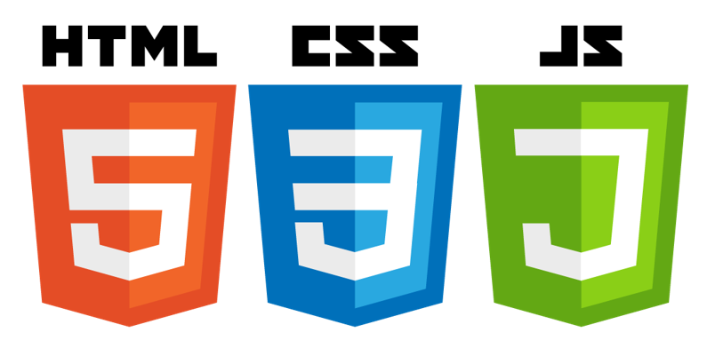

## 5.1.1. Software Development Environment Configuration

Para el desarrollo de Refrio se utilizaron distintas herramientas, cada una con una función específica dentro del proyecto. Estas se organizan según las principales disciplinas de trabajo.

1. Project Management
2. Requirements Management
3. Product UX/UI Design
4. Software Development
5. Software Testing
6. Software Documentation

### Project Management
Esta disciplina permitió organizar tareas, distribuir responsabilidades y hacer seguimiento al avance del proyecto.


### Requirements Management
Esta parte estuvo enfocada en documentar, estructurar y dar seguimiento a los requerimientos del proyecto, asegurando que respondan a las necesidades de los segmentos objetivo.


### Product UX/UI Design
En esta disciplina se trabajó el diseño de la experiencia de usuario y de la interfaz de la plataforma, especialmente en funciones relacionadas con inventario, trazabilidad y monitoreo de productos perecibles.

1. **UXPressia**: Herramienta utilizada para elaborar User Personas, Empathy Maps y Customer Journey Maps de los segmentos objetivo del proyecto.
   Ruta de referencia: https://uxpressia.com/
<p align="center">
  
</p>

2. **Figma**: Herramienta de diseño colaborativo utilizada para crear wireframes, mockups y propuestas visuales de Refrio.
   Ruta de referencia: https://www.figma.com/
<p align="center">
  
</p>

3. **Miro**: Pizarra colaborativa empleada para ordenar ideas, analizar hallazgos y desarrollar dinámicas relacionadas con el proceso de diseño.
   Ruta de referencia: https://miro.com/
<p align="center">
  
</p>

4. **Lucidchart**: Herramienta utilizada para la elaboración de diagramas, wireflows y representaciones visuales de la estructura de navegación del proyecto.
   Ruta de referencia: https://www.lucidchart.com/pages/es
<p align="center">
  
</p>

5. **Structurizr**: Herramienta empleada para representar de manera estructurada la arquitectura y organización de componentes del sistema.
   Ruta de referencia: https://structurizr.com/
<p align="center">
  
</p>


### Software Development
Aquí se agrupan las herramientas utilizadas para editar archivos, organizar el proyecto y trabajar el contenido técnico y visual del reporte.

1. **GitHub**: Plataforma utilizada para alojar el repositorio del proyecto, gestionar ramas por capítulo, registrar cambios y mantener el control de versiones del trabajo realizado en Refrio.
   Ruta de referencia: GitHub
<p align="center">
  
</p>

2. **WebStorm**: Entorno de desarrollo utilizado para editar archivos del proyecto, organizar carpetas, manejar recursos visuales y trabajar el contenido del reporte de Refrio.
   Ruta de descarga: https://www.jetbrains.com/webstorm/
<p align="center">
  
</p>

3. **HTML, CSS3 y JavaScript**: Tecnologías fundamentales utilizadas para la estructura, el estilo y la interacción de la Landing Page del proyecto Refrio.
   Referencias:
- **HTML:** https://html.spec.whatwg.org/
- **CSS3:** https://www.w3.org/Style/CSS/
- **JavaScript:** https://developer.mozilla.org/es/docs/Web/JavaScript
<p align="center">
  
</p>


### Software Testing
Esta parte ayudó a revisar que los entregables y componentes trabajados mantuvieran coherencia y funcionaran correctamente dentro del proyecto.

* **Revisión manual de entregables**: Proceso utilizado para verificar la estructura del documento, la navegación entre secciones, la correcta visualización de imágenes, tablas, enlaces internos y componentes del proyecto, asegurando consistencia en los resultados finales.
  Ruta de referencia: No aplica, ya que se trató de una validación manual realizada por el equipo.


### Software Documentation
La documentación permitió organizar y explicar el contenido del proyecto de manera clara, facilitando su comprensión y continuidad.

* **Markdown**: Formato principal utilizado para redactar y estructurar el reporte por capítulos.
  Ruta de referencia: https://www.markdownguide.org/
<p align="center">
  
</p>

## 5.1.2. Source Code Management

En esta sección se establecen los medios y esquemas de organización aplicados para el seguimiento de modificaciones del proyecto Refrio. Para ello, se utiliza GitHub como plataforma de alojamiento del repositorio y como sistema de control de versiones distribuido, lo que permite gestionar cambios, mantener trazabilidad y organizar el trabajo colaborativo mediante ramas.

### Repositorios del Proyecto

| Producto | URL del Repositorio |
|---|-|
| Organización en GitHub | https://github.com/upc-pre-202620-1asi0729-7747-refrio |
| Project Report (Informe) | https://github.com/upc-pre-202620-1asi0729-7747-refrio/refrio-report|
| Landing Page | https://github.com/upc-pre-202620-1asi0729-7747-refrio/refrio-website|


### GitFlow Workflow

En Refrio se aplica un modelo de trabajo basado en GitFlow, adaptado a la organización del Project Report por capítulos. Esta estructura permite desarrollar contenido en paralelo, mantener orden en los cambios y facilitar la integración progresiva del trabajo realizado por el equipo.

**Ramas Principales y de soporte:**

- **main:** Rama principal que contiene la versión estable del proyecto y el historial oficial del repositorio.
- **develop:** Rama de integración en la que se consolidan los avances antes de ser incorporados a la rama principal.
- **Feature branches:** se ramifican de develop y vuelven a fusionarse en develop.

### Conventional Commits

Se aplica la especificación Conventional Commits para los mensajes de commit, siguiendo la estructura:

```text
<type>(optional scope): <description>

[optional body]

[optional footer(s)]
````
### Tipos de Commit

| Tipo | Descripción |
|---|---|
| `feat` | Nueva funcionalidad para el usuario |
| `fix` | Corrección de un bug |
| `docs` | Cambios en documentación |
| `style` | Cambios de formato (espacios, comas, etc.) sin afectar lógica |
| `refactor` | Refactorización de código sin cambiar funcionalidad |
| `perf` | Mejoras de rendimiento |
| `test` | Adición o corrección de pruebas |
| `build` | Cambios en sistema de build o dependencias externas |
| `chore` | Tareas de mantenimiento sin afectar código de producción |

### Ejemplos de Commits

```text
feat(auth): add login validation
fix(ui): correct button alignment issue
docs(readme): update installation instructions
build(config): update project settings
chore(repo): clean project structure
```

**Instrucciones rápidas para vincular WebStorm con GitHub (resumen):**

1. VCS > Enable Version Control Integration (seleccionar Git).
2. Agregar cuenta de GitHub desde Settings.
3. Configurar nombre de usuario y realizar commits.
4. Manage Remotes > pegar URL del repositorio.


## 5.1.3. Source Code Style Guide & Conventions

En esta sección se establecen las convenciones de estilo y nomenclatura adoptadas para los recursos y tecnologías utilizadas en el proyecto Refrio. Estas convenciones permiten mantener orden, coherencia visual y uniformidad en la estructura del reporte, en los archivos del proyecto y en los elementos relacionados con la landing page y los recursos gráficos.

### Referencias de Guías de Estilo Adoptadas

| Lenguaje/Tecnología | Guía de Estilo                                                                       |
|---|--------------------------------------------------------------------------------------|
| Markdown | [Markdown Guide](https://www.markdownguide.org/)                                     |
| HTML/CSS | [Google HTML/CSS Style Guide](https://google.github.io/styleguide/htmlcssguide.html) |
| JavaScript | [Google JavaScript Style Guide](https://google.github.io/styleguide/jsguide.html)    |
| Java | [Google Java Style Guide](https://google.github.io/styleguide/javaguide.html)        |


### Nomenclatura General
Se usará inglés relacionado con la entidad representada, en minúsculas. Ejemplos:

```css 
.inventory-card {}
.shipment-item {} 
.alert-box {} 
.login-form {}
```

### Sangría

Se aplica una sangría de **dos espacios** en archivos HTML, CSS y JavaScript para mantener una estructura legible y uniforme. En el caso de Markdown, se respeta una organización limpia del contenido, utilizando niveles de encabezado, listas y bloques de código de manera consistente.

**Ejemplo HTML:**

```html
<section class="hero-section">
  <div class="hero-content">
    <h1>Refrio</h1>
    <p>Inventory and traceability for perishable products.</p>
  </div>
</section>
```

#### HTML

- Declarar `<!DOCTYPE html>` en la primera línea.
- Utilizar minúsculas para nombres de elementos y atributos.
- Utilizar comillas dobles para valores de atributos: `<div class="container">`
- Incluir atributos `alt` en las imágenes para mejorar la accesibilidad.
- No omitir elementos como `<title>` y meta tags.
- Usar líneas en blanco para separar bloques extensos de código.

**Ejemplo HTML:**

```html
<!DOCTYPE html>
<html lang="en">
  <head>
    <meta charset="UTF-8">
    <meta name="viewport" content="width=device-width, initial-scale=1.0">
    <title>Refrio</title>
  </head>
  <body>
    <header class="hero-section">
      <h1>Refrio</h1>
      <p>Inventory and traceability for perishable products.</p>
    </header>
  </body>
</html>
```
### CSS
- Utilizar shorthand properties cuando sea posible: margin: `10px 20px`;
- Terminar todas las declaraciones con punto y coma.
- Mantener un espacio después de los dos puntos en cada propiedad: color: `#333`;
- Usar nombres de clases en `kebab-case`.
- Organizar las propiedades de manera consistente dentro de cada selector.
- Separar visualmente los bloques de reglas para mejorar la legibilidad.

**Ejemplo CSS:**

```CSS
.hero-section {
  background-color: #3F51B5;
  color: #FFFFFF;
  padding: 24px;
  text-align: center;
}

.feature-card {
  border: 1px solid #BDBDBD;
  margin: 16px;
  padding: 20px;
}
```
### JavaScript

- Utilizar `const` y `let` en lugar de `var`.
- Mantener espacios alrededor de operadores: `const total = a + b`;
- Colocar punto y coma al final de las instrucciones.
- Usar llaves de apertura en la misma línea de la declaración.
- Emplear nombres descriptivos en `camelCase` para variables y funciones.
- Utilizar funciones claras y breves para facilitar la lectura del código.

**Ejemplo JavaScript:**

```JavaScript
const productStatus = "available";

function showInventoryAlert() {
  console.log("Inventory alert active");
}

function calculateTotalItems(currentItems, newItems) {
  return currentItems + newItems;
}
```
### Markdown
- Utilizar encabezados jerárquicos de forma ordenada (`#`, `##`, `###`).
- Mantener una estructura clara por secciones y subsecciones.
- Usar listas y tablas solo cuando aporten claridad al contenido.
- Emplear nombres descriptivos en enlaces internos y anchors.
- Mantener consistencia en títulos, numeración y bloques de código.

**Ejemplo Markdown:**

``` Markdown
## 4.1. Style Guidelines

### 4.1.1. General Style Guidelines

En esta sección se presentan las pautas visuales utilizadas en Refrio.

### 4.1.2. Web Style Guide

Se describen los componentes y elementos visuales empleados en la interfaz web.
```
### Gherkin
- Escribir escenarios en inglés.
  Definir un escenario por comportamiento específico.
- Mantener pasos claros, breves y reutilizables.
- Utilizar la estructura Given, When, Then, And.
- Aplicar una sangría uniforme para mejorar la legibilidad.

**Ejemplo Gherkin:**

``` Gherkin
Feature: Inventory Management

Scenario: Register a new perishable product
Given the user is on the inventory form
When the user enters valid product information
And saves the new record
Then the system should store the product successfully
And the product should appear in the inventory list
```
### 5.1.4. Software Deployment Configuration

El despliegue continuo del sitio web de **Refrio** se gestiona a través de **GitHub Pages**, garantizando alta disponibilidad, conexión segura vía HTTPS y actualización automática ante nuevos cambios. El procedimiento de configuración comprende los siguientes pasos:

1. **Selección del Entorno de Despliegue:**  
   En el repositorio `refrio-website` de la organización `upc-pre-202620-1asi0729-7747-refrio`, se accede a la pestaña **Settings** y se selecciona el apartado **Pages** en el menú lateral de configuración.

2. **Definición de la Fuente de Compilación (Build and deployment):**
    * **Source:** Se configura en la opción `Deploy from a branch`.
    * **Branch:** Se selecciona la rama de producción `main` con el directorio raíz (`/root`) para el servicio de los archivos estáticos (HTML5, CSS3, JavaScript).

3. **Ejecución del Flujo Automatizado:**  
   Al guardar los parámetros, GitHub dispara de forma automática el flujo de trabajo (`pages-build-deployment`) mediante GitHub Actions, compilando los recursos y desplegándolos en el entorno de producción.

4. **Verificación y Enlace de Producción:**  
   Se confirma el despliegue verificando la respuesta exitosa en el dominio público asignado con su respectivo certificado SSL/TLS activo:
    * **URL de despliegue:** [[https://upc-pre-202620-1asi0729-7747-refrio.github.io/refrio-website/][(https://upc-pre-202620-1asi0729-7747-refrio.github.io/refrio-website/)](https://github.com/upc-pre-202620-1asi0729-7747-refrio/refrio-website)](https://github.com/upc-pre-202620-1asi0729-7747-refrio/refrio-website)


## 5.2. Landing Page, Services & Applications Implementation

### 5.2.1. Sprint 1

#### 5.2.1.1. Sprint Planning 1

El Sprint 1 está dedicado exclusivamente a establecer la presencia digital de la startup mediante el diseño, desarrollo y despliegue de la primera versión del Landing Page de Refrio[cite: 1].

| Campo | Detalle |
|:------|:--------|
| **Sprint #** | Sprint 1 |
| **Date** | `2026-09-08` |
| **Time** | `7:00 pm` |
| **Location** | Reunión virtual por Discord / Google Meet |
| **Prepared By** | `Alca Morán, César Alejandro` |
| **Attendees** | Alca Morán, César Alejandro / Centeno León, Adriano Samir / Rivas Méndez, Bernie Aarón / Saavedra Flores, Rodrigo Andree / Tello Lima, Jose Alejandro |
| **Sprint 1 Goal** | Establecer la presencia digital de Refrio mediante el diseño, desarrollo y despliegue de la Landing Page. Comunicaremos claramente nuestra propuesta de valor: erradicar las pérdidas de alimentos perecibles en el Perú mediante el monitoreo telemétrico IoT en tiempo real de la cadena de frío y la gestión inteligente de inventario bajo la política FEFO (*First Expired, First Out*). El éxito se confirmará cuando los visitantes accedan al sitio web en vivo y comprendan la solución técnica, visualicen la comparativa de los planes de suscripción (Básico, Profesional y Empresarial) y puedan remitir solicitudes de demostración técnica corporativa. |
| **Sprint 1 Velocity** | 18 Story Points |
| **Sum of Story Points** | `11` |


#### 5.2.1.2. Aspect Leaders and Collaborators

Para este primer Sprint enfocado en el Landing Page y la configuración inicial de los repositorios y estándares de código abierto, la distribución de liderazgo (L) y colaboración (C) es la siguiente:

| Team Member (Last Name, First Name) | GitHub Username | UI/UX Design (Figma) | Landing Page Layout (HTML/CSS) | Landing Page Interactivity (JS) | DevOps & Deployment |
|:-----------------------------------:|:---------------:|:-------------:|:-------------:|:-------------:|:-------------:|
| Alca Morán, César Alejandro | `almocesar-cell` | L | C | L | C |
| Centeno León, Adriano Samir | `Adri11-dk` | C | L | C | C |
| Rivas Méndez, Bernie Aarón | `Arivas3008` | C | L | L | C |
| Saavedra Flores, Rodrigo Andree | `rodrigoxd67` | C | C | C | L |
| Tello Lima, Jose Alejandro | `j4ndrow` | L | C | L | C |

> **L** = Leader &nbsp;|&nbsp; **C** = Collaborator


#### 5.2.1.3. Sprint Backlog 1

El objetivo principal de este Sprint es contar con un sitio web estático desplegado que presente a Refrio, su propuesta de valor IoT, sus planes tarifarios y sus canales de contacto comercial

| **Sprint 1** | **User Story** | | **Work-Item / Task** | | | | |
|:--------:|---|---|---|---|---|---|---|
| | **ID** | **Título** | **ID** | **Título** | **Descripción** | **Estimación (h)** | **Asignado a** | **Estado** |
| | US01 | Visualización de Hero Section | T01 | Diseñar UI en Figma | Diseñar el Hero section con métricas de merma y llamadas a la acción (CTA). | 4 | Centeno, Adriano | Done |
| | US01 | Visualización de Hero Section | T02 | Maquetar estructura base | Maquetar en HTML5 semántico y CSS3 responsive la cabecera, propuesta y valor visual. | 5 | Alca, César | Done |
| | US02 | Visualización de Planes | T03 | Programar tarificador | Implementar tarjetas de planes (Básico, Pro, Empresarial) y selector mensual/anual con JS. | 4 | Rivas, Bernie | Done |
| | US03 | Formulario de Contacto B2B | T04 | Maquetar y validar formulario | Construir formulario B2B con validación de campos obligatorios (RUC, correo corporativo). | 3 | Tello, Jose | Done |
| | *Task* | Configurar Repositorios | T05 | Setup GitHub y CI/CD | Inicializar repositorio en GitHub, estructurar ramas y automatizar despliegue en GitHub Pages. | 2 | Saavedra, Rodrigo | Done |


#### 5.2.1.4. Development Evidence for Sprint Review

Durante el Sprint 1, el equipo se enfocó en establecer la base técnica de Refrio mediante estándares web modernos: HTML5 semántico para la accesibilidad y CSS3 estructurado bajo la metodología BEM y variables CSS personalizadas con la identidad de marca (azul corporativo, grises de soporte y blanco puro). La interactividad se desarrolló con JavaScript modular para manipular dinámicamente el catálogo de planes y la validación de formularios comerciales.

| Repository | Branch | Commit ID | Commit Message | Commit Message Body | Committed on (Date) |
|:----------:|:------:|:---------:|:--------------:|:-------------------:|:-------------------:|
| `refrio/refrio-landing-page` | `main` | `a3c91d4` | `feat: add hero section and value prop` | `Implemented responsive hero section with main B2B CTA and live metrics` | `2026-09-12` |
| `refrio/refrio-landing-page` | `develop` | `7e2b8f1` | `feat: add pricing tiers table` | `Created interactive pricing cards for Basic, Pro and Enterprise plans` | `2026-09-13` |
| `refrio/refrio-landing-page` | `develop` | `4d18c9a` | `feat: add b2b contact form validation` | `Implemented corporate validation for RUC and business emails` | `2026-09-14` |
| `refrio/refrio-landing-page` | `main` | `5c8e2a0` | `style: apply refrio brand palette` | `Standardized primary blue, clean grays and typography hierarchy` | `2026-09-15` |

---

#### 5.2.1.5. Execution Evidence for Sprint Review

En este primer Sprint se completó el diseño y maquetación de la Landing Page pública de Refrio. La interfaz integra las secciones de "Hero", "Propuesta de Valor IoT & FEFO", "Planes de Suscripción (Básico S/ 59, Profesional S/ 129, Empresarial S/ 249)", "Casos de Éxito y Merma Evitada" y el "Formulario de Contacto B2B", siendo 100% responsiva para pantallas móviles y de escritorio.


#### 5.2.1.6. Services Documentation Evidence for Sprint Review

> *Para el Sprint 1, enfocado estrictamente en la implementación, estilizado y despliegue del Landing Page estático, esta sección no aplica. La documentación formal de los Web Services y endpoints de la API RESTful (controladores de telemetría IoT, inventario FEFO y autenticación JWT) mediante OpenAPI / Swagger se desarrollará e incorporará a partir de los sprints posteriores.*


#### 5.2.1.7. Software Deployment Evidence for Sprint Review

Durante el Sprint 1 se realizó el despliegue exitoso del Landing Page utilizando la plataforma GitHub Pages:
1. Se creó el repositorio oficial `refrio-landing-page` dentro de la organización de GitHub del proyecto.
2. Se configuró el flujo de trabajo local y remoto mediante Git utilizando la convención GitFlow (`main` y `develop`).
3. Se instaló la herramienta y dependencia de empaquetado `gh-pages` para gestionar el pipeline de entrega continua.
4. Se configuró el archivo `vite.config.js` estableciendo la propiedad `base: '/refrio-landing-page/'`.
5. Se agregaron los scripts de automatización `"build": "vite build"` y `"deploy": "gh-pages -d dist"` en el archivo `package.json`.
6. Se ejecutó la compilación de producción mediante el comando `npm run build`, optimizando assets CSS, HTML y bundles de JavaScript.
7. Se ejecutó el despliegue automático hacia la rama de publicación con el comando `npm run deploy`.
8. Se verificó la activación del servicio en GitHub ingresando a `Settings > Pages`.
9. Se seleccionó la rama `gh-pages` como la fuente oficial de despliegue desde la raíz (`/root`).
10. Se comprobó la disponibilidad pública y el rendimiento del sitio web en vivo accediendo a su URL pública generada.


#### 5.2.1.8. Team Collaboration Insights during Sprint

Durante este sprint, la colaboración técnica se gestionó íntegramente a través de la plataforma GitHub. Todo el trabajo individual se desarrolló en ramas de características (`feature/*`), las cuales fueron revisadas mediante Pull Requests (PRs) con aprobación cruzada antes de su integración a la rama `develop` y su posterior pase a `main`.


#### 5.2.1.6. Services Documentation Evidence for Sprint Review

#### 5.2.1.7. Software Deployment Evidence for Sprint Review

#### 5.2.1.8. Team Collaboration Insights during Sprint
