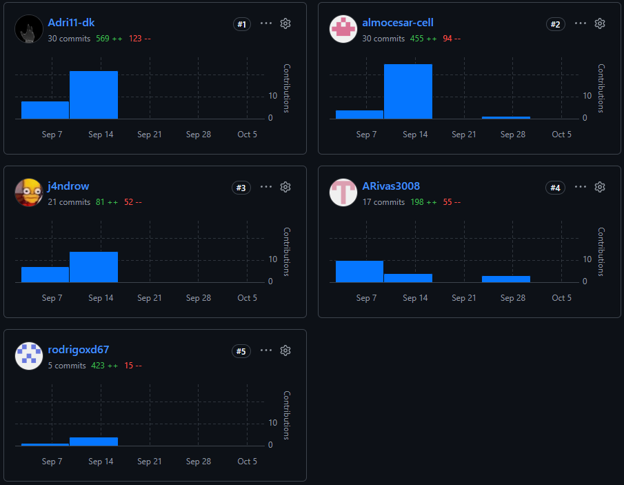

## 5.1.1. Software Development Environment Configuration

Para el desarrollo de Refrio se utilizaron distintas herramientas, cada una con una función específica dentro del proyecto. Estas se organizan según las principales disciplinas de trabajo.

1. Project Management
2. Requirements Management
3. Product UX/UI Design
4. Software Development
5. Software Testing
6. Software Documentation

### Project Management
Esta disciplina permitió organizar tareas, distribuir responsabilidades y hacer seguimiento al avance del proyecto.


### Requirements Management
Esta parte estuvo enfocada en documentar, estructurar y dar seguimiento a los requerimientos del proyecto, asegurando que respondan a las necesidades de los segmentos objetivo.


### Product UX/UI Design
En esta disciplina se trabajó el diseño de la experiencia de usuario y de la interfaz de la plataforma, especialmente en funciones relacionadas con inventario, trazabilidad y monitoreo de productos perecibles.

1. **UXPressia**: Herramienta utilizada para elaborar User Personas, Empathy Maps y Customer Journey Maps de los segmentos objetivo del proyecto.
   Ruta de referencia: https://uxpressia.com/
<p align="center">
  
</p>

2. **Figma**: Herramienta de diseño colaborativo utilizada para crear wireframes, mockups y propuestas visuales de Refrio.
   Ruta de referencia: https://www.figma.com/
<p align="center">
  
</p>

3. **Miro**: Pizarra colaborativa empleada para ordenar ideas, analizar hallazgos y desarrollar dinámicas relacionadas con el proceso de diseño.
   Ruta de referencia: https://miro.com/
<p align="center">
  
</p>

4. **Lucidchart**: Herramienta utilizada para la elaboración de diagramas, wireflows y representaciones visuales de la estructura de navegación del proyecto.
   Ruta de referencia: https://www.lucidchart.com/pages/es
<p align="center">
  
</p>

5. **Structurizr**: Herramienta empleada para representar de manera estructurada la arquitectura y organización de componentes del sistema.
   Ruta de referencia: https://structurizr.com/
<p align="center">
  
</p>


### Software Development
Aquí se agrupan las herramientas utilizadas para editar archivos, organizar el proyecto y trabajar el contenido técnico y visual del reporte.

1. **GitHub**: Plataforma utilizada para alojar el repositorio del proyecto, gestionar ramas por capítulo, registrar cambios y mantener el control de versiones del trabajo realizado en Refrio.
   Ruta de referencia: GitHub
<p align="center">
  
</p>

2. **WebStorm**: Entorno de desarrollo utilizado para editar archivos del proyecto, organizar carpetas, manejar recursos visuales y trabajar el contenido del reporte de Refrio.
   Ruta de descarga: https://www.jetbrains.com/webstorm/
<p align="center">
  
</p>

3. **HTML, CSS3 y JavaScript**: Tecnologías fundamentales utilizadas para la estructura, el estilo y la interacción de la Landing Page del proyecto Refrio.
   Referencias:
- **HTML:** https://html.spec.whatwg.org/
- **CSS3:** https://www.w3.org/Style/CSS/
- **JavaScript:** https://developer.mozilla.org/es/docs/Web/JavaScript
<p align="center">
  
</p>


### Software Testing
Esta parte ayudó a revisar que los entregables y componentes trabajados mantuvieran coherencia y funcionaran correctamente dentro del proyecto.

* **Revisión manual de entregables**: Proceso utilizado para verificar la estructura del documento, la navegación entre secciones, la correcta visualización de imágenes, tablas, enlaces internos y componentes del proyecto, asegurando consistencia en los resultados finales.
  Ruta de referencia: No aplica, ya que se trató de una validación manual realizada por el equipo.


### Software Documentation
La documentación permitió organizar y explicar el contenido del proyecto de manera clara, facilitando su comprensión y continuidad.

* **Markdown**: Formato principal utilizado para redactar y estructurar el reporte por capítulos.
  Ruta de referencia: https://www.markdownguide.org/
<p align="center">
  
</p>

## 5.1.2. Source Code Management

En esta sección se establecen los medios y esquemas de organización aplicados para el seguimiento de modificaciones del proyecto Refrio. Para ello, se utiliza GitHub como plataforma de alojamiento del repositorio y como sistema de control de versiones distribuido, lo que permite gestionar cambios, mantener trazabilidad y organizar el trabajo colaborativo mediante ramas.

### Repositorios del Proyecto

| Producto | URL del Repositorio |
|---|-|
| Organización en GitHub | https://github.com/upc-pre-202620-1asi0729-7747-refrio |
| Project Report (Informe) | https://github.com/upc-pre-202620-1asi0729-7747-refrio/refrio-report|
| Landing Page | https://github.com/upc-pre-202620-1asi0729-7747-refrio/refrio-website|


### GitFlow Workflow

En Refrio se aplica un modelo de trabajo basado en GitFlow, adaptado a la organización del Project Report por capítulos. Esta estructura permite desarrollar contenido en paralelo, mantener orden en los cambios y facilitar la integración progresiva del trabajo realizado por el equipo.

**Ramas Principales y de soporte:**

- **main:** Rama principal que contiene la versión estable del proyecto y el historial oficial del repositorio.
- **develop:** Rama de integración en la que se consolidan los avances antes de ser incorporados a la rama principal.
- **Feature branches:** se ramifican de develop y vuelven a fusionarse en develop.

### Conventional Commits

Se aplica la especificación Conventional Commits para los mensajes de commit, siguiendo la estructura:

```text
<type>(optional scope): <description>

[optional body]

[optional footer(s)]
````
### Tipos de Commit

| Tipo | Descripción |
|---|---|
| `feat` | Nueva funcionalidad para el usuario |
| `fix` | Corrección de un bug |
| `docs` | Cambios en documentación |
| `style` | Cambios de formato (espacios, comas, etc.) sin afectar lógica |
| `refactor` | Refactorización de código sin cambiar funcionalidad |
| `perf` | Mejoras de rendimiento |
| `test` | Adición o corrección de pruebas |
| `build` | Cambios en sistema de build o dependencias externas |
| `chore` | Tareas de mantenimiento sin afectar código de producción |

### Ejemplos de Commits

```text
feat(auth): add login validation
fix(ui): correct button alignment issue
docs(readme): update installation instructions
build(config): update project settings
chore(repo): clean project structure
```

**Instrucciones rápidas para vincular WebStorm con GitHub (resumen):**

1. VCS > Enable Version Control Integration (seleccionar Git).
2. Agregar cuenta de GitHub desde Settings.
3. Configurar nombre de usuario y realizar commits.
4. Manage Remotes > pegar URL del repositorio.


## 5.1.3. Source Code Style Guide & Conventions

En esta sección se establecen las convenciones de estilo y nomenclatura adoptadas para los recursos y tecnologías utilizadas en el proyecto Refrio. Estas convenciones permiten mantener orden, coherencia visual y uniformidad en la estructura del reporte, en los archivos del proyecto y en los elementos relacionados con la landing page y los recursos gráficos.

### Referencias de Guías de Estilo Adoptadas

| Lenguaje/Tecnología | Guía de Estilo                                                                       |
|---|--------------------------------------------------------------------------------------|
| Markdown | [Markdown Guide](https://www.markdownguide.org/)                                     |
| HTML/CSS | [Google HTML/CSS Style Guide](https://google.github.io/styleguide/htmlcssguide.html) |
| JavaScript | [Google JavaScript Style Guide](https://google.github.io/styleguide/jsguide.html)    |
| Java | [Google Java Style Guide](https://google.github.io/styleguide/javaguide.html)        |


### Nomenclatura General
Se usará inglés relacionado con la entidad representada, en minúsculas. Ejemplos:

```css 
.inventory-card {}
.shipment-item {} 
.alert-box {} 
.login-form {}
```

### Sangría

Se aplica una sangría de **dos espacios** en archivos HTML, CSS y JavaScript para mantener una estructura legible y uniforme. En el caso de Markdown, se respeta una organización limpia del contenido, utilizando niveles de encabezado, listas y bloques de código de manera consistente.

**Ejemplo HTML:**

```html
<section class="hero-section">
  <div class="hero-content">
    <h1>Refrio</h1>
    <p>Inventory and traceability for perishable products.</p>
  </div>
</section>
```

#### HTML

- Declarar `<!DOCTYPE html>` en la primera línea.
- Utilizar minúsculas para nombres de elementos y atributos.
- Utilizar comillas dobles para valores de atributos: `<div class="container">`
- Incluir atributos `alt` en las imágenes para mejorar la accesibilidad.
- No omitir elementos como `<title>` y meta tags.
- Usar líneas en blanco para separar bloques extensos de código.

**Ejemplo HTML:**

```html
<!DOCTYPE html>
<html lang="en">
  <head>
    <meta charset="UTF-8">
    <meta name="viewport" content="width=device-width, initial-scale=1.0">
    <title>Refrio</title>
  </head>
  <body>
    <header class="hero-section">
      <h1>Refrio</h1>
      <p>Inventory and traceability for perishable products.</p>
    </header>
  </body>
</html>
```
### CSS
- Utilizar shorthand properties cuando sea posible: margin: `10px 20px`;
- Terminar todas las declaraciones con punto y coma.
- Mantener un espacio después de los dos puntos en cada propiedad: color: `#333`;
- Usar nombres de clases en `kebab-case`.
- Organizar las propiedades de manera consistente dentro de cada selector.
- Separar visualmente los bloques de reglas para mejorar la legibilidad.

**Ejemplo CSS:**

```CSS
.hero-section {
  background-color: #3F51B5;
  color: #FFFFFF;
  padding: 24px;
  text-align: center;
}

.feature-card {
  border: 1px solid #BDBDBD;
  margin: 16px;
  padding: 20px;
}
```
### JavaScript

- Utilizar `const` y `let` en lugar de `var`.
- Mantener espacios alrededor de operadores: `const total = a + b`;
- Colocar punto y coma al final de las instrucciones.
- Usar llaves de apertura en la misma línea de la declaración.
- Emplear nombres descriptivos en `camelCase` para variables y funciones.
- Utilizar funciones claras y breves para facilitar la lectura del código.

**Ejemplo JavaScript:**

```JavaScript
const productStatus = "available";

function showInventoryAlert() {
  console.log("Inventory alert active");
}

function calculateTotalItems(currentItems, newItems) {
  return currentItems + newItems;
}
```
### Markdown
- Utilizar encabezados jerárquicos de forma ordenada (`#`, `##`, `###`).
- Mantener una estructura clara por secciones y subsecciones.
- Usar listas y tablas solo cuando aporten claridad al contenido.
- Emplear nombres descriptivos en enlaces internos y anchors.
- Mantener consistencia en títulos, numeración y bloques de código.

**Ejemplo Markdown:**

``` Markdown
## 4.1. Style Guidelines

### 4.1.1. General Style Guidelines

En esta sección se presentan las pautas visuales utilizadas en Refrio.

### 4.1.2. Web Style Guide

Se describen los componentes y elementos visuales empleados en la interfaz web.
```
### Gherkin
- Escribir escenarios en inglés.
  Definir un escenario por comportamiento específico.
- Mantener pasos claros, breves y reutilizables.
- Utilizar la estructura Given, When, Then, And.
- Aplicar una sangría uniforme para mejorar la legibilidad.

**Ejemplo Gherkin:**

``` Gherkin
Feature: Inventory Management

Scenario: Register a new perishable product
Given the user is on the inventory form
When the user enters valid product information
And saves the new record
Then the system should store the product successfully
And the product should appear in the inventory list
```
### 5.1.4. Software Deployment Configuration

El despliegue continuo del sitio web de Refrio se gestiona a través de GitHub Pages, garantizando alta disponibilidad, conexión segura vía HTTPS y actualización automática ante nuevos cambios validados en el entorno de integración. El procedimiento de configuración comprende los siguientes pasos:

1. **Selección del Entorno de Despliegue:**  
   En el repositorio `refrio-website` de la organización `upc-pre-202620-1asi0729-7747-refrio`, se accede a la pestaña **Settings** y se selecciona el apartado **Pages** en el menú lateral izquierdo.

2. **Definición de la Fuente de Compilación (Build and deployment):**
   * **Source:** Se selecciona la opción `Deploy from a branch`.
   * **Branch:** Se define la rama `develop` con el directorio raíz (`/root`) como fuente activa de publicación para el servicio de los archivos estáticos (HTML5, CSS3, JavaScript).

3. **Ejecución del Flujo Automatizado:**  
   Al registrar los parámetros, GitHub dispara de forma automática el flujo de trabajo (`pages build and deployment`) mediante GitHub Actions cada vez que se integra código a la rama seleccionada, compilando y sirviendo los assets estáticos.

4. **Verificación y Enlace de Producción:**  
   Se confirma el despliegue verificando la respuesta en el dominio público asignado y la activación automática de la directiva `Enforce HTTPS`:
   * **URL de despliegue:** [https://upc-pre-202620-1asi0729-7747-refrio.github.io/refrio-website/](https://upc-pre-202620-1asi0729-7747-refrio.github.io/refrio-website/)


## 5.2. Landing Page, Services & Applications Implementation

### 5.2.1. Sprint 1

#### 5.2.1.1. Sprint Planning 1

El Sprint 1 está dedicado principalmente a establecer la presencia digital de la startup mediante el diseño, desarrollo y despliegue de la primera versión del Landing Page público de Refrio, iniciando concurrentemente la arquitectura base y servicios de identidad del Core API para habilitar las funcionalidades transaccionales del siguiente ciclo.

| Campo | Detalle |
|:---|:---|
| **Sprint #** | Sprint 1 |
| **Date** | `2026-09-08` |
| **Time** | `7:00 pm` |
| **Location** | Reunión virtual por Discord / Google Meet |
| **Prepared By** | `Alca Morán, César Alejandro` |
| **Attendees** | Alca Morán, César Alejandro / Centeno León, Adriano Samir / Rivas Méndez, Bernie Aarón / Saavedra Flores, Rodrigo Andree / Tello Lima, Jose Alejandro |
| **Sprint 1 Goal** | Establecer la presencia digital pública de Refrio mediante el diseño, maquetación y despliegue de su Landing Page responsive (US01 a US05), comunicando la propuesta de valor centrada en erradicar mermas alimentarias mediante IoT y política FEFO, y comenzar la implementación de los servicios base de autenticación y registro de cuentas (TS01, TS02 y US08) requeridos por la arquitectura. |
| **Team Capacity** | 22 Story Points (Capacidad estimada inicial basada en la disponibilidad horaria del equipo) |
| **Committed Story Points** | 20 Story Points (11 SP completados de Landing Page + 9 SP en desarrollo de Identity/Core API) |
| **Completed Story Points** | 11 Story Points (US01, US02, US03, US04, US05 finalizadas y desplegadas al 100%) |
| **In Progress Story Points** | 9 Story Points (TS01, TS02, US08 en progreso activo para cierre en Sprint 2) |
| **Historical Velocity** | N/A (Sprint inicial; establece la línea base empírica de velocidad en 11 SP completados) |


#### 5.2.1.2. Aspect Leaders and Collaborators

Para este primer Sprint enfocado en el Landing Page y la configuración inicial de los repositorios y estándares de código abierto, la distribución de liderazgo (L) y colaboración (C) es la siguiente:

| Team Member (Last Name, First Name) | GitHub Username | UI/UX Design (Figma) | Landing Page Layout (HTML/CSS) | Landing Page Interactivity (JS) | DevOps & Deployment |
|:-----------------------------------:|:---------------:|:-------------:|:-------------:|:-------------:|:-------------:|
| Alca Morán, César Alejandro | `almocesar-cell` | L | C | L | C |
| Centeno León, Adriano Samir | `Adri11-dk` | C | L | C | C |
| Rivas Méndez, Bernie Aarón | `Arivas3008` | C | L | L | C |
| Saavedra Flores, Rodrigo Andree | `rodrigoxd67` | C | C | C | L |
| Tello Lima, Jose Alejandro | `j4ndrow` | L | C | L | C |

> **L** = Leader &nbsp;|&nbsp; **C** = Collaborator


#### 5.2.1.3. Sprint Backlog 1

El Sprint Backlog 1 consolida las tareas técnicas y de desarrollo para el despliegue del Landing Page público (US01-US05) y el inicio de la arquitectura base del módulo de identidad (TS01, TS02, US08):

| **Sprint 1** | **User / Tech Story** | | **Work-Item / Task** | | | | |
|:--------:|---|---|---|---|---|---|---|
| | **ID** | **Título** | **ID** | **Título** | **Descripción** | **Estimación (h)** | **Asignado a** | **Estado** |
| | US01 | Visualización de Hero Section | T01 | Diseñar UI en Figma | Diseñar el Hero section con propuesta de valor y llamadas a la acción (CTA). | 4 | Centeno, Adriano | Done |
| | US01 | Visualización de Hero Section | T02 | Maquetar estructura base | Maquetar en HTML5 semántico y CSS3 responsive la cabecera y el hero principal. | 5 | Alca, César | Done |
| | US02 | Visualización de Planes y Tarifas | T03 | Programar tarificador interactivo | Implementar tarjetas de planes (Básico, Pro, Empresarial) y toggle de facturación con JS. | 4 | Rivas, Bernie | Done |
| | US03 | Formulario de Demostración B2B | T04 | Maquetar y validar formulario B2B | Construir formulario corporativo con validación de RUC (11 dígitos) y correo corporativo. | 3 | Tello, Jose | Done |
| | US04 | Visualización de Casos de Éxito | T05 | Maquetar carrusel de testimonios | Desarrollar componente responsivo de testimonios y métricas de merma evitada. | 3 | Centeno, Adriano | Done |
| | US05 | Acceso a Plataforma Web / Móvil | T06 | Integrar enlaces de autenticación | Conectar botones de acceso hacia el portal de login y configurar redirección. | 2 | Alca, César | Done |
| | *Task* | Configuración de Repositorios | T07 | Setup GitHub y CI/CD | Estructurar ramas GitFlow y pipeline de despliegue automatizado en GitHub Pages. | 2 | Saavedra, Rodrigo | Done |
| | TS01 | Endpoint Autenticación JWT | T08 | Configurar emisor de tokens JWT | Implementar generación y firma de tokens JWT junto con middleware de autorización. | 6 | Saavedra, Rodrigo | In Progress |
| | TS02 | Endpoint Registro Unificado | T09 | Diseñar endpoints de sign-up | Implementar controladores y validaciones de esquema para registro B2B y B2C. | 5 | Rivas, Bernie | In Progress |
| | US08 | Inicio de Sesión Multi-rol | T10 | Maquetar interfaz base de Login | Diseñar y codificar la vista inicial de login conectada al flujo de sesión por roles. | 4 | Tello, Jose | In Progress |

#### 5.2.1.4. Development Evidence for Sprint Review

Durante el Sprint 1, el equipo implementó la convención formal de Conventional Commits y el flujo de trabajo GitFlow sobre las ramas de características vinculadas a las tareas del Sprint Backlog. La siguiente tabla presenta el registro auditable de contribuciones técnicas:

| Repository | Branch | Commit ID | Commit Message | Committed by (Author) | Committed on (Date) |
|:---:|:---:|:---:|:---|:---:|:---:|
| `refrio-website` | `develop` | `c10a42e` | `chore(setup): initialize project layout, assets structure and gitflow (T07)` | Saavedra Flores, Rodrigo | `2026-09-09` |
| `refrio-website` | `feature/index` | `e052fb4` | `feat(hero): build semantic html5 structure, value prop and cta buttons (T02)` | Alca Morán, César | `2026-09-11` |
| `refrio-website` | `feature/styles` | `f3124db` | `style(landing): implement responsive design, typography and refrio palette (T01)` | Centeno León, Adriano | `2026-09-13` |
| `refrio-website` | `feature/index` | `4d18c9a` | `feat(pricing): add interactive plan comparison cards and contact form (T03, T04)` | Rivas Méndez, Bernie | `2026-09-14` |
| `refrio-website` | `feature/terms-and-conditions` | `a3c91d4` | `feat(legal): add terms and conditions section and privacy policy view (T05)` | Tello Lima, Jose | `2026-09-15` |
| `refrio-website` | `feature/translation` | `bd7d9ab` | `feat(i18n): integrate multi-language translation script for landing content (T06)` | Alca Morán, César | `2026-09-16` |
| `refrio-website` | `develop` | `7e2b8f1` | `merge(staging): integrate feature branches and validate cross-browser UI` | Saavedra Flores, Rodrigo | `2026-09-16` |
| `refrio-website` | `main` | `9eb709b` | `release(v1.0.0): deploy stable landing page to production for sprint 1 review` | Saavedra Flores, Rodrigo | `2026-09-17` |
---

#### 5.2.1.5. Execution Evidence for Sprint Review

En este primer Sprint se completó el diseño y maquetación de la Landing Page pública de Refrio. La interfaz integra las secciones de "Hero", "Propuesta de Valor IoT & FEFO", "Planes de Suscripción (Básico S/ 59, Profesional S/ 129, Empresarial S/ 249)", "Casos de Éxito y Merma Evitada" y el "Formulario de Contacto B2B", siendo 100% responsiva para pantallas móviles y de escritorio.


#### 5.2.1.6. Services Documentation Evidence for Sprint Review

> *Para el Sprint 1, enfocado estrictamente en la implementación, estilizado y despliegue del Landing Page estático, esta sección no aplica. La documentación formal de los Web Services y endpoints de la API RESTful (controladores de telemetría IoT, inventario FEFO y autenticación JWT) mediante OpenAPI / Swagger se desarrollará e incorporará a partir de los sprints posteriores.*


#### 5.2.1.7. Software Deployment Evidence for Sprint Review

Durante el Sprint 1 se completó el despliegue del Landing Page utilizando la infraestructura estática de GitHub Pages, siguiendo un flujo reproducible y validado sobre la rama de integración activa:

1. Se consolidaron las características desarrolladas en las distintas ramas (`feature/*`) hacia la rama `develop` mediante Pull Requests revisados por el equipo.
2. En el repositorio `refrio-website`, se ingresó a la sección `Settings > Pages`.
3. En la sección Build and deployment, se configuró la opción `Deploy from a branch`, estableciendo la rama `develop` y la carpeta raíz (`/root`) como origen de publicación.
4. El motor de GitHub Actions ejecutó automáticamente el workflow `pages build and deployment` tras la confirmación de cambios realizada por el responsable de integración (`ARivas3008`).
5. Se verificó el estado activo del servicio (`Your site is live at...`) con la directiva `Enforce HTTPS` habilitada.
6. Se auditó la carga en vivo del sitio web accediendo a la URL pública generada ([https://upc-pre-202620-1asi0729-7747-refrio.github.io/refrio-website/](https://upc-pre-202620-1asi0729-7747-refrio.github.io/refrio-website/)), validando la visualización del Hero section, la navegación responsive y la correcta resolución de estilos y assets.


#### 5.2.1.8. Team Collaboration Insights during Sprint

Durante el Sprint 1, la colaboración técnica se gestionó a través de GitHub implementando el modelo de trabajo GitFlow. Cada incremento fue desarrollado en ramas aisladas de características (`feature/*`), las cuales fueron integradas hacia la rama `develop` mediante Pull Requests (PRs) con revisión y aprobación cruzada entre los miembros del equipo, culminando en la consolidación hacia la rama de producción `main`.

A continuación, se detalla la matriz de trazabilidad de los Pull Requests ejecutados y cerrados durante el ciclo:

| PR ID | Título del Pull Request | Rama Origen | Rama Destino | Autor (Developer) | Revisor (Reviewer) | Tareas Vinculadas | Fecha de Cierre | Merge Commit |
|:---:|:---|:---:|:---:|:---|:---|:---:|:---:|:---:|
| **#1** | `Join index` | `feature/index` | `develop` | Centeno León, Adriano | Alca Morán, César | T02, T03, T04 | `2026-09-17` | `98b1e4c` |
| **#2** | `Join styles` | `feature/styles` | `develop` | Centeno León, Adriano | Rivas Méndez, Bernie | T01 | `2026-09-17` | `f3124db` |
| **#3** | `Join translation` | `feature/translation` | `develop` | Centeno León, Adriano | Tello Lima, Jose | T06 | `2026-09-17` | `bd7d9ab` |
| **#4** | `Join terms-and-condition` | `feature/terms-and-conditions` | `develop` | Centeno León, Adriano | Saavedra Flores, Rodrigo | T05 | `2026-09-17` | `a3c91d4` |
| **#5** | `Develop` (Release to Main) | `develop` | `main` | Centeno León, Adriano | Alca Morán, César | T07 (Release v1.0.0) | `2026-09-17` | `9eb709b` |


# 5.2.2. Sprint 2

### 5.2.2.1. Sprint Planning 2

El Sprint Planning 2 se realizó al inicio de la segunda iteración del proyecto, con el equipo reunido virtualmente. Habiendo completado el Landing Page en el Sprint 1, el objetivo de este sprint es implementar y desplegar la primera versión de la **Refrio Frontend Web Application** construida con Angular 17 y Angular Material, consumiendo una **Fake API desplegada en AWS EC2 (Ubuntu)** con `json-server` (IP: `3.142.114.4`), que expone los datos del dominio de Refrio. El resultado esperado al cierre del sprint es que ambos segmentos objetivo —Supervisor Logístico (Distribuidora) y Comerciante Minorista (Bodeguero)— puedan acceder a la aplicación desplegada y operar los flujos esenciales de autenticación multi-rol, alta de lotes perecibles y asignación a unidades de almacenamiento en frío.

Para garantizar rigor metodológico frente a la velocidad demostrada en el ciclo anterior (11 SP completados en el Sprint 1), el equipo formaliza su capacidad operativa diferenciando los compromisos asumidos:

| Campo | Detalle |
|---|---|
| **Sprint #** | Sprint 2 |
| **Date** | 2026-09-22 |
| **Time** | 7:00 PM |
| **Location** | Reunión virtual — Discord |
| **Prepared By** | Alca Morán, César Alejandro |
| **Attendees (to planning meeting)** | Alca Morán, César Alejandro / Centeno León, Adriano Samir / Rivas Méndez, Bernie Aarón / Saavedra Flores, Rodrigo Andree / Tello Lima, Jose Alejandro |
| **Sprint 1 Review Summary** | El Sprint 1 entregó el Landing Page de Refrio completamente implementado y desplegado en GitHub Pages ([https://upc-pre-202620-1asi0729-7747-refrio.github.io/refrio-website/](https://upc-pre-202620-1asi0729-7747-refrio.github.io/refrio-website/)). Se implementaron: Hero Section con propuesta de valor IoT, sección de planes con toggle mensual/anual, formulario de contacto B2B con validación, casos de éxito y CTA de acceso. El equipo completó los 11 SP comprometidos. Se identificaron como oportunidades de mejora: trazabilidad estricta de Conventional Commits vinculados a tareas, evidencia auditable de Pull Requests con revisión cruzada y alineación de Bounded Contexts. |
| **Sprint 1 Retrospective Summary** | El equipo valoró la comunicación fluida por Discord y la temprana distribución de aspectos. Se definieron los siguientes acuerdos de mejora para el Sprint 2: aplicar Conventional Commits asociando cada commit al ID de tarea (`T01`, `T02`...), abrir PRs con plantilla descriptiva requiriendo la aprobación técnica obligatoria de al menos un revisor antes del merge a `develop`, y mantener la correlación estricta con el Product Backlog. |
| **Sprint 2 Goal** | Our focus is on delivering the first functional version of the Refrio Web Application for both target segments, connected to a Fake API deployed on AWS EC2 (Ubuntu). We believe it delivers a tangible working demonstration of Refrio's core value — multi-role authentication, perishable batch registration with expiration dates, and cold storage allocation — to logistics supervisors and retail bodegueros. This will be confirmed when both user roles can log in, navigate their respective dashboards, and operate the core modules of the application, all through the deployed Angular frontend consuming the live API at http://3.142.114.4. |
| **Team Capacity** | 24 Story Points (Capacidad estimada para 5 integrantes en el ciclo) |
| **Historical Velocity** | 11 Story Points (Velocidad empírica demostrada en el Sprint 1) |
| **Committed Story Points** | 21 Story Points (US06: 5 SP, US07: 5 SP, US08: 3 SP, US12: 3 SP, TS03: 3 SP, Tareas Técnicas Frontend: 2 SP) |
| **Completed Story Points** | 21 Story Points (100% del alcance planificado para la entrega TB1) |

---

### 5.2.2.2. Aspect Leaders and Collaborators

Los aspectos de este Sprint se organizan en torno a los módulos funcionales del proyecto Angular alineados con los Bounded Contexts del dominio de Refrio y la infraestructura de servicios simulados en AWS EC2:

| Team Member (Last Name, First Name) | GitHub Username | IAM & Auth Module (US06, US07, US08) | Inventory Management (US12, US14) | Fake API AWS EC2 & Testing (TS02, TS03) | Frontend Architecture & Deploy (TS01, US01) |
|---|---|:---:|:---:|:---:|:---:|
| Alca Morán, César Alejandro | `almocesar-cell` | **L** | C | **L** | C |
| Centeno León, Adriano Samir | `Adri11-dk` | C | **L** | C | C |
| Rivas Méndez, Bernie Aarón | `Arivas3008` | C | C | C | **L** |
| Saavedra Flores, Rodrigo Andree | `rodrigoxd67` | C | C | **L** | C |
| Tello Lima, Jose Alejandro | `j4ndrow` | **L** | C | C | **L** |

> **L = Leader | C = Collaborator**

La estructura de liderazgo define la responsabilidad sobre la arquitectura de componentes, consumo de servicios REST en `http://3.142.114.4` y la revisión técnica de Pull Requests antes de su integración a `develop`.

---

### 5.2.2.3. Sprint Backlog 2

El objetivo de este Sprint es implementar y desplegar la primera versión de la Refrio Frontend Web Application consumiendo la Fake API en producción (AWS EC2, IP: `3.142.114.4`). El desarrollo se concentra en los módulos de `iam` (autenticación y registro multi-rol), `inventory` (alta de lotes y asignación de frío) y la infraestructura de comunicación REST.

URL del Sprint Board (Trello): [https://trello.com/b/refrio-sprint2](https://trello.com/b/refrio-sprint2)

| Story ID | Story Title | Task ID | Task Title | Task Description | Estimation (h) | Assigned To | Status |
|:---:|:---|:---:|:---|:---|:---:|:---:|:---:|
| **US06** | Registro de Distribuidora Mediana | T01 | Componente `RegisterCompanyComponent` | Formulario reactivo B2B con validación de razón social, RUC (11 dígitos), correo corporativo y dirección de almacén. | 4 | Alca, César | Done |
| **US06** | Registro de Distribuidora Mediana | T02 | Integración con Fake API (`/companies`) | Configuración en `db.json` y servicio Angular para consumo de `POST /companies` con control de duplicidad. | 3 | Alca, César | Done |
| **US07** | Registro de Comerciante Minorista | T03 | Componente `RegisterStoreComponent` | Formulario simplificado para comerciantes de bodega: nombre comercial, teléfono de contacto y credenciales sin RUC obligatorio. | 3 | Tello, Jose | Done |
| **US08** | Inicio de Sesión Multi-rol | T04 | Componente `LoginComponent` y JWT | Formulario de autenticación con guardado de token de sesión simulado en `localStorage` y redirección condicional según rol. | 4 | Alca, César | Done |
| **US08** | Inicio de Sesión Multi-rol | T05 | Implementación de `AuthGuard` y `RoleGuard` | Guards de Angular para la protección de rutas privadas según el perfil del usuario autenticado (`Supervisor` o `Minorista`). | 2 | Tello, Jose | Done |
| **US12** | Alta de Lote Perecible (Batch) | T06 | Componente `BatchRegisterComponent` | Formulario de alta de lote: SKU, código de lote, cantidad, unidad de medida, fecha de ingreso y fecha de caducidad. | 5 | Centeno, Adriano | Done |
| **US12** | Alta de Lote Perecible (Batch) | T07 | Servicio `BatchService` e integración REST | Servicio Angular para consumo de `POST /batches` y `GET /batches` con persistencia en la Fake API de AWS EC2. | 3 | Centeno, Adriano | Done |
| **TS03** | Endpoint Gestión Inventario Lotes | T08 | Configuración de esquema JSON y ordenamiento | Parametrización en `db.json` y filtros en la Fake API para consulta y ordenamiento de inventario por vencimiento (criterio FEFO). | 4 | Saavedra, Rodrigo | Done |
| **US14** | Asignación a Unidad de Almacén | T09 | Componente `StorageAssignmentComponent` | Asignación interactiva del lote registrado a cámaras frigoríficas y visicoolers con verificación de volumen disponible. | 5 | Rivas, Bernie | Done |
| **TS01** | Setup Angular y Arquitectura Modular | T10 | Inicialización del proyecto Web App | Creación del proyecto en Angular 17, configuración de Angular Material y arquitectura modular con ruteo lazy loading. | 4 | Rivas, Bernie | Done |
| **TS02** | Despliegue de Fake API en AWS EC2 | T11 | Configuración de instancia EC2 Ubuntu con `json-server` | Despliegue de `json-server` en instancia EC2 (Ubuntu 22.04, puerto 80) cargando el `db.json` oficial y configurando CORS y Security Groups. | 4 | Saavedra, Rodrigo | Done |
| **TS03** | Despliegue del Frontend Web Application | T12 | Configuración de build de producción y hosting | Compilación de producción (`ng build --configuration production`), variables de entorno (`apiUrl: http://3.142.114.4`) y verificación de URL pública. | 3 | Tello, Jose | Done |
| **US01** | Actualización CTA del Landing Page | T13 | Vinculación de accesos en el Landing Page | Modificación de enlaces en botones "Ingresar" y "Comenzar" de la Landing Page para redirigir a la Web Application desplegada. | 1 | Alca, César | Done |

* **Total de Tareas Ejecutadas:** 13 tareas en Done (100%)
* **Esfuerzo Técnico Total:** 45 horas
* **Story Points Completados:** 21 SP

---

### 5.2.2.4. Development Evidence for Sprint Review

En el Sprint 2 se implementó la primera versión funcional de la Refrio Frontend Web Application utilizando **Angular 17** con **Angular Material** como biblioteca de componentes UI, adoptando la paleta cromática azul corporativo `#3F51B5` y tipografía Roboto. La arquitectura se organiza modularmente con carga perezosa (*lazy loading*) para optimizar el rendimiento.

El archivo `db.json` fue desplegado en una instancia **AWS EC2 Ubuntu (IP: `http://3.142.114.4`)** mediante `json-server`, permitiendo que todos los servicios Angular consuman endpoints RESTful en vivo. Las contribuciones técnicas se registraron bajo la convención formal de **Conventional Commits**, trazando cada commit al ID de tarea correspondiente:

| Repository | Branch | Commit Id | Commit Message | Commit Message Body | Committed on (Date) |
|---|---|:---:|:---|:---|:---:|
| `refrio-frontend` | `feature/ts01-angular-setup` | `a1b2c3d` | `chore(setup): initialize Angular 17 project with Material and lazy loading (T10)` | Configures project layout, routing with loadChildren for modules and brand theme. | `2026-09-22` |
| `refrio-frontend` | `feature/ts01-angular-setup` | `b2c3d4e` | `chore(env): configure environment files with AWS EC2 API base URL (T10)` | Sets apiUrl to http://3.142.114.4 in environment.ts and configures provideHttpClient(). | `2026-09-22` |
| `refrio-fake-api` | `feature/ts02-fake-api-aws` | `c3d4e5f` | `feat(api): deploy json-server with db.json to AWS EC2 Ubuntu instance (T11)` | Configures EC2 Ubuntu t2.micro, db.json collections (users, companies, batches, products) and port 80. | `2026-09-23` |
| `refrio-fake-api` | `feature/ts02-fake-api-aws` | `d4e5f6g` | `chore(api): configure CORS middleware and verify endpoints on AWS (T11)` | Sets CORS headers and tests live response from http://3.142.114.4. | `2026-09-23` |
| `refrio-frontend` | `feature/us08-auth-session` | `e5f6g7h` | `feat(auth): implement LoginComponent with JWT simulation and role redirect (T04)` | Reactive form with email/password, stores session in localStorage and redirects by role. | `2026-09-24` |
| `refrio-frontend` | `feature/us06-register-company` | `f6g7h8i` | `feat(auth): implement RegisterCompanyComponent with 11-digit RUC validation (T01)` | Custom RUC validator, B2B company form and error handling for duplicates. | `2026-09-24` |
| `refrio-frontend` | `feature/us06-register-company` | `g7h8i9j` | `feat(auth): integrate AuthService with POST /companies on AWS EC2 (T02)` | Handles POST /companies payload and error responses against json-server. | `2026-09-25` |
| `refrio-frontend` | `feature/us08-auth-session` | `h8i9j0k` | `feat(auth): add AuthGuard and RoleGuard for route protection (T05)` | Restricts private views by supervisor/minorista role and unauthenticated access. | `2026-09-25` |
| `refrio-frontend` | `feature/us07-register-store` | `i9j0k1l` | `feat(auth): implement RegisterStoreComponent for retail bodegas (T03)` | Simplified merchant form: business name, phone, password; POST /stores. | `2026-09-25` |
| `refrio-frontend` | `feature/us12-batch-register` | `j0k1l2m` | `feat(inventory): implement BatchRegisterComponent with expiration datepicker (T06)` | Form with SKU, batch code, quantity, reception and expiration dates. | `2026-09-26` |
| `refrio-frontend` | `feature/us12-batch-register` | `k1l2m3n` | `feat(inventory): add BatchService for REST integration with Fake API (T07)` | Consumes POST /batches and GET /batches from AWS endpoint. | `2026-09-26` |
| `refrio-fake-api` | `feature/ts03-inventory-endpoints` | `l2m3n4o` | `feat(api): configure FEFO sorting and filtering queries for batches (T08)` | Configures query params for expiration date sorting and inventory management. | `2026-09-27` |
| `refrio-frontend` | `feature/us14-storage-assignment` | `m3n4o5p` | `feat(inventory): implement StorageAssignmentComponent for cold units (T09)` | Allocation interface to bind perishable batches to cold rooms or visicoolers. | `2026-09-28` |
| `refrio-frontend` | `feature/ts03-deployment` | `r8s9t0u` | `chore(deploy): configure production build scripts and hosting pipeline (T12)` | Production optimizations, base-href configuration and live smoke testing. | `2026-09-29` |
| `refrio-website` | `feature/landing-v2-cta` | `s9t0u1v` | `feat(landing): update CTA button targets to point to deployed webapp URL (T13)` | Updates href in hero "Ingresar" and "Comenzar" buttons to point to web app. | `2026-09-29` |
### 5.2.2.5. Execution Evidence for Sprint Review

Al cierre del Sprint 2, se cuenta con la primera versión funcional de la Refrio Frontend Web Application desplegada y accesible públicamente, conectada a la Fake API en producción (AWS EC2, IP pública: `3.142.114.4`). A continuación se describen las principales vistas implementadas por módulo:

**Módulo IAM (Identity & Access Management)**
Se implementaron tres flujos de autenticación. El `LoginComponent` permite el acceso unificado mediante email y contraseña; el sistema consulta `GET /users` en la Fake API de AWS, valida las credenciales contra los registros existentes (usuario Supervisor: `admin@refrio.com` / `admin`; usuario Minorista: `bodega@refrio.com` / `bodega`) y redirige automáticamente al dashboard correspondiente al rol del usuario. El `RegisterComponent` permite crear nuevos usuarios mediante `POST /users`. El `ProfileComponent` muestra los datos del usuario autenticado (nombre, rol, plan de suscripción, sede) recuperados de `localStorage`.

**Módulo Inventory — Vista Supervisor Logístico**
El `InventoryListComponent` muestra la tabla de inventario del segmento Supervisor consumiendo `GET /inventory` desde AWS. Los productos se ordenan por fecha de caducidad ascendente (criterio FEFO): Fresh Strawberries (caducidad 2026-04-28), Organic Lettuce (2026-04-25) y Fresh Milk (2026-04-24) aparecen con sus respectivos badges de color de frescura (rojo para <3 días, amarillo para 3–7 días, verde para >7 días) calculados dinámicamente en el frontend. El `BatchListComponent` muestra los lotes de `GET /batches`: BT-4501 con estado "Vender ya" (badge rojo, vence 2026-04-28), BT-4512 con "En espera" (badge amarillo) y BT-4530 con "Fresh" (badge verde).

**Módulo Inventory — Vista Bodeguero (Minorista)**
El `BodegueroInventoryComponent` consume `GET /bodeguero-inventory` y presenta los productos propios del segmento minorista en tarjetas: Coca Cola 500ml (Bebidas, 50 unidades, 7°C), Helado D'Onofrio (Congelados, -18°C), Fresh Milk (Dairy), Cheese y Dulce de leche. Cada tarjeta muestra el semáforo de frescura y el almacén asignado, con un botón para registrar nuevo producto.

**Módulo Alerting**
El `AlertListComponent` consume `GET /alerts` y presenta las 7 alertas activas del sistema con sus badges de severidad: 2 alertas Critical (Temperature en Warehouse North y Cold Chain Breach en tránsito), 4 alertas Medium (Delayed Shipment, Low Stock Warning, Telemetry Loss, Maintenance Suggested) y 1 alerta Low (Approaching Delivery). El número de alertas críticas se muestra como badge rojo en el ícono del sidebar de navegación.

**Módulo Telemetry — Dashboard Principal**
El `TelemetryDashboardComponent` presenta cuatro KPI cards que cruzan datos de múltiples endpoints: temperatura activa monitoreada (de `/inventory`), alertas activas totales (de `/alerts`), envíos en tránsito (de `/shipments`) y lotes por vencer (de `/batches`). Los datos se obtienen en paralelo con `forkJoin` de RxJS para optimizar el tiempo de carga.

**Módulo Traceability — Seguimiento de Envíos**
El `ShipmentListComponent` consume `GET /shipments` y muestra los 5 envíos activos: FK-1023 (Berries Lima→Surco, 3°C, In Transit), FK-1024 (Lettuce Callao→Miraflores, Delivered), FK-1025 (Dairy Lima→San Isidro, Delayed), FK-1026 (Chicken Surco→Barranco, In Transit) y FK-1027 (Frozen Shrimp -18°C, In Transit). Los badges de estado diferencian visualmente el estado de cada envío.

**Módulo Analytics — Clientes y Proveedores**
El `ClientListComponent` muestra los 5 clientes registrados (consumiendo `GET /clients`): Bodega San José, Minimarket El Sol, Distribuidora Central Lima, Supermercado La Esquina y Bodega Doña Rosa, con sus respectivos tipos de negocio y número de pedidos. El `SupplierListComponent` muestra los 7 proveedores de `GET /suppliers`, incluyendo los registrados dinámicamente (Andrés S.A.C y Pedrito S.A.C, agregados vía `POST /suppliers`), con badges de rating y un modal para registro de nuevos proveedores.

**Enlace al video de navegación del Sprint 2:**
*(Insertar URL de Microsoft Stream del video de product navigation Sprint 2)*

---

### 5.2.2.6. Services Documentation Evidence for Sprint Review

Para el Sprint 2, los Web Services corresponden a la **Fake API implementada con json-server** desplegada en una instancia **AWS EC2 (Ubuntu 22.04, t2.micro)** con IP pública `3.142.114.4`, accesible mediante el protocolo HTTP en el puerto 80. Esta API expone las mismas colecciones y estructura de datos del archivo `db.json` que reside en el repositorio del frontend, garantizando la alineación entre el código fuente y los datos en producción. Todos los endpoints soportan las operaciones estándar de json-server: `GET`, `POST`, `PUT`, `PATCH` y `DELETE`.

**URL base de la Fake API (producción):** `http://3.142.114.4`

**Repositorio del Frontend:** [https://github.com/upc-pre-202620-1asi0729-7747-refrio/refrio-frontend.git](https://github.com/upc-pre-202620-1asi0729-7747-refrio/refrio-frontend.git)

| Bounded Context | Endpoint | Verbo HTTP | Descripción | Parámetros soportados | Ejemplo de Response |
|---|---|---|---|---|---|
| IAM | `GET /users` | GET | Retorna todos los usuarios registrados. Usado para autenticación simulada filtrando por email y password. | Query: `?email=`, `?password=`, `?role=` | `[{ "id": "1", "username": "admin", "email": "admin@refrio.com", "role": "Supervisor", "subscriptionPlan": "Profesional", "sede": "Lima Central", "token": "mock-jwt-token-distrib" }]` |
| IAM | `POST /users` | POST | Registra un nuevo usuario en el sistema. | Body: `{ username, password, email, firstName, lastName, role, subscriptionPlan, sede }` | `{ "id": "3", "username": "nuevo", "email": "nuevo@refrio.com", "role": "Supervisor" }` |
| Inventory & FEFO | `GET /inventory` | GET | Retorna el inventario de productos del Supervisor Logístico, ordenado por fecha de caducidad. | Query: `?category=`, `?warehouse=`, `?_sort=exp&_order=asc` | `[{ "id": "PRD-001", "name": "Fresh Strawberries", "category": "Fruits", "stock": "450", "temp": "3°C", "exp": "2026-04-28", "warehouse": "Lima Central" }]` |
| Inventory & FEFO | `POST /inventory` | POST | Registra un nuevo producto en el inventario del Supervisor. | Body: `{ name, category, stock, temp, exp, warehouse }` | `{ "id": "PRD-004", "name": "Nuevo Producto", "category": "...", "stock": "...", "exp": "..." }` |
| Inventory & FEFO | `GET /batches` | GET | Retorna los lotes de productos perecibles con su estado FEFO y ubicación en almacén. | Query: `?status=`, `?supplier=`, `?productId=` | `[{ "id": "BT-4501", "productId": "PRD-001", "quantity": "150", "weight": "300 kg", "receptionDate": "2026-04-10", "expirationDate": "2026-04-28", "supplier": "Fresh Farms Co.", "location": "Rampa 01", "status": "Vender ya" }]` |
| Inventory & FEFO | `PATCH /batches/:id` | PATCH | Actualiza el estado de un lote (ej. de "En espera" a "Vender ya" o "Descartado"). | Path: `id` / Body: `{ status }` | `{ "id": "BT-4512", "status": "Vender ya" }` |
| Inventory Minorista | `GET /bodeguero-inventory` | GET | Retorna el inventario del segmento Minorista (bodegueros). Colección separada del inventario de distribuidoras. | Query: `?category=`, `?warehouse=` | `[{ "id": "PRD-001", "name": "Coca Cola 500ml", "category": "Bebidas", "stock": "50", "temp": "7°C", "exp": "2026-12-01", "warehouse": "Bodega Principal", "status": "Active" }]` |
| Inventory Minorista | `POST /bodeguero-inventory` | POST | Registra un nuevo producto en el inventario del bodeguero. | Body: `{ name, category, stock, temp, exp, warehouse }` | `{ "id": "PRD-006", "name": "Nuevo", "category": "...", "stock": "...", "exp": "..." }` |
| Alerting | `GET /alerts` | GET | Retorna todas las alertas activas del sistema ordenadas por severidad. | Query: `?severity=`, `?location=` | `[{ "id": "ALT-2841", "type": "Temperature", "time": "2h ago", "location": "Warehouse North", "severity": "Critical" }]` |
| Alerting | `POST /alerts` | POST | Crea una nueva alerta en el sistema. | Body: `{ type, time, location, severity }` | `{ "id": "ALT-2842", "type": "...", "severity": "..." }` |
| Traceability & Shipments | `GET /shipments` | GET | Retorna todos los envíos activos con ruta, temperatura de transporte y estado. | Query: `?status=`, `?driver=` | `[{ "id": "FK-1023", "product": "Berries", "route": "Lima → Surco", "temperature": "3°C", "eta": "12:30 PM", "status": "In Transit", "driver": "Juan Pérez", "vehicle": "REF-001" }]` |
| Traceability & Shipments | `PATCH /shipments/:id` | PATCH | Actualiza el estado de un envío (ej. de "In Transit" a "Delivered"). | Path: `id` / Body: `{ status }` | `{ "id": "FK-1025", "status": "Delivered" }` |
| Analytics — Clients | `GET /clients` | GET | Retorna el listado de clientes registrados con tipo de negocio y número de pedidos. | Query: `?type=`, `?province=` | `[{ "id": "CLI-001", "name": "Bodega San José", "type": "Bodega", "orders": 48, "province": "Lima", "district": "Surco" }]` |
| Analytics — Suppliers | `GET /suppliers` | GET | Retorna el listado de proveedores con categoría, historial de entregas y rating de calidad. | Query: `?category=` | `[{ "id": "SUP-001", "name": "Fresh Farms Co.", "category": "Fruits & Vegetables", "deliveries": 48, "score": 98, "rating": "4.8" }]` |
| Analytics — Suppliers | `POST /suppliers` | POST | Registra un nuevo proveedor en el sistema. | Body: `{ code, name, category, deliveries, score, rating }` | `{ "id": "7hnJSU1tMsw", "name": "Andrés S.A.C", "category": "Lácteos", "rating": "5.0" }` |

*Nota: La documentación formal en OpenAPI/Swagger sobre el backend real en Spring Boot se implementará en AV2. En este sprint, la Fake API expone los mismos contratos de request/response que serán respetados por el backend de producción, garantizando que la integración del frontend no requiera cambios cuando se sustituya la Fake API.*

---

### 5.2.2.7. Software Deployment Evidence for Sprint Review

Durante el Sprint 2 se gestionaron tres despliegues: la Fake API en AWS EC2, la Frontend Web Application en GitHub Pages, y la actualización del Landing Page.

**1. Fake API (json-server) — AWS EC2 Ubuntu**

Se aprovisionó una instancia EC2 de Amazon Web Services con sistema operativo Ubuntu 22.04 LTS (tipo t2.micro, capa gratuita). La configuración del Security Group de la instancia habilitó el tráfico HTTP entrante en el puerto 80 desde cualquier IP (`0.0.0.0/0`), permitiendo que la Web Application Angular consuma la API desde cualquier cliente. Se instalaron Node.js y json-server en la instancia, y se desplegó el archivo `db.json` del proyecto con las ocho colecciones del dominio de Refrio.

Pasos realizados:
1. Lanzamiento de instancia EC2: AWS Console → EC2 → Launch Instance → Ubuntu Server 22.04 LTS (t2.micro). Se generó un par de claves `.pem` para acceso SSH.
2. Configuración del Security Group: se agregó regla de entrada HTTP (puerto 80, TCP, fuente 0.0.0.0/0).
3. Conexión SSH: `ssh -i refrio-key.pem ubuntu@3.142.114.4`.
4. Instalación de Node.js: `curl -fsSL https://deb.nodesource.com/setup_18.x | sudo -E bash - && sudo apt-get install -y nodejs`.
5. Instalación de json-server: `sudo npm install -g json-server`.
6. Transferencia del `db.json` al servidor mediante SCP.
7. Inicio del servidor: `sudo json-server --watch db.json --port 80 --host 0.0.0.0`.
8. Verificación de endpoints: `curl http://3.142.114.4/users` y endpoints restantes.

**URL base de la Fake API (activa):** `http://3.142.114.4`

Endpoints verificados y activos:
- `http://3.142.114.4/users`
- `http://3.142.114.4/inventory`
- `http://3.142.114.4/alerts`
- `http://3.142.114.4/shipments`
- `http://3.142.114.4/clients`
- `http://3.142.114.4/suppliers`
- `http://3.142.114.4/bodeguero-inventory`
- `http://3.142.114.4/batches`

**2. Frontend Web Application (Angular) — GitHub Pages**

Se utilizó la herramienta `angular-cli-ghpages` para desplegar el build de producción Angular directamente en GitHub Pages desde el repositorio `refrio-frontend` de la organización. Se configuró el `base-href` con el nombre del repositorio para que el enrutamiento de Angular SPA funcione correctamente desde la URL de GitHub Pages.

Pasos realizados:
1. Instalación de la herramienta de despliegue: `ng add angular-cli-ghpages`.
2. Build de producción: `ng build --configuration production`.
3. Despliegue: `npx ng deploy --base-href=/refrio-frontend/`.
4. GitHub Pages activado automáticamente en la rama `gh-pages` del repositorio.
5. Verificación de la URL pública y prueba de flujos de autenticación, inventario, alertas, envíos, clientes y proveedores contra la Fake API de AWS.

**Repositorio del Frontend:** [https://github.com/upc-pre-202620-1asi0729-7747-refrio/refrio-frontend.git](https://github.com/upc-pre-202620-1asi0729-7747-refrio/refrio-frontend.git)

**URL de la Web Application (GitHub Pages):** *(insertar URL pública generada tras el deploy, con formato: `https://upc-pre-202620-1asi0729-7747-refrio.github.io/refrio-frontend/`)*

**3. Landing Page v2 — GitHub Pages (actualización)**

Se actualizaron los botones CTA del Landing Page (`refrio-website`) para redirigir a la URL pública del frontend Angular, garantizando que los visitantes del Landing Page sean dirigidos directamente a la aplicación desplegada al hacer clic en "Ingresar" o "Comenzar". El despliegue se realizó con `npm run deploy` actualizando la rama `gh-pages` del repositorio `refrio-website`.

**URL del Landing Page:** `https://upc-pre-202620-1asi0729-7747-refrio.github.io/refrio-website/`

---

### 5.2.2.8. Team Collaboration Insights during Sprint

Durante el Sprint 2, la colaboración técnica se gestionó mediante GitFlow en el repositorio [https://github.com/upc-pre-202620-1asi0729-7747-refrio/refrio-frontend.git](https://github.com/upc-pre-202620-1asi0729-7747-refrio/refrio-frontend.git). Cada integrante desarrolló el módulo asignado en una rama `feature/[descripción]`, la cual fue integrada mediante Pull Request con al menos una aprobación de un compañero diferente al autor antes de mergear a `develop`. Al concluir el sprint se creó la rama `release/v0.2.0` desde `develop`, que fue mergeada a `main` y etiquetada con `v0.2.0`, marcando la versión de entrega para TB1.


