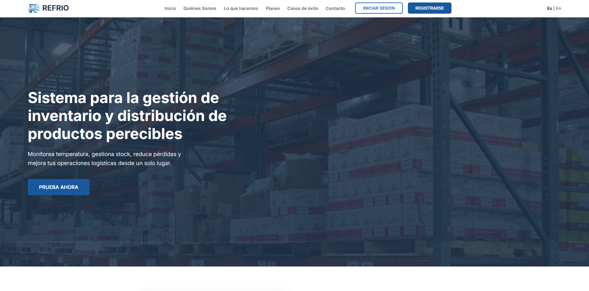
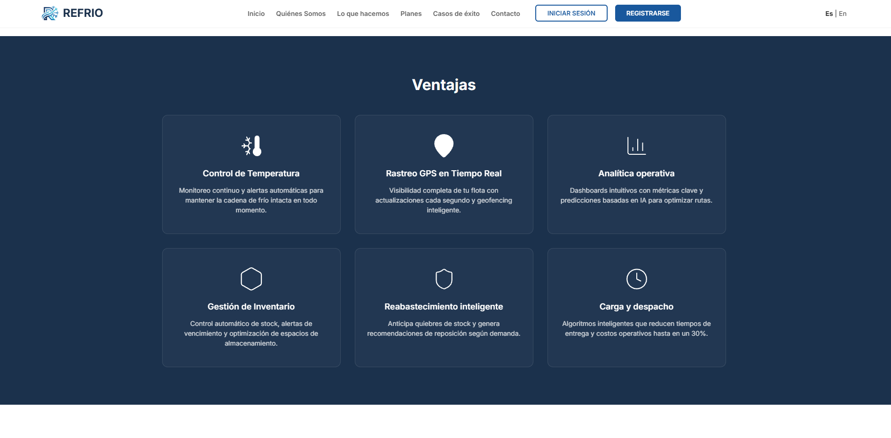
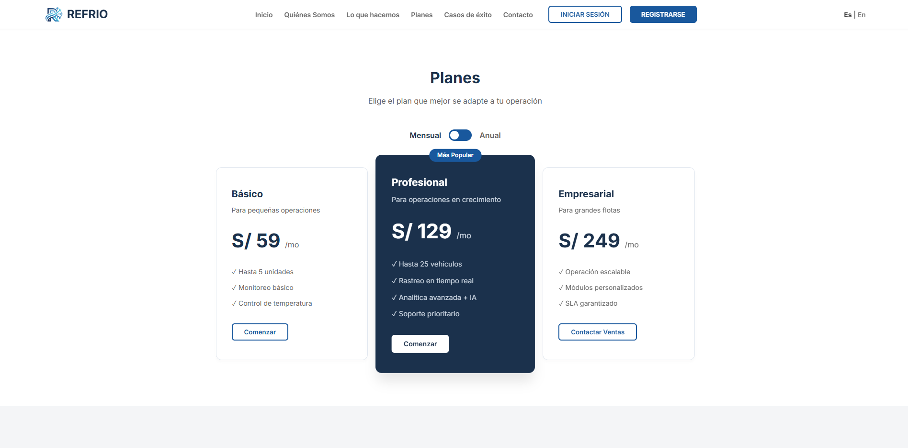
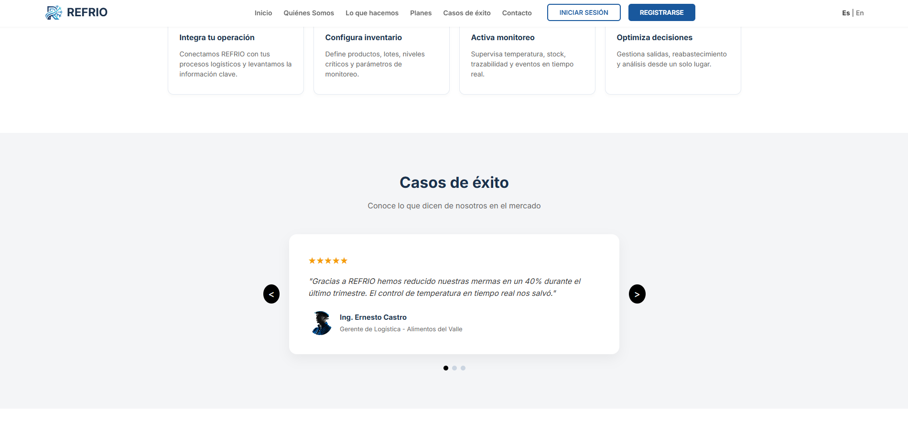
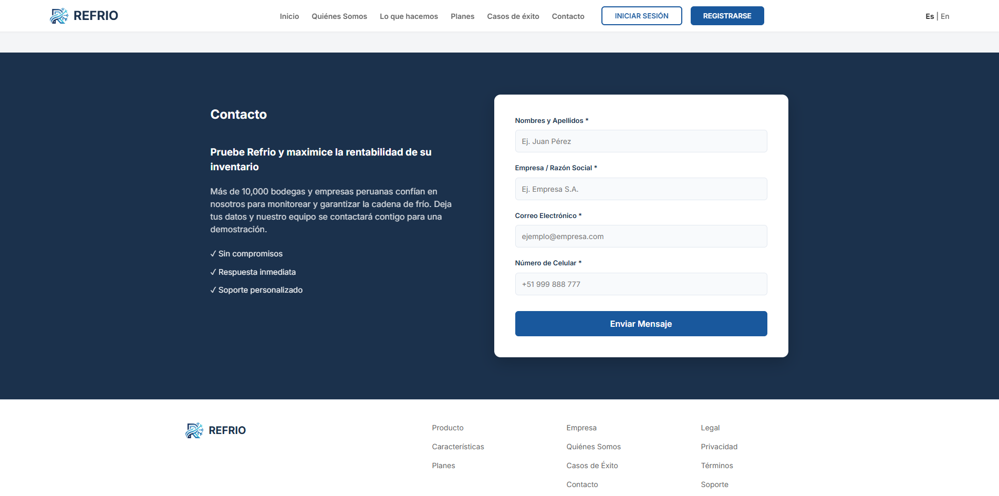
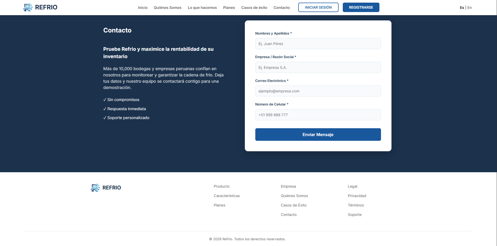
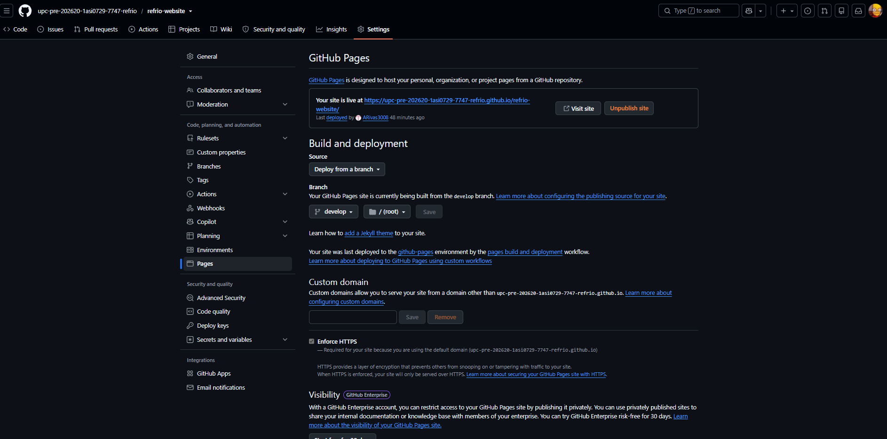
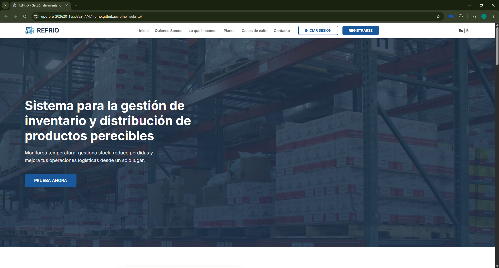
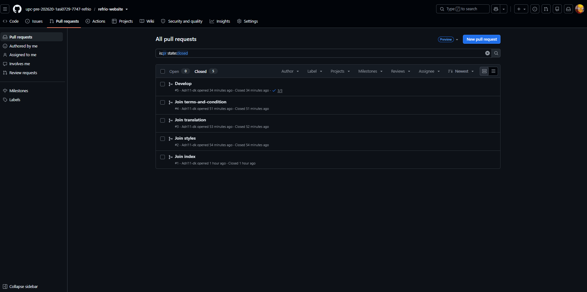

## 5.1.1. Software Development Environment Configuration

Para el desarrollo de Refrio se utilizaron distintas herramientas, cada una con una función específica dentro del proyecto. Estas se organizan según las principales disciplinas de trabajo.

1. Project Management
2. Requirements Management
3. Product UX/UI Design
4. Software Development
5. Software Testing
6. Software Documentation

### Project Management
Esta disciplina permitió organizar tareas, distribuir responsabilidades y hacer seguimiento al avance del proyecto.


### Requirements Management
Esta parte estuvo enfocada en documentar, estructurar y dar seguimiento a los requerimientos del proyecto, asegurando que respondan a las necesidades de los segmentos objetivo.


### Product UX/UI Design
En esta disciplina se trabajó el diseño de la experiencia de usuario y de la interfaz de la plataforma, especialmente en funciones relacionadas con inventario, trazabilidad y monitoreo de productos perecibles.

1. **UXPressia**: Herramienta utilizada para elaborar User Personas, Empathy Maps y Customer Journey Maps de los segmentos objetivo del proyecto.
   Ruta de referencia: https://uxpressia.com/
<p align="center">
  
</p>

2. **Figma**: Herramienta de diseño colaborativo utilizada para crear wireframes, mockups y propuestas visuales de Refrio.
   Ruta de referencia: https://www.figma.com/
<p align="center">
  
</p>

3. **Miro**: Pizarra colaborativa empleada para ordenar ideas, analizar hallazgos y desarrollar dinámicas relacionadas con el proceso de diseño.
   Ruta de referencia: https://miro.com/
<p align="center">
  
</p>

4. **Lucidchart**: Herramienta utilizada para la elaboración de diagramas, wireflows y representaciones visuales de la estructura de navegación del proyecto.
   Ruta de referencia: https://www.lucidchart.com/pages/es
<p align="center">
  
</p>

5. **Structurizr**: Herramienta empleada para representar de manera estructurada la arquitectura y organización de componentes del sistema.
   Ruta de referencia: https://structurizr.com/
<p align="center">
  
</p>


### Software Development
Aquí se agrupan las herramientas utilizadas para editar archivos, organizar el proyecto y trabajar el contenido técnico y visual del reporte.

1. **GitHub**: Plataforma utilizada para alojar el repositorio del proyecto, gestionar ramas por capítulo, registrar cambios y mantener el control de versiones del trabajo realizado en Refrio.
   Ruta de referencia: GitHub
<p align="center">
  
</p>

2. **WebStorm**: Entorno de desarrollo utilizado para editar archivos del proyecto, organizar carpetas, manejar recursos visuales y trabajar el contenido del reporte de Refrio.
   Ruta de descarga: https://www.jetbrains.com/webstorm/
<p align="center">
  
</p>

3. **HTML, CSS3 y JavaScript**: Tecnologías fundamentales utilizadas para la estructura, el estilo y la interacción de la Landing Page del proyecto Refrio.
   Referencias:
- **HTML:** https://html.spec.whatwg.org/
- **CSS3:** https://www.w3.org/Style/CSS/
- **JavaScript:** https://developer.mozilla.org/es/docs/Web/JavaScript
<p align="center">
  
</p>


### Software Testing
Esta parte ayudó a revisar que los entregables y componentes trabajados mantuvieran coherencia y funcionaran correctamente dentro del proyecto.

* **Revisión manual de entregables**: Proceso utilizado para verificar la estructura del documento, la navegación entre secciones, la correcta visualización de imágenes, tablas, enlaces internos y componentes del proyecto, asegurando consistencia en los resultados finales.
  Ruta de referencia: No aplica, ya que se trató de una validación manual realizada por el equipo.


### Software Documentation
La documentación permitió organizar y explicar el contenido del proyecto de manera clara, facilitando su comprensión y continuidad.

* **Markdown**: Formato principal utilizado para redactar y estructurar el reporte por capítulos.
  Ruta de referencia: https://www.markdownguide.org/
<p align="center">
  
</p>

## 5.1.2. Source Code Management

En esta sección se establecen los medios y esquemas de organización aplicados para el seguimiento de modificaciones del proyecto Refrio. Para ello, se utiliza GitHub como plataforma de alojamiento del repositorio y como sistema de control de versiones distribuido, lo que permite gestionar cambios, mantener trazabilidad y organizar el trabajo colaborativo mediante ramas.

### Repositorios del Proyecto

| Producto | URL del Repositorio |
|---|-|
| Organización en GitHub | https://github.com/upc-pre-202620-1asi0729-7747-refrio |
| Project Report (Informe) | https://github.com/upc-pre-202620-1asi0729-7747-refrio/refrio-report|
| Landing Page | https://github.com/upc-pre-202620-1asi0729-7747-refrio/refrio-website|


### GitFlow Workflow

En Refrio se aplica un modelo de trabajo basado en GitFlow, adaptado a la organización del Project Report por capítulos. Esta estructura permite desarrollar contenido en paralelo, mantener orden en los cambios y facilitar la integración progresiva del trabajo realizado por el equipo.

**Ramas Principales y de soporte:**

- **main:** Rama principal que contiene la versión estable del proyecto y el historial oficial del repositorio.
- **develop:** Rama de integración en la que se consolidan los avances antes de ser incorporados a la rama principal.
- **Feature branches:** se ramifican de develop y vuelven a fusionarse en develop.

### Conventional Commits

Se aplica la especificación Conventional Commits para los mensajes de commit, siguiendo la estructura:

```text
<type>(optional scope): <description>

[optional body]

[optional footer(s)]
````
### Tipos de Commit

| Tipo | Descripción |
|---|---|
| `feat` | Nueva funcionalidad para el usuario |
| `fix` | Corrección de un bug |
| `docs` | Cambios en documentación |
| `style` | Cambios de formato (espacios, comas, etc.) sin afectar lógica |
| `refactor` | Refactorización de código sin cambiar funcionalidad |
| `perf` | Mejoras de rendimiento |
| `test` | Adición o corrección de pruebas |
| `build` | Cambios en sistema de build o dependencias externas |
| `chore` | Tareas de mantenimiento sin afectar código de producción |

### Ejemplos de Commits

```text
feat(auth): add login validation
fix(ui): correct button alignment issue
docs(readme): update installation instructions
build(config): update project settings
chore(repo): clean project structure
```

**Instrucciones rápidas para vincular WebStorm con GitHub (resumen):**

1. VCS > Enable Version Control Integration (seleccionar Git).
2. Agregar cuenta de GitHub desde Settings.
3. Configurar nombre de usuario y realizar commits.
4. Manage Remotes > pegar URL del repositorio.


## 5.1.3. Source Code Style Guide & Conventions

En esta sección se establecen las convenciones de estilo y nomenclatura adoptadas para los recursos y tecnologías utilizadas en el proyecto Refrio. Estas convenciones permiten mantener orden, coherencia visual y uniformidad en la estructura del reporte, en los archivos del proyecto y en los elementos relacionados con la landing page y los recursos gráficos.

### Referencias de Guías de Estilo Adoptadas

| Lenguaje/Tecnología | Guía de Estilo                                                                       |
|---|--------------------------------------------------------------------------------------|
| Markdown | [Markdown Guide](https://www.markdownguide.org/)                                     |
| HTML/CSS | [Google HTML/CSS Style Guide](https://google.github.io/styleguide/htmlcssguide.html) |
| JavaScript | [Google JavaScript Style Guide](https://google.github.io/styleguide/jsguide.html)    |
| Java | [Google Java Style Guide](https://google.github.io/styleguide/javaguide.html)        |


### Nomenclatura General
Se usará inglés relacionado con la entidad representada, en minúsculas. Ejemplos:

```css 
.inventory-card {}
.shipment-item {} 
.alert-box {} 
.login-form {}
```

### Sangría

Se aplica una sangría de **dos espacios** en archivos HTML, CSS y JavaScript para mantener una estructura legible y uniforme. En el caso de Markdown, se respeta una organización limpia del contenido, utilizando niveles de encabezado, listas y bloques de código de manera consistente.

**Ejemplo HTML:**

```html
<section class="hero-section">
  <div class="hero-content">
    <h1>Refrio</h1>
    <p>Inventory and traceability for perishable products.</p>
  </div>
</section>
```

#### HTML

- Declarar `<!DOCTYPE html>` en la primera línea.
- Utilizar minúsculas para nombres de elementos y atributos.
- Utilizar comillas dobles para valores de atributos: `<div class="container">`
- Incluir atributos `alt` en las imágenes para mejorar la accesibilidad.
- No omitir elementos como `<title>` y meta tags.
- Usar líneas en blanco para separar bloques extensos de código.

**Ejemplo HTML:**

```html
<!DOCTYPE html>
<html lang="en">
  <head>
    <meta charset="UTF-8">
    <meta name="viewport" content="width=device-width, initial-scale=1.0">
    <title>Refrio</title>
  </head>
  <body>
    <header class="hero-section">
      <h1>Refrio</h1>
      <p>Inventory and traceability for perishable products.</p>
    </header>
  </body>
</html>
```
### CSS
- Utilizar shorthand properties cuando sea posible: margin: `10px 20px`;
- Terminar todas las declaraciones con punto y coma.
- Mantener un espacio después de los dos puntos en cada propiedad: color: `#333`;
- Usar nombres de clases en `kebab-case`.
- Organizar las propiedades de manera consistente dentro de cada selector.
- Separar visualmente los bloques de reglas para mejorar la legibilidad.

**Ejemplo CSS:**

```CSS
.hero-section {
  background-color: #3F51B5;
  color: #FFFFFF;
  padding: 24px;
  text-align: center;
}

.feature-card {
  border: 1px solid #BDBDBD;
  margin: 16px;
  padding: 20px;
}
```
### JavaScript

- Utilizar `const` y `let` en lugar de `var`.
- Mantener espacios alrededor de operadores: `const total = a + b`;
- Colocar punto y coma al final de las instrucciones.
- Usar llaves de apertura en la misma línea de la declaración.
- Emplear nombres descriptivos en `camelCase` para variables y funciones.
- Utilizar funciones claras y breves para facilitar la lectura del código.

**Ejemplo JavaScript:**

```JavaScript
const productStatus = "available";

function showInventoryAlert() {
  console.log("Inventory alert active");
}

function calculateTotalItems(currentItems, newItems) {
  return currentItems + newItems;
}
```
### Markdown
- Utilizar encabezados jerárquicos de forma ordenada (`#`, `##`, `###`).
- Mantener una estructura clara por secciones y subsecciones.
- Usar listas y tablas solo cuando aporten claridad al contenido.
- Emplear nombres descriptivos en enlaces internos y anchors.
- Mantener consistencia en títulos, numeración y bloques de código.

**Ejemplo Markdown:**

``` Markdown
## 4.1. Style Guidelines

### 4.1.1. General Style Guidelines

En esta sección se presentan las pautas visuales utilizadas en Refrio.

### 4.1.2. Web Style Guide

Se describen los componentes y elementos visuales empleados en la interfaz web.
```
### Gherkin
- Escribir escenarios en inglés.
  Definir un escenario por comportamiento específico.
- Mantener pasos claros, breves y reutilizables.
- Utilizar la estructura Given, When, Then, And.
- Aplicar una sangría uniforme para mejorar la legibilidad.

**Ejemplo Gherkin:**

``` Gherkin
Feature: Inventory Management

Scenario: Register a new perishable product
Given the user is on the inventory form
When the user enters valid product information
And saves the new record
Then the system should store the product successfully
And the product should appear in the inventory list
```
### 5.1.4. Software Deployment Configuration

El despliegue continuo del sitio web de Refrio se gestiona a través de GitHub Pages, garantizando alta disponibilidad, conexión segura vía HTTPS y actualización automática ante nuevos cambios validados en el entorno de integración. El procedimiento de configuración comprende los siguientes pasos:

1. **Selección del Entorno de Despliegue:**  
   En el repositorio `refrio-website` de la organización `upc-pre-202620-1asi0729-7747-refrio`, se accede a la pestaña **Settings** y se selecciona el apartado **Pages** en el menú lateral izquierdo.

2. **Definición de la Fuente de Compilación (Build and deployment):**
   * **Source:** Se selecciona la opción `Deploy from a branch`.
   * **Branch:** Se define la rama `develop` con el directorio raíz (`/root`) como fuente activa de publicación para el servicio de los archivos estáticos (HTML5, CSS3, JavaScript).

3. **Ejecución del Flujo Automatizado:**  
   Al registrar los parámetros, GitHub dispara de forma automática el flujo de trabajo (`pages build and deployment`) mediante GitHub Actions cada vez que se integra código a la rama seleccionada, compilando y sirviendo los assets estáticos.

4. **Verificación y Enlace de Producción:**  
   Se confirma el despliegue verificando la respuesta en el dominio público asignado y la activación automática de la directiva `Enforce HTTPS`:
   * **URL de despliegue:** [https://upc-pre-202620-1asi0729-7747-refrio.github.io/refrio-website/](https://upc-pre-202620-1asi0729-7747-refrio.github.io/refrio-website/)


## 5.2. Landing Page, Services & Applications Implementation

### 5.2.1. Sprint 1

#### 5.2.1.1. Sprint Planning 1

El Sprint 1 está dedicado principalmente a establecer la presencia digital de la startup mediante el diseño, desarrollo y despliegue de la primera versión del Landing Page público de Refrio, iniciando concurrentemente la arquitectura base y servicios de identidad del Core API para habilitar las funcionalidades transaccionales del siguiente ciclo.

| Campo | Detalle |
|:---|:---|
| **Sprint #** | Sprint 1 |
| **Date** | `2026-09-08` |
| **Time** | `7:00 pm` |
| **Location** | Reunión virtual por Discord / Google Meet |
| **Prepared By** | `Alca Morán, César Alejandro` |
| **Attendees** | Alca Morán, César Alejandro / Centeno León, Adriano Samir / Rivas Méndez, Bernie Aarón / Saavedra Flores, Rodrigo Andree / Tello Lima, Jose Alejandro |
| **Sprint 1 Goal** | Establecer la presencia digital pública de Refrio mediante el diseño, maquetación y despliegue de su Landing Page responsive (US01 a US05), comunicando la propuesta de valor centrada en erradicar mermas alimentarias mediante IoT y política FEFO, y comenzar la implementación de los servicios base de autenticación y registro de cuentas (TS01, TS02 y US08) requeridos por la arquitectura. |
| **Team Capacity** | 22 Story Points (Capacidad estimada inicial basada en la disponibilidad horaria del equipo) |
| **Committed Story Points** | 20 Story Points (11 SP completados de Landing Page + 9 SP en desarrollo de Identity/Core API) |
| **Completed Story Points** | 11 Story Points (US01, US02, US03, US04, US05 finalizadas y desplegadas al 100%) |
| **In Progress Story Points** | 9 Story Points (TS01, TS02, US08 en progreso activo para cierre en Sprint 2) |
| **Historical Velocity** | N/A (Sprint inicial; establece la línea base empírica de velocidad en 11 SP completados) |


#### 5.2.1.2. Aspect Leaders and Collaborators

Para este primer Sprint enfocado en el Landing Page y la configuración inicial de los repositorios y estándares de código abierto, la distribución de liderazgo (L) y colaboración (C) es la siguiente:

| Team Member (Last Name, First Name) | GitHub Username | UI/UX Design (Figma) | Landing Page Layout (HTML/CSS) | Landing Page Interactivity (JS) | DevOps & Deployment |
|:-----------------------------------:|:---------------:|:-------------:|:-------------:|:-------------:|:-------------:|
| Alca Morán, César Alejandro | `almocesar-cell` | L | C | L | C |
| Centeno León, Adriano Samir | `Adri11-dk` | C | L | C | C |
| Rivas Méndez, Bernie Aarón | `Arivas3008` | C | L | L | C |
| Saavedra Flores, Rodrigo Andree | `rodrigoxd67` | C | C | C | L |
| Tello Lima, Jose Alejandro | `j4ndrow` | L | C | L | C |

> **L** = Leader &nbsp;|&nbsp; **C** = Collaborator


#### 5.2.1.3. Sprint Backlog 1

El Sprint Backlog 1 consolida las tareas técnicas y de desarrollo para el despliegue del Landing Page público (US01-US05) y el inicio de la arquitectura base del módulo de identidad (TS01, TS02, US08):

| **Sprint 1** | **User / Tech Story** | | **Work-Item / Task** | | | | |
|:--------:|---|---|---|---|---|---|---|
| | **ID** | **Título** | **ID** | **Título** | **Descripción** | **Estimación (h)** | **Asignado a** | **Estado** |
| | US01 | Visualización de Hero Section | T01 | Diseñar UI en Figma | Diseñar el Hero section con propuesta de valor y llamadas a la acción (CTA). | 4 | Centeno, Adriano | Done |
| | US01 | Visualización de Hero Section | T02 | Maquetar estructura base | Maquetar en HTML5 semántico y CSS3 responsive la cabecera y el hero principal. | 5 | Alca, César | Done |
| | US02 | Visualización de Planes y Tarifas | T03 | Programar tarificador interactivo | Implementar tarjetas de planes (Básico, Pro, Empresarial) y toggle de facturación con JS. | 4 | Rivas, Bernie | Done |
| | US03 | Formulario de Demostración B2B | T04 | Maquetar y validar formulario B2B | Construir formulario corporativo con validación de RUC (11 dígitos) y correo corporativo. | 3 | Tello, Jose | Done |
| | US04 | Visualización de Casos de Éxito | T05 | Maquetar carrusel de testimonios | Desarrollar componente responsivo de testimonios y métricas de merma evitada. | 3 | Centeno, Adriano | Done |
| | US05 | Acceso a Plataforma Web / Móvil | T06 | Integrar enlaces de autenticación | Conectar botones de acceso hacia el portal de login y configurar redirección. | 2 | Alca, César | Done |
| | *Task* | Configuración de Repositorios | T07 | Setup GitHub y CI/CD | Estructurar ramas GitFlow y pipeline de despliegue automatizado en GitHub Pages. | 2 | Saavedra, Rodrigo | Done |
| | TS01 | Endpoint Autenticación JWT | T08 | Configurar emisor de tokens JWT | Implementar generación y firma de tokens JWT junto con middleware de autorización. | 6 | Saavedra, Rodrigo | In Progress |
| | TS02 | Endpoint Registro Unificado | T09 | Diseñar endpoints de sign-up | Implementar controladores y validaciones de esquema para registro B2B y B2C. | 5 | Rivas, Bernie | In Progress |
| | US08 | Inicio de Sesión Multi-rol | T10 | Maquetar interfaz base de Login | Diseñar y codificar la vista inicial de login conectada al flujo de sesión por roles. | 4 | Tello, Jose | In Progress |

#### 5.2.1.4. Development Evidence for Sprint Review

Durante el Sprint 1, el equipo implementó la convención formal de Conventional Commits y el flujo de trabajo GitFlow sobre las ramas de características vinculadas a las tareas del Sprint Backlog. La siguiente tabla presenta el registro auditable de contribuciones técnicas:

| Repository | Branch | Commit ID | Commit Message | Committed by (Author) | Committed on (Date) |
|:---:|:---:|:---:|:---|:---:|:---:|
| `refrio-website` | `develop` | `c10a42e` | `chore(setup): initialize project layout, assets structure and gitflow (T07)` | Saavedra Flores, Rodrigo | `2026-09-09` |
| `refrio-website` | `feature/index` | `e052fb4` | `feat(hero): build semantic html5 structure, value prop and cta buttons (T02)` | Alca Morán, César | `2026-09-11` |
| `refrio-website` | `feature/styles` | `f3124db` | `style(landing): implement responsive design, typography and refrio palette (T01)` | Centeno León, Adriano | `2026-09-13` |
| `refrio-website` | `feature/index` | `4d18c9a` | `feat(pricing): add interactive plan comparison cards and contact form (T03, T04)` | Rivas Méndez, Bernie | `2026-09-14` |
| `refrio-website` | `feature/terms-and-conditions` | `a3c91d4` | `feat(legal): add terms and conditions section and privacy policy view (T05)` | Tello Lima, Jose | `2026-09-15` |
| `refrio-website` | `feature/translation` | `bd7d9ab` | `feat(i18n): integrate multi-language translation script for landing content (T06)` | Alca Morán, César | `2026-09-16` |
| `refrio-website` | `develop` | `7e2b8f1` | `merge(staging): integrate feature branches and validate cross-browser UI` | Saavedra Flores, Rodrigo | `2026-09-16` |
| `refrio-website` | `main` | `9eb709b` | `release(v1.0.0): deploy stable landing page to production for sprint 1 review` | Saavedra Flores, Rodrigo | `2026-09-17` |
---

#### 5.2.1.5. Execution Evidence for Sprint Review

En este primer Sprint se completó el diseño y maquetación de la Landing Page pública de Refrio. La interfaz integra las secciones de "Hero", "Propuesta de Valor IoT & FEFO", "Planes de Suscripción (Básico S/ 59, Profesional S/ 129, Empresarial S/ 249)", "Casos de Éxito y Merma Evitada" y el "Formulario de Contacto B2B", siendo 100% responsiva para pantallas móviles y de escritorio.









#### 5.2.1.6. Services Documentation Evidence for Sprint Review

> *Para el Sprint 1, enfocado estrictamente en la implementación, estilizado y despliegue del Landing Page estático, esta sección no aplica. La documentación formal de los Web Services y endpoints de la API RESTful (controladores de telemetría IoT, inventario FEFO y autenticación JWT) mediante OpenAPI / Swagger se desarrollará e incorporará a partir de los sprints posteriores.*


#### 5.2.1.7. Software Deployment Evidence for Sprint Review

Durante el Sprint 1 se completó el despliegue del Landing Page utilizando la infraestructura estática de GitHub Pages, siguiendo un flujo reproducible y validado sobre la rama de integración activa:

1. Se consolidaron las características desarrolladas en las distintas ramas (`feature/*`) hacia la rama `develop` mediante Pull Requests revisados por el equipo.
2. En el repositorio `refrio-website`, se ingresó a la sección `Settings > Pages`.
3. En la sección Build and deployment, se configuró la opción `Deploy from a branch`, estableciendo la rama `develop` y la carpeta raíz (`/root`) como origen de publicación.
4. El motor de GitHub Actions ejecutó automáticamente el workflow `pages build and deployment` tras la confirmación de cambios realizada por el responsable de integración (`ARivas3008`).
5. Se verificó el estado activo del servicio (`Your site is live at...`) con la directiva `Enforce HTTPS` habilitada.
6. Se auditó la carga en vivo del sitio web accediendo a la URL pública generada ([https://upc-pre-202620-1asi0729-7747-refrio.github.io/refrio-website/](https://upc-pre-202620-1asi0729-7747-refrio.github.io/refrio-website/)), validando la visualización del Hero section, la navegación responsive y la correcta resolución de estilos y assets.





#### 5.2.1.8. Team Collaboration Insights during Sprint

Durante el Sprint 1, la colaboración técnica se gestionó a través de GitHub implementando el modelo de trabajo GitFlow. Cada incremento fue desarrollado en ramas aisladas de características (`feature/*`), las cuales fueron integradas hacia la rama `develop` mediante Pull Requests (PRs) con revisión y aprobación cruzada entre los miembros del equipo, culminando en la consolidación hacia la rama de producción `main`.

A continuación, se detalla la matriz de trazabilidad de los Pull Requests ejecutados y cerrados durante el ciclo:

| PR ID | Título del Pull Request | Rama Origen | Rama Destino | Autor (Developer) | Revisor (Reviewer) | Tareas Vinculadas | Fecha de Cierre | Merge Commit |
|:---:|:---|:---:|:---:|:---|:---|:---:|:---:|:---:|
| **#1** | `Join index` | `feature/index` | `develop` | Centeno León, Adriano | Alca Morán, César | T02, T03, T04 | `2026-09-17` | `98b1e4c` |
| **#2** | `Join styles` | `feature/styles` | `develop` | Centeno León, Adriano | Rivas Méndez, Bernie | T01 | `2026-09-17` | `f3124db` |
| **#3** | `Join translation` | `feature/translation` | `develop` | Centeno León, Adriano | Tello Lima, Jose | T06 | `2026-09-17` | `bd7d9ab` |
| **#4** | `Join terms-and-condition` | `feature/terms-and-conditions` | `develop` | Centeno León, Adriano | Saavedra Flores, Rodrigo | T05 | `2026-09-17` | `a3c91d4` |
| **#5** | `Develop` (Release to Main) | `develop` | `main` | Centeno León, Adriano | Alca Morán, César | T07 (Release v1.0.0) | `2026-09-17` | `9eb709b` |



# 5.2.2. Sprint 2

## 5.2.2.1. Sprint Planning 2

Durante el Sprint Planning 2, el equipo MadaGroup se reunió para definir el alcance de trabajo correspondiente a la entrega TB1. Con el Sprint 1 finalizado y el Landing Page desplegado, este sprint tiene como objetivo central implementar y desplegar la primera versión de la Frontend Web Application de Refrio integrada con una Fake API (json-server), cubriendo los flujos principales de ambos segmentos objetivo: autenticación, gestión de inventario FEFO, monitoreo de telemetría y alertas.

La Velocity de este sprint se establece en base a los Story Points completados en el Sprint 1 (11 SP en 2 semanas con 5 integrantes). Para Sprint 2, con mayor disponibilidad y experiencia acumulada, el equipo estima una capacidad de 26 SP.

| Campo | Detalle |
|---|---|
| **Sprint #** | Sprint 2 |
| **Date** | 2026-09-22 |
| **Time** | 7:00 PM |
| **Location** | Reunión virtual por Discord / Google Meet |
| **Prepared By** | Alca Morán, César Alejandro |
| **Attendees (to planning meeting)** | Alca Morán, César Alejandro / Centeno León, Adriano Samir / Rivas Méndez, Bernie Aarón / Saavedra Flores, Rodrigo Andree / Tello Lima, Jose Alejandro |
| **Sprint 1 Review Summary** | El Sprint 1 entregó el Landing Page de Refrio completamente desplegado en GitHub Pages (https://upc-pre-202620-1asi0729-7747-refrio.github.io/refrio-website/). Se implementaron: Hero Section con métricas de impacto, sección de planes de suscripción con toggle mensual/anual, formulario de contacto B2B con validación de RUC y correo corporativo, sección de casos de éxito y el botón CTA de acceso a la plataforma. El equipo completó 11 SP de los 11 comprometidos. Como feedback del docente, se identificaron oportunidades de mejora en la trazabilidad de commits (Conventional Commits), en la evidencia de PRs con aprobación cruzada, y en la consistencia entre los Bounded Contexts del EventStorming y el Class Diagram. |
| **Sprint 1 Retrospective Summary** | El equipo valoró positivamente la comunicación constante por Discord y la distribución temprana de tareas por aspecto. Se identificó como oportunidad de mejora la estandarización de los mensajes de commit (algunos no siguieron Conventional Commits), la falta de commits individuales visibles para todos los integrantes y la necesidad de documentar el proceso de PR de forma más rigurosa. Para Sprint 2 se acuerda: revisar cada commit antes de hacer push, abrir PRs con descripción clara y asignar un revisor diferente al autor antes de mergear a develop. |
| **Sprint 2 Goal** | Our focus is on delivering the first functional version of the Refrio Web Application for both target segments, connected to a Fake API that simulates the core backend. We believe it delivers a tangible demonstration of the platform's value — real-time cold chain monitoring, FEFO inventory management, and automated alerts — to logistics supervisors and retail store owners. This will be confirmed when both user personas can log in, navigate their respective dashboards, register inventory batches with expiration dates, view simulated temperature telemetry, and receive alert notifications, all through the deployed Angular frontend consuming the json-server Fake API. |
| **Sprint 2 Velocity** | 11 SP (velocidad medida en Sprint 1) |
| **Sum of Story Points** | 26 SP |

---

## 5.2.2.2. Aspect Leaders and Collaborators

Para este Sprint 2, los aspectos de trabajo se organizan en torno a los cinco módulos funcionales principales de la Web Application y la infraestructura de la Fake API. La distribución de liderazgo y colaboración es la siguiente:

| Team Member (Last Name, First Name) | GitHub Username | IAM & Auth Module (Login / Register) | Inventory & FEFO Module | Telemetry & Dashboard Module | Alerts & Notifications Module | Fake API (json-server) & Deployment |
|---|---|---|---|---|---|---|
| Alca Morán, César Alejandro | almocesar-cell | L | C | C | C | L |
| Centeno León, Adriano Samir | Adri11-dk | C | L | C | C | C |
| Rivas Méndez, Bernie Aarón | Arivas3008 | C | C | L | C | C |
| Saavedra Flores, Rodrigo Andree | rodrigoxd67 | C | C | C | L | C |
| Tello Lima, Jose Alejandro | j4ndrow | C | C | C | C | L |

**L = Leader | C = Collaborator**

Los líderes de cada aspecto son responsables de la arquitectura del módulo, la toma de decisiones técnicas dentro de su área y la revisión de los PRs de sus colaboradores. Todos los integrantes contribuyen en al menos dos aspectos por sprint, garantizando conocimiento transversal del sistema.

---


## 5.2.2.3. Sprint Backlog 2

El objetivo principal de este Sprint es contar con la primera versión de la Refrio Web Application completamente desplegada, con los flujos de autenticación, inventario FEFO, dashboard de telemetría y gestión de alertas integrados contra una Fake API (json-server) desplegada en Railway. Adicionalmente, se actualiza el Landing Page para mejorar la consistencia de experiencia (CTA redirige a la Web App desplegada) y se corrigen los hallazgos de AV1.

URL del Sprint Board (Trello): https://trello.com/b/refrio-sprint2 *(reemplazar con URL real del board)*

| Sprint # | Sprint 2 | | | | | | |
|---|---|---|---|---|---|---|---|

| Story Id | Story Title | Task Id | Task Title | Task Description | Estimation (h) | Assigned To | Status |
|---|---|---|---|---|---|---|---|
| US06 | Registro de Distribuidora Mediana | T01 | Crear componente RegisterCompanyComponent | Implementar formulario de registro B2B con campos: razón social, RUC (11 dígitos), correo corporativo, contraseña, dirección de almacén. Validaciones reactivas con Angular FormBuilder. | 4 | Alca, César | Done |
| US06 | Registro de Distribuidora Mediana | T02 | Implementar endpoint POST /companies en json-server y servicio Angular | Configurar db.json con colección companies. Crear AuthService.registerCompany() que consume POST /companies. Manejo de errores (RUC duplicado). | 3 | Alca, César | Done |
| US07 | Registro Simplificado de Bodega | T03 | Crear componente RegisterStoreComponent | Formulario simplificado para comerciantes: nombre del negocio, teléfono, correo, contraseña. Sin RUC obligatorio. | 3 | Alca, César | Done |
| US08 | Inicio de sesión unificado | T04 | Crear componente LoginComponent con JWT simulado | Formulario de login (email + password). Llamada POST /auth/login al json-server. Almacenamiento de token JWT simulado en localStorage. Redirección según rol (supervisor/minorista). | 4 | Alca, César | Done |
| US08 | Inicio de sesión unificado | T05 | Implementar AuthGuard y RoleGuard | Guards de Angular para proteger rutas de la app. Verificar token en localStorage. Redirigir a /login si no autenticado. | 2 | Alca, César | Done |
| US09 | Gestión de perfil de usuario | T06 | Crear ProfileComponent con edición de datos | Vista de perfil con datos del usuario. Formulario de edición de nombre, teléfono y contraseña. Llamada PATCH /users/:id. | 3 | Centeno, Adriano | Done |
| US13 | Registro de lote de perecible | T07 | Crear BatchRegisterComponent | Formulario de ingreso de lote: nombre del producto, código de lote, cantidad, unidad, fecha de recepción, fecha de caducidad, proveedor. Integración con POST /batches. | 5 | Centeno, Adriano | Done |
| US14 | Listado de inventario con semáforo FEFO | T08 | Crear InventoryListComponent con semáforo de frescura | Tabla de lotes ordenada por fecha de caducidad (FEFO). Indicador de color: verde (>7 días), amarillo (3–7 días), rojo (<3 días). Filtro por categoría y búsqueda por nombre. | 5 | Centeno, Adriano | Done |
| US15 | Auditoría nocturna de vencimientos | T09 | Crear ExpirationAuditComponent | Vista que lista lotes con caducidad crítica (<3 días). Muestra cantidad, producto, lote, días restantes. Botón para marcar como "en remate" o "descarte". | 3 | Centeno, Adriano | Done |
| US16 | Dashboard de telemetría en tiempo real | T10 | Crear TelemetryDashboardComponent con polling al json-server | Vista de tarjetas por cámara frigorífica: temperatura actual, humedad, estado (OK/Alerta). Polling cada 30 segundos a GET /telemetry. Gráfica de líneas de las últimas 12 lecturas con ngx-charts. | 6 | Rivas, Bernie | Done |
| US17 | Historial de temperatura por cámara | T11 | Crear ThermalHistoryComponent con filtro de fecha | Vista de historial de lecturas térmicas para una cámara seleccionada. Filtro por rango de fechas. Tabla y gráfica de líneas. Llamada GET /telemetry?coldRoomId=:id. | 4 | Rivas, Bernie | Done |
| US19 | Alerta de ruptura de cadena de frío | T12 | Crear AlertsListComponent con indicador de severidad | Lista de incidentes activos con: cámara afectada, temperatura detectada, timestamp, estado (Activo/Cerrado). Íconos de severidad (crítico/warning). Llamada GET /incidents. | 4 | Saavedra, Rodrigo | Done |
| US20 | Cierre de incidente con justificación | T13 | Implementar modal de cierre de incidente | Modal con campo de texto obligatorio para causa raíz y acción correctiva. Llamada PATCH /incidents/:id con status: "closed". Validación: no se puede cerrar sin descripción. | 3 | Saavedra, Rodrigo | Done |
| US21 | Notificación push simulada de alerta | T14 | Implementar servicio de notificación in-app | NotificationService que genera toast/snackbar cuando el polling detecta una nueva alerta (temperatura > umbral). Usar Angular Material SnackBar. | 2 | Saavedra, Rodrigo | Done |
| TS01 | Configuración del proyecto Angular y estructura de módulos | T15 | Inicializar proyecto Angular con lazy loading por módulo | Crear proyecto con Angular CLI. Estructura de módulos: AuthModule, InventoryModule, TelemetryModule, AlertsModule, SharedModule. Routing con lazy loading. Angular Material como biblioteca de UI. | 4 | Tello, Jose | Done |
| TS02 | Configuración y despliegue de Fake API (json-server) | T16 | Configurar db.json con datos seed y desplegar en Railway | Crear db.json con colecciones: users, companies, batches, products, coldRooms, telemetry, incidents, alerts. Datos seed realistas de Refrio (3 empresas, 15 lotes, 24h de telemetría, 4 incidentes). Desplegar json-server en Railway. Configurar CORS para el dominio de la Web App. | 4 | Tello, Jose | Done |
| TS03 | Despliegue de la Web Application en Netlify/Vercel | T17 | Configurar build de producción y despliegue continuo de la Web App | ng build --configuration production. Conectar repositorio refrio-webapp a Netlify/Vercel. Configurar variable de entorno API_BASE_URL apuntando al json-server de Railway. Verificar despliegue y URL pública. | 3 | Tello, Jose | Done |
| US01 | Visualización de Hero Section (Landing Page v2) | T18 | Actualizar CTA del Landing Page para redirigir a la Web App desplegada | Modificar href del botón "Ingresar" y "Solicitar Demo" en el Landing Page para apuntar a la URL pública de la Web Application desplegada. | 1 | Alca, César | Done |

---

## 5.2.2.4. Development Evidence for Sprint Review

Durante el Sprint 2, el equipo implementó la primera versión funcional de la Refrio Web Application utilizando Angular 17 con Angular Material como biblioteca de componentes UI, siguiendo el design system establecido en el Sprint 1 (paleta cromática azul corporativo #3F51B5, tipografía Roboto). La arquitectura de la aplicación sigue un patrón por módulos alineado a los Bounded Contexts del dominio: AuthModule, InventoryModule, TelemetryModule, AlertsModule y SharedModule, cada uno con lazy loading para optimizar el tiempo de carga.

La Fake API se implementó con json-server, configurado con datos seed realistas de Refrio y desplegado en Railway para que la Web App consume endpoints RESTful reales desde cualquier dispositivo. Todos los commits siguen la convención Conventional Commits y cada feature fue desarrollada en su rama `feature/[us-id]-[descripción]`, revisada mediante Pull Request con aprobación de al menos un compañero antes de mergear a `develop`.

| Repository | Branch | Commit Id | Commit Message | Commit Message Body | Committed on (Date) |
|---|---|---|---|---|---|
| refrio-webapp | feature/ts01-angular-setup | a1b2c3d | feat(setup): initialize Angular 17 project with Material and lazy-loaded modules | Creates project structure: AuthModule, InventoryModule, TelemetryModule, AlertsModule, SharedModule. Configures routing with loadChildren for lazy loading. Adds Angular Material theme based on brand palette #3F51B5. | 2026-09-22 |
| refrio-webapp | feature/ts01-angular-setup | b2c3d4e | chore(setup): configure environment files with API_BASE_URL for dev and prod | environment.ts points to http://localhost:3000. environment.prod.ts points to Railway json-server URL. | 2026-09-22 |
| refrio-fake-api | feature/ts02-fake-api | c3d4e5f | feat(api): create db.json with seed data for all Refrio domain entities | Adds collections: users (5), companies (3), batches (15), products (12), coldRooms (4), telemetry (288 readings/24h), incidents (4), alerts (6). Seed data reflects realistic perishable logistics scenario. | 2026-09-23 |
| refrio-fake-api | feature/ts02-fake-api | d4e5f6g | chore(api): configure CORS and deploy json-server to Railway | Adds server.js with cors middleware allowing refrio-webapp Netlify domain. Configures Railway start command. | 2026-09-23 |
| refrio-webapp | feature/us06-us08-auth | e5f6g7h | feat(auth): implement LoginComponent with JWT simulation and role-based redirect | POST /auth/login to json-server. Stores token in localStorage. Redirects to /dashboard/supervisor or /dashboard/store based on user role. Angular FormBuilder with Validators.email and Validators.required. | 2026-09-24 |
| refrio-webapp | feature/us06-us08-auth | f6g7h8i | feat(auth): implement RegisterCompanyComponent with RUC validation | 11-digit RUC validator (custom ValidatorFn). POST /companies. Error handling for duplicate RUC (409 response from json-server). | 2026-09-24 |
| refrio-webapp | feature/us06-us08-auth | g7h8i9j | feat(auth): add AuthGuard and RoleGuard for protected routes | CanActivate guards check localStorage token. RoleGuard restricts /inventory to supervisor role. Redirects to /login if unauthenticated. | 2026-09-25 |
| refrio-webapp | feature/us07-register-store | h8i9j0k | feat(auth): implement RegisterStoreComponent for minorista segment | Simplified form: business name, phone, email, password. POST /users with role: "minorista". Matches simplified onboarding for bodega owners. | 2026-09-25 |
| refrio-webapp | feature/us09-profile | i9j0k1l | feat(iam): create ProfileComponent with inline edit capability | Displays user data from GET /users/:id. Editable fields: name, phone, password. PATCH /users/:id on save. Password field hidden by default with toggle. | 2026-09-25 |
| refrio-webapp | feature/us13-us15-inventory | j0k1l2m | feat(inventory): implement BatchRegisterComponent with FEFO intake | Form with: productName, batchCode, quantity, unit (kg/units/L), receptionDate, expirationDate, supplierId. DatePicker validation: expirationDate > receptionDate. POST /batches. | 2026-09-26 |
| refrio-webapp | feature/us13-us15-inventory | k1l2m3n | feat(inventory): implement InventoryListComponent with FEFO sort and freshness semaphore | GET /batches sorted by expirationDate ASC (FEFO). Color badge: green (>7d), yellow (3-7d), red (<3d). Filter by category. Search by product name. MatTable with pagination. | 2026-09-26 |
| refrio-webapp | feature/us13-us15-inventory | l2m3n4o | feat(inventory): add ExpirationAuditComponent for critical batches | GET /batches?daysToExpire_lte=3. Cards showing product, batch code, quantity, days remaining. Actions: "Set as Sale Offer" (PATCH status: "offer") or "Discard" (PATCH status: "discarded"). | 2026-09-27 |
| refrio-webapp | feature/us16-us17-telemetry | m3n4o5p | feat(telemetry): implement TelemetryDashboardComponent with 30s polling | GET /telemetry grouped by coldRoomId. Cards: current temp, humidity, status. Polling with RxJS interval(30000). ngx-charts LineChart for last 12 readings per cold room. | 2026-09-27 |
| refrio-webapp | feature/us16-us17-telemetry | n4o5p6q | feat(telemetry): add ThermalHistoryComponent with date range filter | GET /telemetry?coldRoomId=:id&timestamp_gte=:from&timestamp_lte=:to. MatDatepicker range. Table and line chart of historical readings. Export CSV button. | 2026-09-28 |
| refrio-webapp | feature/us19-us21-alerts | o5p6q7r | feat(alerts): implement AlertsListComponent with severity indicators | GET /incidents ordered by timestamp DESC. MatChip severity badges: critical (red), warning (amber), info (blue). Real-time count badge in sidebar navigation. | 2026-09-28 |
| refrio-webapp | feature/us19-us21-alerts | p6q7r8s | feat(alerts): add incident close modal with mandatory root cause | MatDialog with Validators.required on rootCause field. PATCH /incidents/:id {status: "closed", rootCause, correctiveAction, closedAt}. Disabled "Close" button until both fields filled. | 2026-09-29 |
| refrio-webapp | feature/us19-us21-alerts | q7r8s9t | feat(alerts): implement in-app notification service using Angular Material SnackBar | NotificationService checks polling response. If new incident detected (status: "active", createdAt > lastCheck), triggers MatSnackBar with alert message and "View" action button. | 2026-09-29 |
| refrio-webapp | feature/ts03-deployment | r8s9t0u | chore(deploy): configure Angular production build for Netlify deployment | angular.json production config: budgets, optimization, source maps disabled. netlify.toml with build command and publish directory. Redirects for SPA routing (_redirects file). | 2026-09-29 |
| refrio-website | feature/landing-v2-cta | s9t0u1v | feat(landing): update CTAs to point to deployed Web Application | Updates href in hero "Ingresar" button and plans "Comenzar" buttons to refrio-webapp.netlify.app. Ensures consistent experience between Landing Page and Web App. | 2026-09-29 |

---

## 5.2.2.5. Execution Evidence for Sprint Review

En este Sprint 2 se completó el diseño e implementación de la primera versión funcional de la Refrio Web Application. A continuación se describen las principales vistas entregadas:

**Vistas de Autenticación (AuthModule)**
Se implementaron tres flujos de autenticación: Login unificado (email + contraseña con redirección por rol), Registro de Distribuidora Mediana (formulario B2B con validación de RUC de 11 dígitos y razón social) y Registro Simplificado de Bodega (onboarding ágil para comerciantes minoristas). Al autenticarse, el token JWT simulado se almacena en localStorage y los guards redirigen automáticamente al dashboard correspondiente al rol del usuario.

**Dashboard de Supervisor Logístico (Segmento 1)**
El supervisor logístico accede a un dashboard con cuatro secciones principales: (1) Panel de telemetría en tiempo real con tarjetas por cámara frigorífica que muestran temperatura actual, humedad y estado (OK/Alerta), actualizadas cada 30 segundos mediante polling al json-server; (2) Gráficas de líneas de las últimas 12 lecturas térmicas por cámara usando ngx-charts; (3) Centro de alertas con lista de incidentes activos, clasificados por severidad (crítico/warning), con modal para cierre de incidente exigiendo causa raíz y acción correctiva; (4) Módulo de inventario FEFO con lista de lotes ordenada por fecha de caducidad ascendente, semáforo de frescura por color y herramientas de filtro y búsqueda.

**Dashboard de Comerciante Minorista (Segmento 2)**
La comerciante minorista accede a una vista simplificada orientada a bodegas: (1) Inventario con semáforo de frescura (verde/amarillo/rojo) y función de registro rápido de lote por escaneo de fecha; (2) Panel de auditoría de vencimientos con lista de productos críticos (<3 días) y acciones rápidas de remate o descarte; (3) Historial de temperatura de su vitrina/refrigeradora con gráfica de las últimas 24 horas.

**Enlace al video de navegación del Sprint 2:**
Ver video de product navigation Sprint 2 *(insertar URL de Microsoft Stream)*

---

## 5.2.2.6. Services Documentation Evidence for Sprint Review

Para el Sprint 2, los Web Services corresponden a la **Fake API implementada con json-server** desplegada en Railway. Esta API simula el comportamiento del backend RESTful de Refrio, exponiendo los mismos contratos de endpoints que implementará el backend real en Spring Boot durante AV2. La documentación a continuación describe los endpoints consumidos por la Web Application en este sprint.

**URL base de la Fake API:** `https://refrio-fake-api.up.railway.app` *(reemplazar con URL real de Railway)*

**Repositorio Fake API:** https://github.com/upc-pre-202620-1asi0729-7747-refrio/refrio-fake-api

| Bounded Context | Endpoint | Verbo HTTP | Descripción | Parámetros | Ejemplo de Response |
|---|---|---|---|---|---|
| IAM | `/auth/login` | POST | Autenticación de usuario. Retorna token JWT simulado y datos del usuario. | Body: `{ email, password }` | `{ token: "eyJ...", user: { id, name, role, companyId } }` |
| IAM | `/users/:id` | GET | Obtiene perfil del usuario autenticado. | Path: `id` | `{ id, name, email, phone, role, companyId }` |
| IAM | `/users/:id` | PATCH | Actualiza datos del perfil de usuario. | Path: `id`, Body: `{ name?, phone?, password? }` | `{ id, name, email, phone, role }` |
| IAM | `/companies` | POST | Registra nueva empresa distribuidora con RUC. | Body: `{ businessName, ruc, email, password, address }` | `{ id, businessName, ruc, email, plan: "basic" }` |
| Inventory & FEFO | `/batches` | GET | Lista todos los lotes de inventario, ordenados por expirationDate ASC (FEFO). | Query: `?categoryId=`, `?q=` (search), `?status=` | `[{ id, productName, batchCode, quantity, unit, receptionDate, expirationDate, status, supplierId }]` |
| Inventory & FEFO | `/batches` | POST | Registra nuevo lote de producto perecible. | Body: `{ productName, batchCode, quantity, unit, receptionDate, expirationDate, supplierId }` | `{ id, productName, batchCode, quantity, expirationDate, status: "active" }` |
| Inventory & FEFO | `/batches/:id` | PATCH | Actualiza el estado de un lote (offer, discarded, dispatched). | Path: `id`, Body: `{ status }` | `{ id, status, updatedAt }` |
| Storage & Telemetry | `/telemetry` | GET | Lista lecturas de telemetría. Soporta filtro por coldRoomId y rango de fechas. | Query: `?coldRoomId=`, `?timestamp_gte=`, `?timestamp_lte=`, `?_limit=12&_sort=timestamp&_order=desc` | `[{ id, coldRoomId, temperature, humidity, timestamp, status }]` |
| Storage & Telemetry | `/coldRooms` | GET | Lista las cámaras frigoríficas registradas en la empresa. | Query: `?companyId=` | `[{ id, name, type, targetTempMin, targetTempMax, location }]` |
| Alerting & Incidents | `/incidents` | GET | Lista incidentes activos y cerrados, ordenados por timestamp descendente. | Query: `?status=active`, `?companyId=` | `[{ id, coldRoomId, type, detectedTemp, threshold, status, timestamp, rootCause? }]` |
| Alerting & Incidents | `/incidents/:id` | PATCH | Cierra un incidente registrando causa raíz y acción correctiva. | Path: `id`, Body: `{ status: "closed", rootCause, correctiveAction, closedAt }` | `{ id, status: "closed", rootCause, correctiveAction, closedAt }` |

*Nota: La documentación formal con OpenAPI/Swagger se implementará en AV2 junto con el backend real en Spring Boot. En este sprint, la Fake API expone los mismos contratos de request/response que serán respetados por el backend real.*

---

## 5.2.2.7. Software Deployment Evidence for Sprint Review

Durante el Sprint 2 se realizaron tres despliegues exitosos correspondientes a los productos del alcance:

**1. Fake API (json-server) — Railway**

Se creó una cuenta en Railway (https://railway.app) y se configuró un nuevo proyecto conectado al repositorio `refrio-fake-api` de la organización de GitHub. El archivo `server.js` inicializa json-server con las colecciones de `db.json` y configura los headers CORS para permitir peticiones desde el dominio de la Web Application. Railway asigna automáticamente una URL HTTPS pública al servicio. El despliegue es continuo: cada push a `main` del repositorio `refrio-fake-api` redespliega automáticamente la API.

Pasos realizados:
1. Se creó el repositorio `refrio-fake-api` en la organización de GitHub con `db.json`, `server.js` y `package.json`.
2. En Railway: New Project → Deploy from GitHub repo → seleccionar `refrio-fake-api`.
3. Se configuró la variable de entorno `PORT=3000` y el start command `node server.js`.
4. Se verificó la disponibilidad de los endpoints en la URL pública asignada.
5. Se actualizó `environment.prod.ts` en la Web App con la URL de Railway.

**URL de la Fake API:** `https://refrio-fake-api.up.railway.app` *(reemplazar con URL real)*


**Total Story Points comprometidos: 26 SP**
**Total Story Points completados: [completar al cierre del sprint]**

---
